# Exercise 1: Implement Dev Box

Microsoft Dev Box is a service that provides self-service access to high-performance, preconfigured, and ready-to-code cloud-based workstations called dev boxes.
In the exercise, you'll configure a dev box environment and access the dev box and explore its features.

## Task 1: Create Dev box definition

In this task, you'll create a Dev box definition. Dev box definitions define the image and SKU (compute + storage) that will be used in the creation of the dev boxes.

1. In the Azure portal, search for **Microsoft dev box** **(1)**, and then click on it from the search results **(2)**.

   
  
1. Now on the left hand side blade click on **Dev Centers** **(1)** and then click on **devcenter-<inject key="DeploymentID" enableCopy="false" />** **(2)**.

   
  
1. On the left hand side pane, click on **Dev box definitions** **(1)**, and click on **+ Create** **(2)**.

   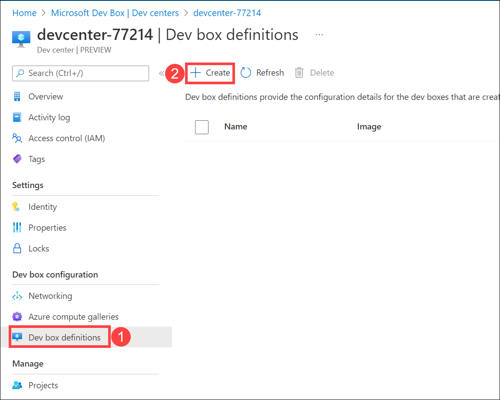
  
1. Now under Create dev box definition window, add the below details and then click on **Create** **(6)**.

   - Name: **devboxdef-01** **(1)**
   - Image: **Windows 11 Enterprise + Microsoft 365 Apps 21H2** **(2)**
   - Image version: **Latest** **(3)**
   - Compute: **4vCPU, 16 GB RAM** **(4)**
   - Storage: **256 GB SSD** **(5)**

   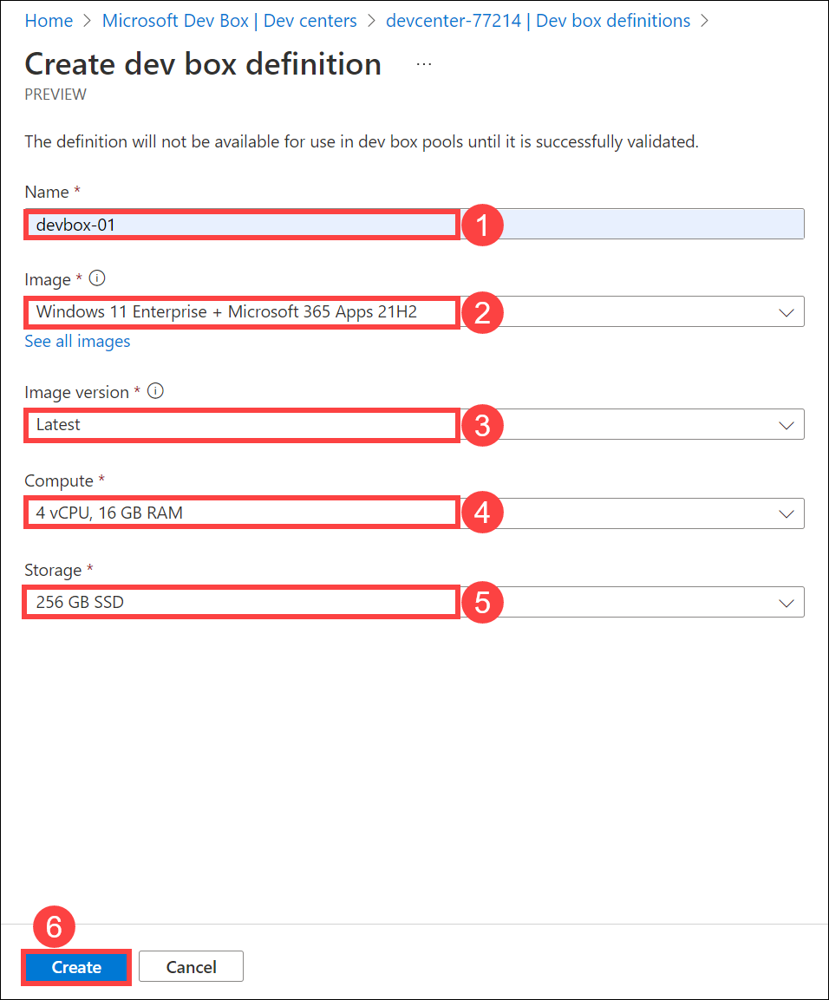
  
1. Once the definition is created. In the Azure portal, search for **Microsoft dev box** **(1)**, and then click on it from the search results **(2)**.

   
  
   >**Note:** Wait for the deployment to complete before proceeding with the lab.
  
## Task 2: Create Network connection

In this task, you'll configure the network connection using Dev Center. Network connections determine the region into which dev boxes are deployed and allow them to be connected to your existing virtual networks.

1. Navigate back to *Microsoft dev box* and then on the left-hand side blade, click on **Network Connections** **(1)**, and then click on **Create network connection** **(2)**.

   
  
1. Now under the *Create a network connection* window, enter the following details and click on **Review and Create** **(6)**.

   - Domain join type: **Azure active directory join** **(1)**
   - ResourceGroup: **devbox-rg** **(2)**
   - Name: **devbox-network** **(3)**
   - Virtual network: **CAFsec-vnet (East US)** **(4)**
   - Subnet: **default** **(5)**

   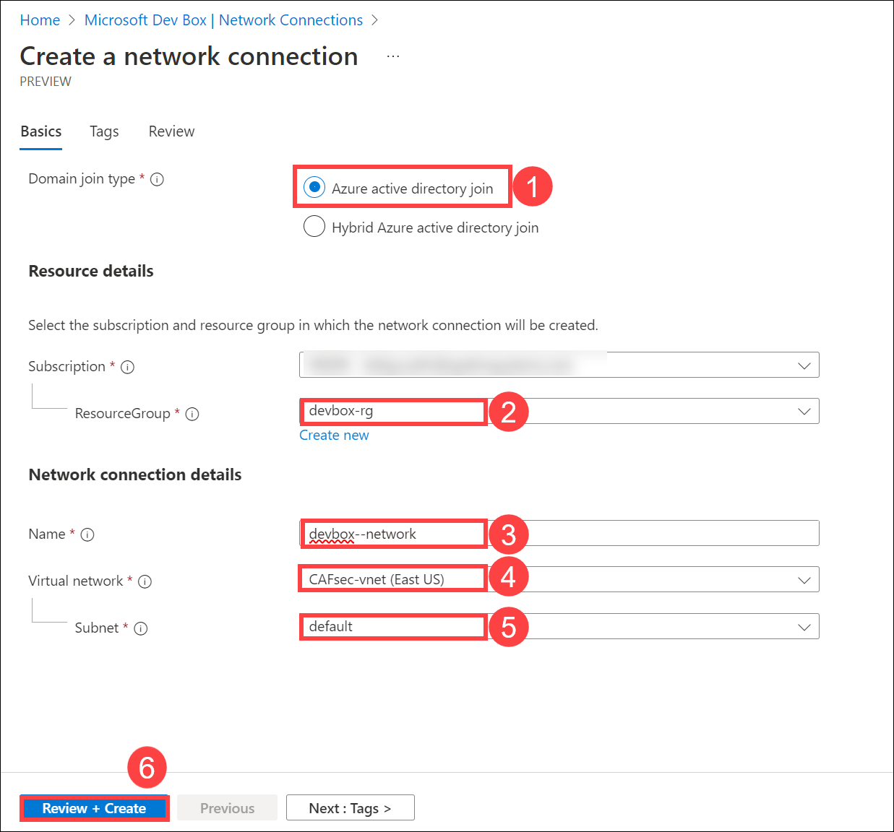

1. After deployment validation is passed, click on **Create**.

   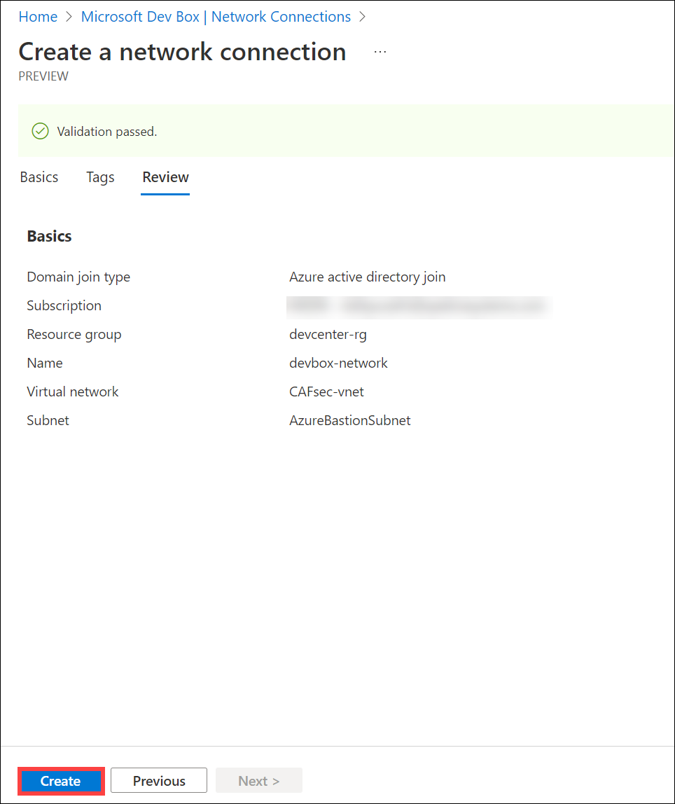
  
   >**Note:** Wait for the deployment to complete before proceeding with the lab.

1. Once the network connection is created, navigate back to the **Microsoft dev box**, and then click on **Dev center** **(1)** and then click on the **devcenter-<inject key="DeploymentID" enableCopy="false" />** **(2)**.

   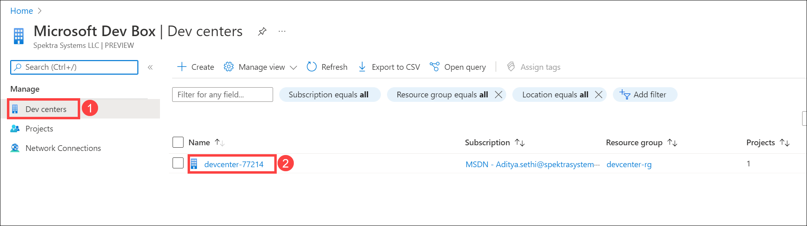

1. Now under left-hand side pane, click on **Networking** under Dev box configuration, and then click on **+ Add**.

   
  
1. Now under *Add network connection*, select the **dev-network** for Network Connection from the drop-down and then click on **Add**.

   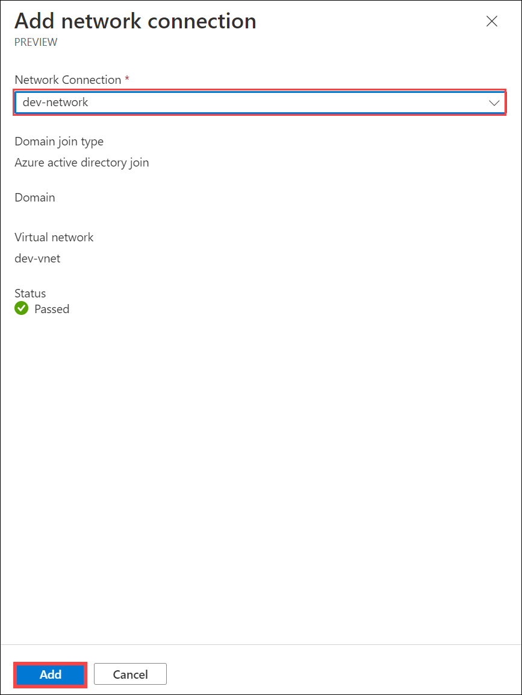
    
## Task 3: Create dev box pool

In this task, you'll create a Dev pool using previously configured network connection and Dev Box definitions. A dev box pool is a collection of dev boxes that you manage together. 

1. Return to Microsoft dev box, and click on **Projects** **(1)** then click on the **devbox-project** **(2)**.

   

1. On the left hand side pane click on **Dev box pools** **(1)** and then click on **Add New** **(2)**.

   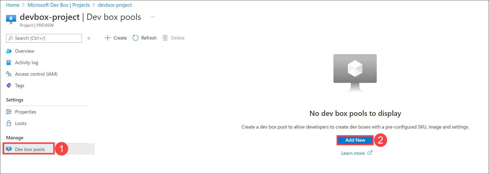
  
1. Under *Create a dev box pool* window, enter the following details and click on **Create** **(6)**.

   - Name:**devbox-pool** **(1)**
   - Dev box definition: **devboxdef-01** **(2)**
   - Network Connection: **devbox-network** **(3)**
   - Dev box Creator Privileges: **Local Administrator** **(4)**
   - Licensing: Check the checkbox **(5)**
  
   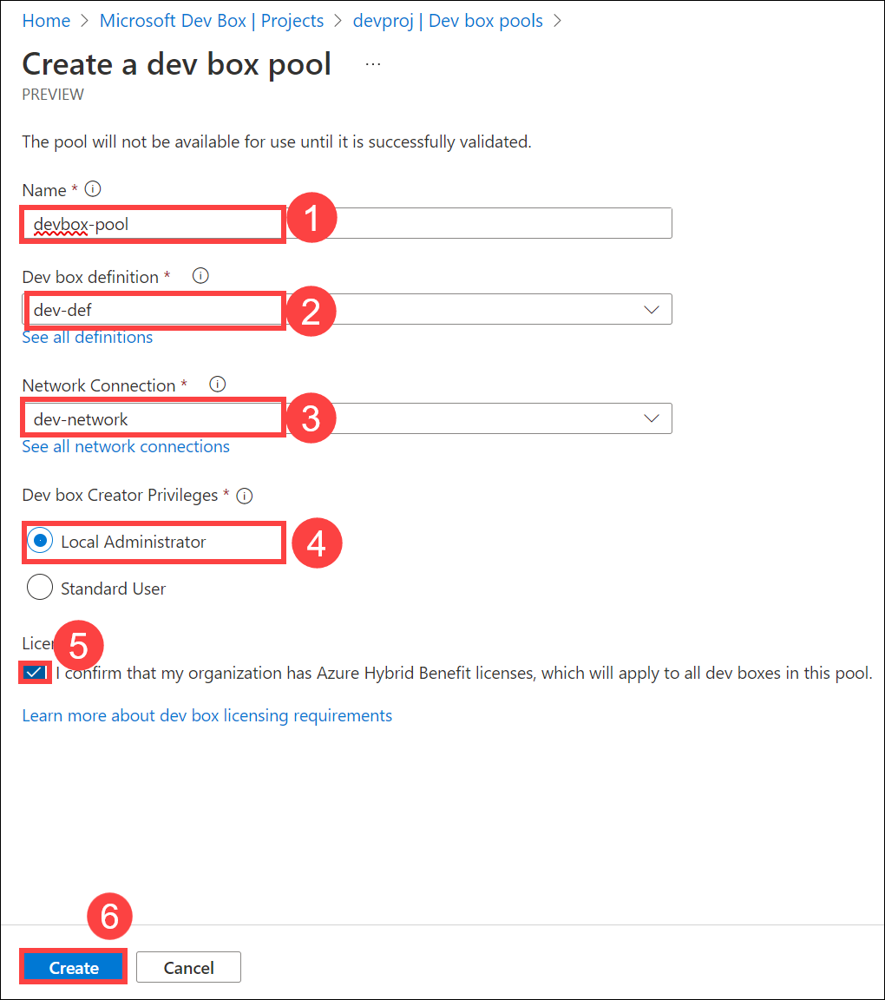
  
## Task 4: Giving user access over Dev box

In this task, you'll explore about access control and provide access to Dev Box user using built-in DevCenter Dev Box User role.

1. Return to Microsoft dev box, and click on **Projects** **(1)** then click on the **devbox-project** **(2)**.

   

1. On the left hand side pane click on **Access control** **(1)** then click on **+ Add** **(2)** and select **Add role assignment** **(3)** from the drop down.

   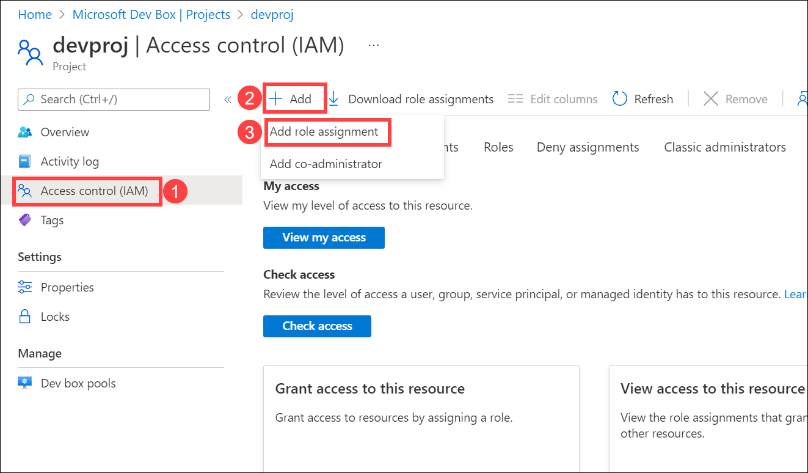

1. Under Role, select **DevCenter Dev box User** **(1)**, and then click on **Next** **(2)**.

   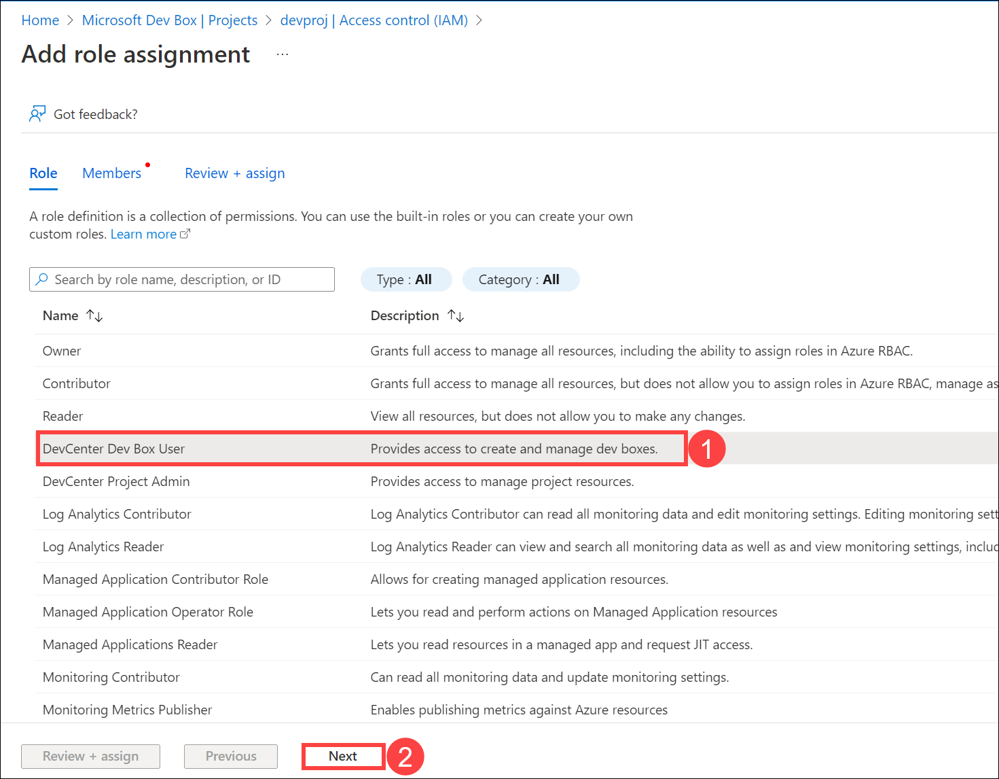
  
1. Under Members, click on **+ Select members** **(1)**, then search and select the ODL user **(2)**, and then click on **Select** **(3)** followed by **Review + assign** **(4)**.

   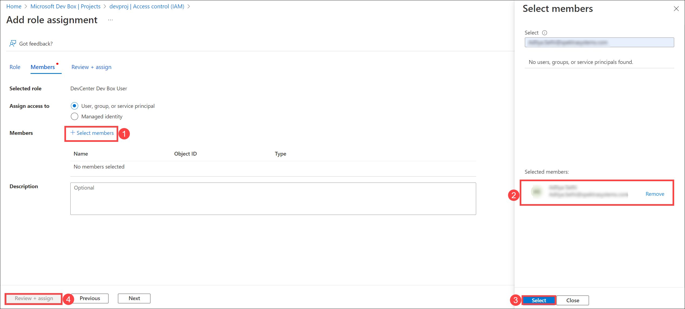
  
## Task 5: Launching Dev box

In this task, you'll access a Dev Box and explore its features.

1. On a new browser tab, visit ```https://devbox.microsoft.com/```.

1. Here, click on **Get started** **(1)**, Name it as **devbox-01** **(2)** and then click on **Create** **(3)**.

   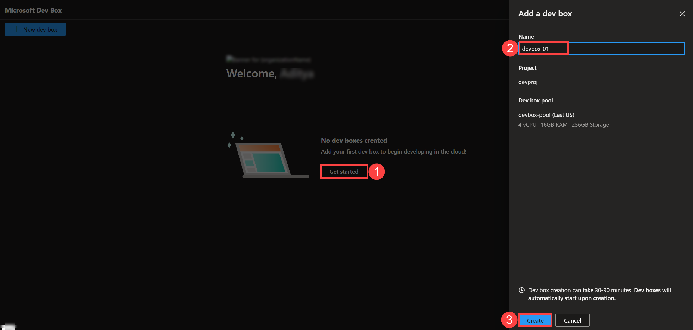

## Summary

In this exercise, you have created Dev box definition, Network connection and Dev box pool in Microsoft Dev Box. Also you have accessed a Dev Box and explored its features.
