# Exercise 2: Continuous Integration and Continous Deployment

In this exercise, you are going to set up the local infrastructure using Docker containers. There are three images you will be working with: fabrikam-init, fabrikam-api, and fabrikam-web. you will also build automation in GitHub for updating and republishing our Docker images when the code changes.

### Task 1: Access the lab files.

In this task, you'll access and explore the code repository of the web app using Visual Studio Code. Visual Studio Code is a cross-platform, lightweight but powerful source code editor.

1. From the VM desktop, double-click on the **Visual Studio Code** desktop icon to open the application.

   
   
1. In **Visual Studio Code**, click on **File** **(1)** at the left top and select **Open Folder** **(2)**.

   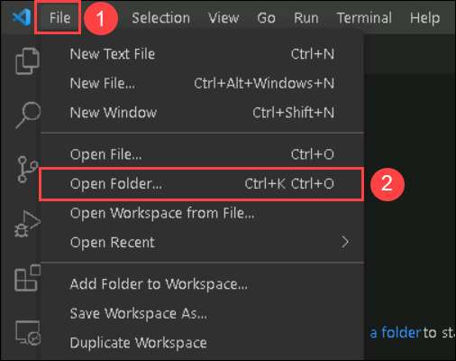

1. In the **Open Folder** tab, navigate to the following path `C:\Workspaces\lab\mcw-continuous-delivery-lab-files` to open your local GitHub repository and click on **Select Folder**.

   
    
1. You may receive a prompt: Do you trust the authors of the files in this folder? select the **checkbox** **(1)** the box and click on **Yes, I trust the authors** **(2)**.

   
   
1. You'll be to see the lab files in Visual Studio code and explore the code files.

   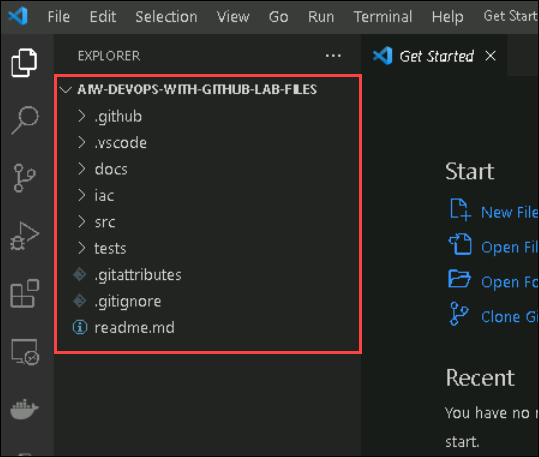

### Task 3: Set up Local Infrastructure

In this task, You will set up the local infrastructure using Dotnet . You'll be wokring with three docker images:fabrikam-init, fabrikam-api, and fabrikam-web.
   
1. Open a **New Terminal** in the Visual Studio Code by selecting **Terminal (1)** and then on **New Terminal (2)**.

   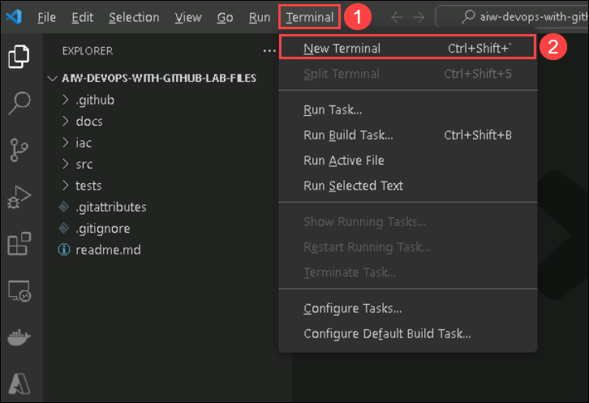
   
1. Click on the **drop-down** ***(1)*** button next to powershell aand select **Command Prompt** from the list. A new command Prompt terminal will be opened.   

   
   
1. Go to Environment details, Click on **Service principal Details** and copy the **Application Id(Client Id)**, **client Secret**, and **tenant Id**.   
   
   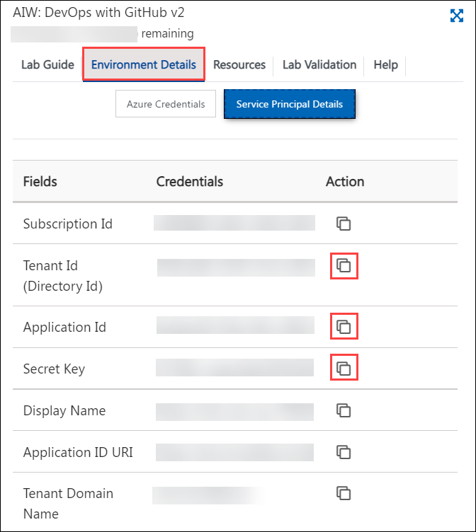
   
1. update the **Application Id(Client Id)**, **client Secret**, and **tenant Id** in the mentioned below. Run it in the terminal.

   ```pwsh
   az login --service-principal -u <clientId> -p <clientSecret> --tenant <tenantId>
   ```

   
   
1. Run the below mentioned command to navigate to `TailwindTraders.Api.Products` folder.

   ```pwsh
   cd C:\Workspaces\lab\aiw-devops-with-github-lab-files\TailwindTraders-master\src\TailwindTraders.Api.Products
   ```
   
   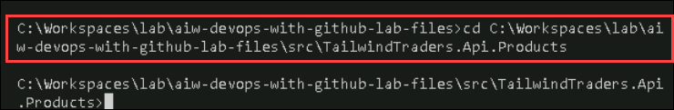   
   
1. Run `dotnet user-secrets set "KeyVaultEndpoint" "https://tailwindtraderskv<inject key="DeploymentID" enableCopy="false" />.vault.azure.net/"` command to set secret path.

   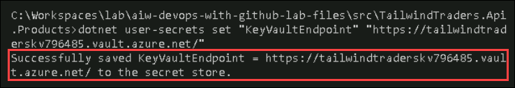
   
1. Run the below mentioned command to build and host the carts locally.

   ```pwsh
   dotnet build && dotnet run
   ```  

   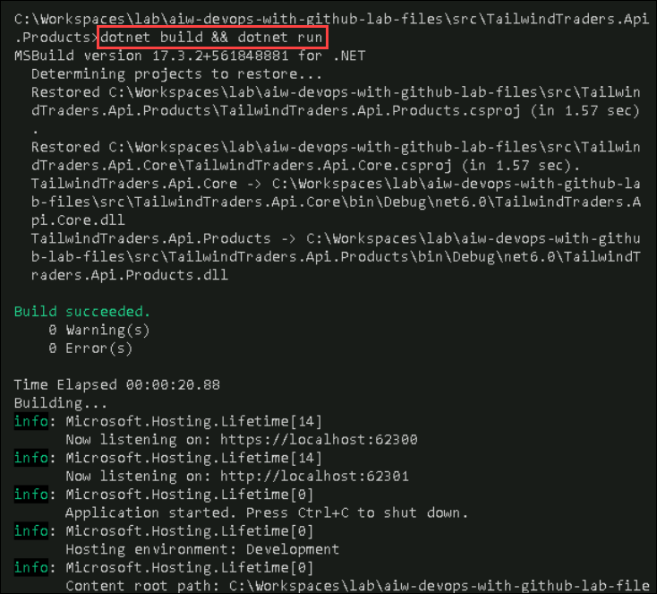 
   
   >**Note**: Please wait for 2 - 3 minutes for build to complete.
   
1. Keep the terminal running. Open a new browser tab and try accessing the application using localhost port. You'll be able to see the output similar to screenshot mentioned below.

   ```pwsh
   https://localhost:62300/swagger
   ```  

   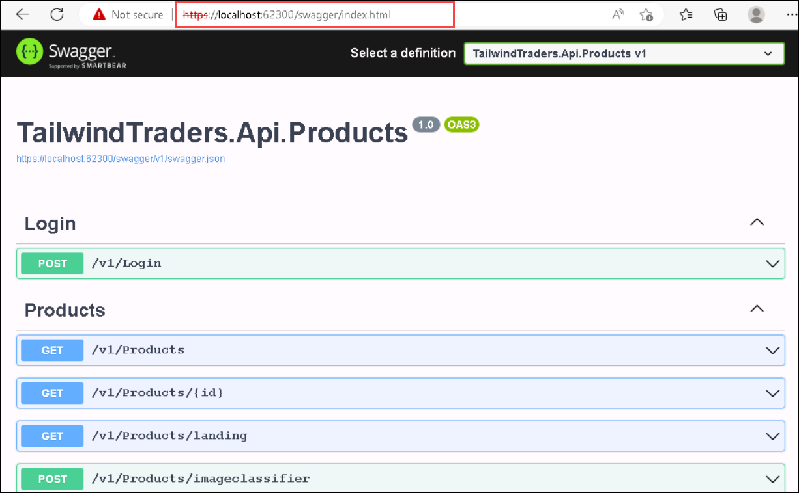     
   
1. Navigate back to **VS Code** and stop the terminal by typing **ctrl+C**. Run the below mentioned command to navigate to `TailwindTraders.Api.Carts` folder. 
  
   ```pwsh
   cd C:\Workspaces\lab\aiw-devops-with-github-lab-files\src\TailwindTraders.Api.Carts
   ```
  
   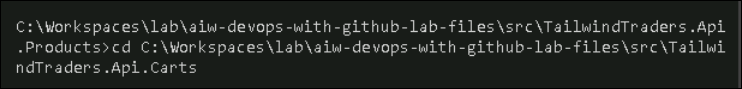     
   
1. Run `dotnet user-secrets set "KeyVaultEndpoint" "dotnet user-secrets set "KeyVaultEndpoint" "https://tailwindtraderskv<inject key="DeploymentID" enableCopy="false" />.vault.azure.net/"` command to set secret path.

   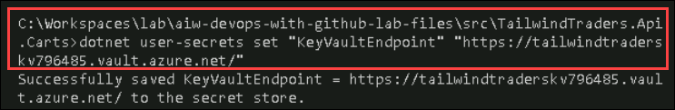
   
1. Run the below mentioned command to build and host the carts locally.

   ```pwsh
   dotnet build && dotnet run
   ```    
  
    
   
   >**Note**: Please wait for 2 - 3 minutes for build to complete.

1. Navigate back to **VS Code** and stop the terminal by typing **ctrl+C**. Run the below mentioned command to navigate to `TailwindTraders.Api.Carts` folder. 
  
   ```pwsh
   cd C:\Workspaces\lab\aiw-devops-with-github-lab-files\src\TailwindTraders.Ui.Website
   ```
  
   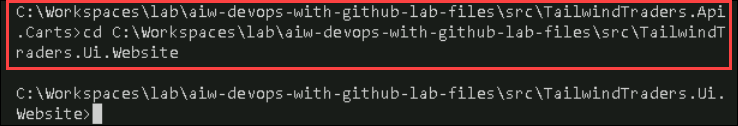 
   
1. Run the below mentioned command to install npm.

   ```pwsh
   npm install
   ```    
  
   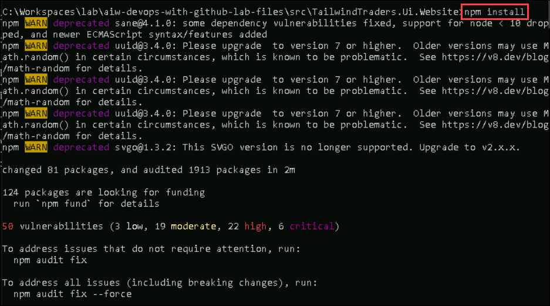 
   
   >**Note**: Please wait untill the installation completes. It will take around 10 - 15 minutes when you run npm install for the first time.
   
1. Run the below mentioned command to run ui of the application. This will automatically open a browser tab where you'll see the complete application running

   ```pwsh
   npm run start
   ```    
  
   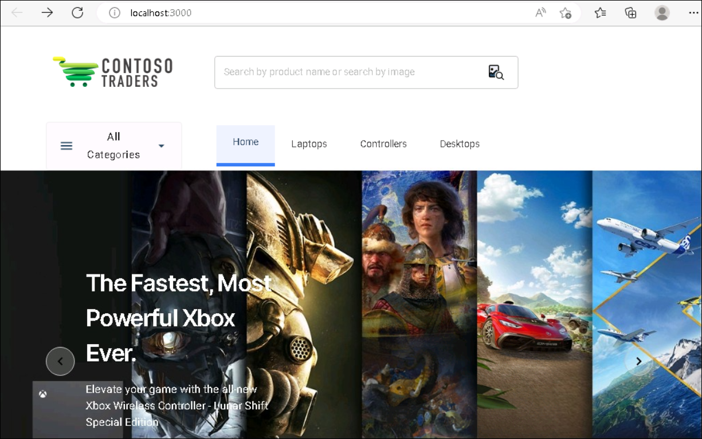 
   
### Task 4: Create the Project Repo

In this task, you'll access the GitHub enterprise account and create a new repository to store the infrastructure.

In this task, you will create an account in [GitHub](https://github.com) and use `git` to add lab files to a new repository.

1. In a new browser tab open ```https://www.github.com``` and Log in with your personal GitHub account.

    > **Note** : You have to use your own GitHub account. If you don't have a GitHub account then navigate to the following link ```https://github.com/join``` and create one.
    
1. In the upper-right corner, expand the user **drop-down menu** ***(1)*** and select **Your repositories** ***(2)***.

   

1. Next to the search criteria, locate and select the **New** button.

   

1. On the **Create a new repository** screen, name the repository ```mcw-continuous-delivery-lab-files``` ***(1)***, select **Private** ***(2)*** and click on **Create repository** ***(3)***  button.

   
   
   >**Note**: Please make sure the delete the Repo and create a new one. 

1. On the **Quick setup** screen, copy the **HTTPS** GitHub URL for your new repository, and **save it** in a notepad for future use.

   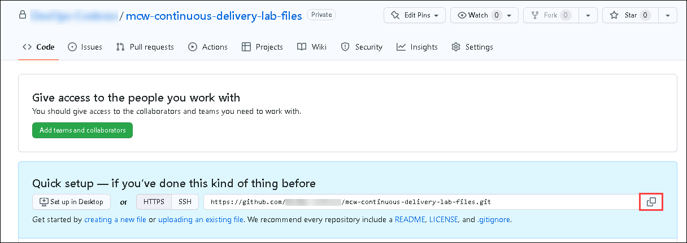
   
1. Navigate back to the **Visual Studio Code** application in which the terminal is already open. In the terminal, click on the **drop-down** button and select **PowerShell** to open a fresh PowerShell terminal tab

   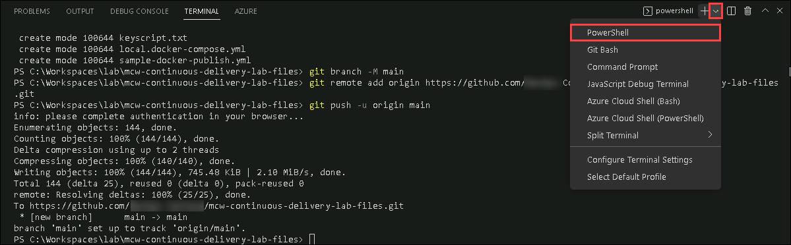

   >**Note**: From the terminal, you can switch between the multiple terminal tabs which is one of the handy features of VS Code.

   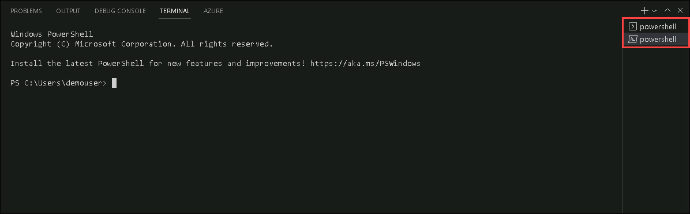

1. In the Visual Studio Code, run the below commands in the terminal to set your **username** and **email**, which Git uses for commits. Make sure to replace your email and username.
   
     ```pwsh
     cd C:\Workspaces\lab\mcw-continuous-delivery-lab-files
     git config --global user.email "you@example.com"
     git config --global user.name "Your UserName"
     ```
     
   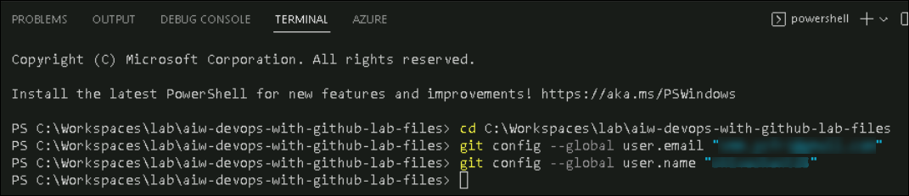
     
    - Initialize the folder as a git repository, commit, and submit contents to the remote GitHub branch `main` in the lab files repository created in Step 1. Make sure to replace `<your_github_repository-url>` with the value you copied in step 5.

      > **Note**: The URI of the lab files GitHub repository created in Step 1 will differ from that in the example below.

      ```pwsh
      git init
      git add .
      git commit -m "Initial commit"
      git branch -M main
      git remote add origin <your_github_repository-url>
      git push -u origin main
      ```
      
    - After running the above commands, you will be prompted with a pop-up window to sign in to GitHub. Select **Sign in with your Browser** on the **Connect to GitHub** pop-up window.

       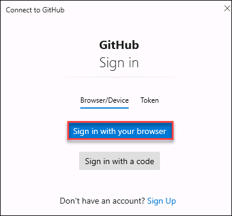
     
   - If you are re-directed to the Git Credential Manager page, sign in to GitHub using your personal GitHub account credentials.

       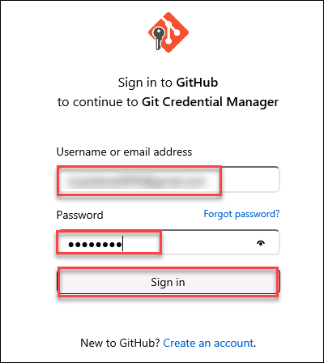
       
   - After you are prompted with the message **Authorization Succeeded**, close the tab and continue with the next task.
   
### Task 5: Create GitHub Personal Access Token

In this task, you'll create personal access token which will be used in workflows to access GitHub. 

1. Navigate back to the browser tab in which **GitHub**. In the upper-right corner of your GitHub page, click your profile photo, then click **Settings** ***(1)*** and in the left sidebar click **Developer settings** ***(2)***.

   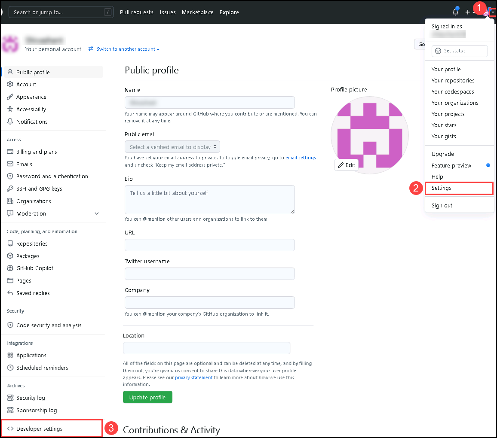
   
1. In the left hand sidebar, click **Personal access tokens** ***(1)*** and select **Generate new token** ***(2)*** button on the right. Provide the GitHub password if prompted. 
   
   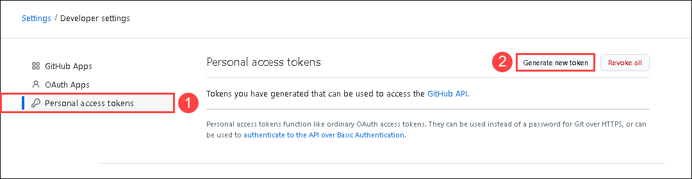
   
1. Select the scopes or permissions you would like to grant this token

   - **Note**: Enter this value in the note field, **<inject key="DeploymentID" enableCopy="false" />-token** ***(1)***
    
   - **Select scopes** ***(2)***:

     * repo - Full control of private repositories
     * workflow - Update GitHub Action workflows
     * write:packages - Upload packages to GitHub Package Registry
     * delete:packages - Delete packages from GitHub Package Registry
     * read:org - Read org and team membership, read org projects
  
   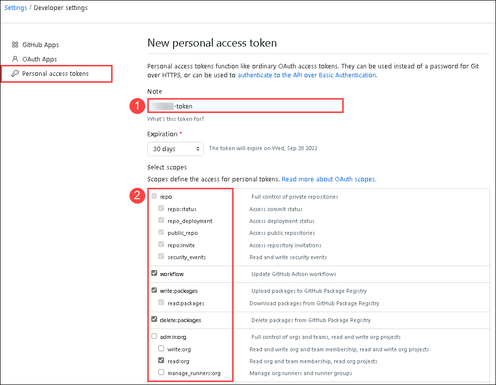
   
   - Click **Generate token**.

     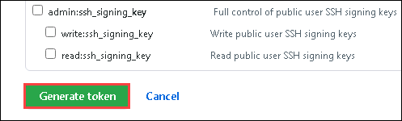
     
1. Click on the Copy icon to copy the token to your clipboard and save it on your notepad. For security reasons, after you navigate off the page, you will not be able to see the token again. **DO NOT COMMIT THIS TO YOUR REPO!**

   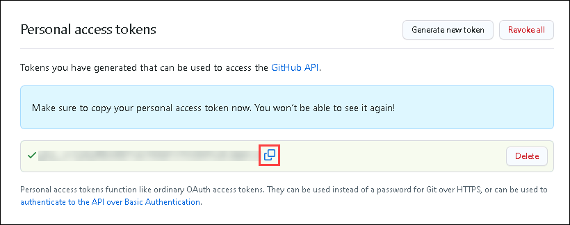
     
### Task 6: Build and push using GitHub Actions

In this exercise, you will build automation in GitHub for updating and republishing our Docker images when the code changes. You will create a workflow file using the GitHub interface and its GitHub Actions workflow editor. This will get you familiar with how to create and edit an action through the GitHub website.

1. From Azure Portal Dashboard, click on Resource groups from the Navigate panel to see the resource groups.

    
   
1. Select **Tailwind-<inject key="DeploymentID" enableCopy="false" />** resource group from the list.

   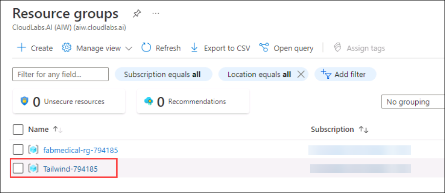 
   
1. Select **productsdb** SQL database from the list of resources.

   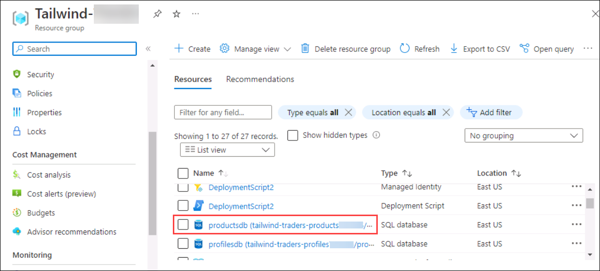 
   
1. Under Settings side blade, select **Connection strings** ***(1)*** and copy the **ADO.NET (SQL authentication)** ***(2)*** connection string from ADO.NET tab. 

   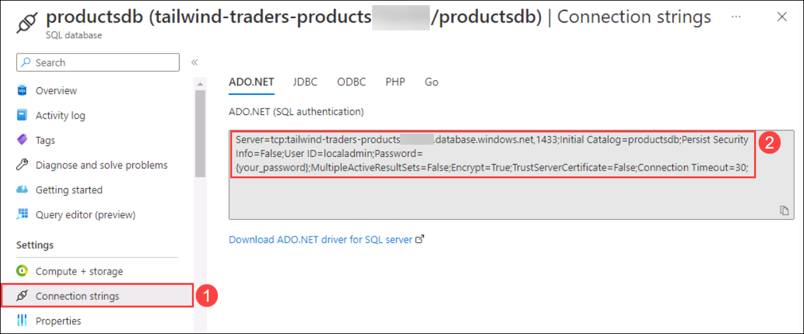  
 
1. In your GitHub lab files repository, select the **Settings** tab from the lab files repository.

   
   
1. Under **Security**, expand **Secrets** ***(1)*** by clicking the drop-down and select **Actions** ***(2)*** blade from the left navigation bar. Select the **New repository secret** ***(3)*** button.

   
    
1. Under **Actions Secrets/New secret** page, enter the below mentioned details and Click on **Add secret** ***(3)***.

   - **Name** : Enter **SQL_PASSWORD** ***(1)***
   - **Value** : **<inject key="Acr Password" />** ***(2)***
   
   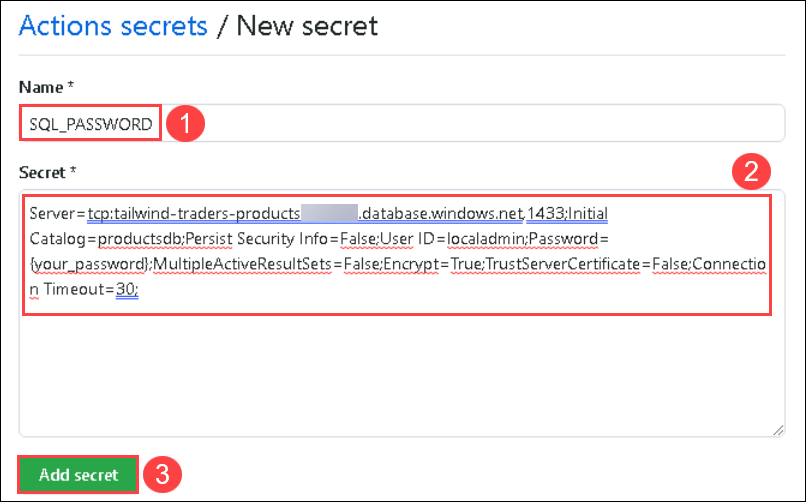    
   
1. Go to Environment details, Click on **Service principle Credentials** and copy the **Application Id (Client Id)** , **client Secret** , **subscription Id** and **tenant Id**.

   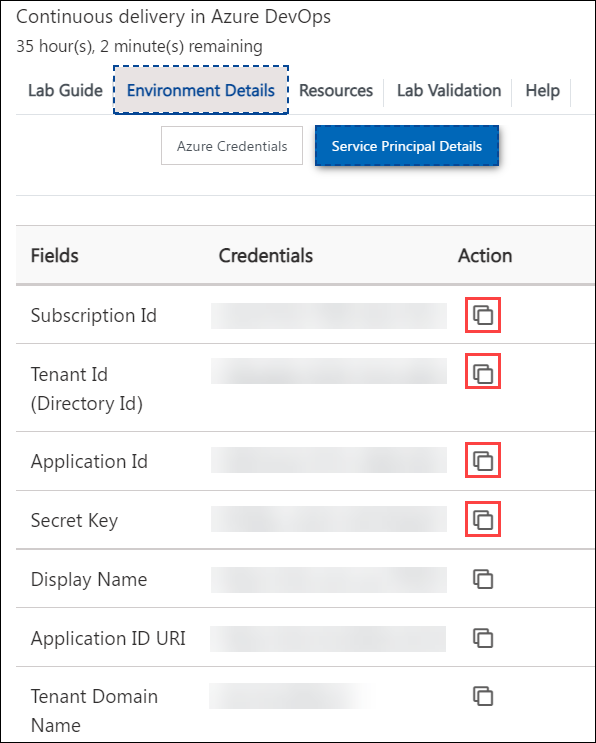
   
   - Replace the values that you copied in below Json. You will be using in this step.
   
   ```json
   {
      "clientId": "zzzzzzzz-zzzz-zzzz-zzzz-zzzzzzzzzzzz",
      "clientSecret": "client-secret",
      "tenantId": "zzzzzzzz-zzzz-zzzz-zzzz-zzzzzzzzzzzz",
      "subscriptionId": "zzzzzzzz-zzzz-zzzz-zzzz-zzzzzzzzzzzz"
   }
   ```
   
1. Under **Actions Secrets/New secret** page, enter the below mentioned details and Click on **Add secret** ***(3)***.

   - **Name** : Enter **SERVICEPRINCIPAL** ***(1)***
   - **Value** : Paste the service principal details in json format ***(2)***
   
   
   
1. Similarly, under **Actions Secrets/New secret** page, enter the below mentioned details and Click on **Add secret** ***(3)***.

   - **Name** : Enter **ACR_PASSWORD** ***(1)***
   - **Value** : **<inject key="Acr Password" />** ***(2)***
   
   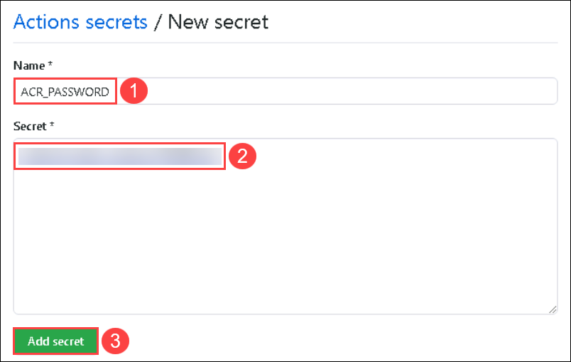 
   
1. Under **Actions Secrets/New secret** page, enter the below mentioned details and Click on **Add secret** ***(3)***.

   - **Name** : Enter **ENVIRONMENT** ***(1)***
   - **Value** : **<inject key="DeploymentID" enableCopy="false" />** ***(2)***
   
   
   
1. From your GitHub repository, select **Actions** ***(1)*** tab. Select the **contoso-traders-app-deployment** ***(2)*** workflow from the side blade, Click on the  **drop-down** ***(3)*** next Run workflow button, and select **Run workflow** ***(4)***.

   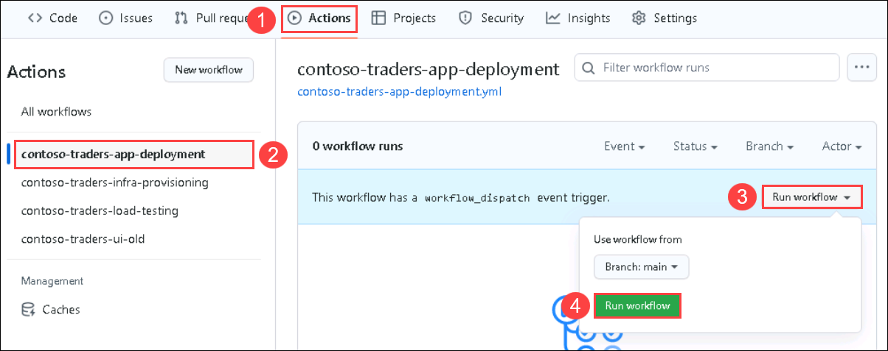
   
1. Navigate back to Actions tab and select the **contoso-traders-app-deployment** workflow. This workflow builds the docker image, which is pushed to container registry. The same image is pushed to Azure container application.

   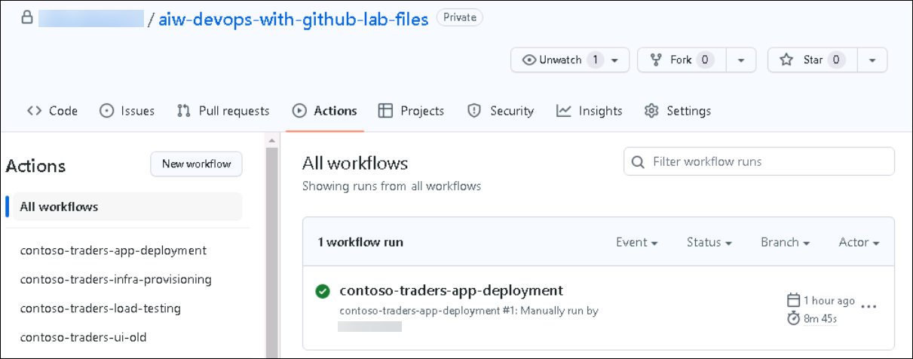
   
   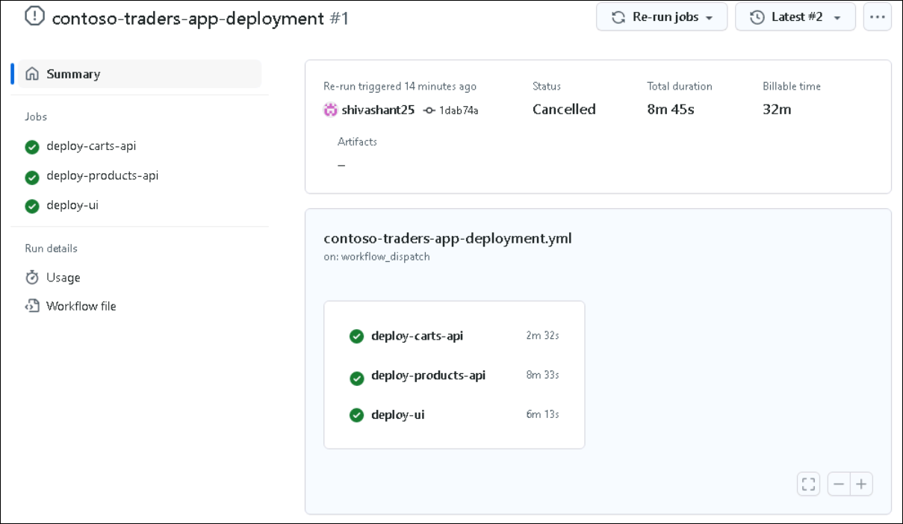     
   
1. Navigate to Azure Portal, click on Resource groups from the Navigate panel to see the resource groups.

    
   
1. Select **Tailwind-<inject key="DeploymentID" enableCopy="false" />** resource group from the list.

      
   
1. Select **tailwind-traders-ui2<inject key="DeploymentID" enableCopy="false" />** endpoint from the list of resources.

    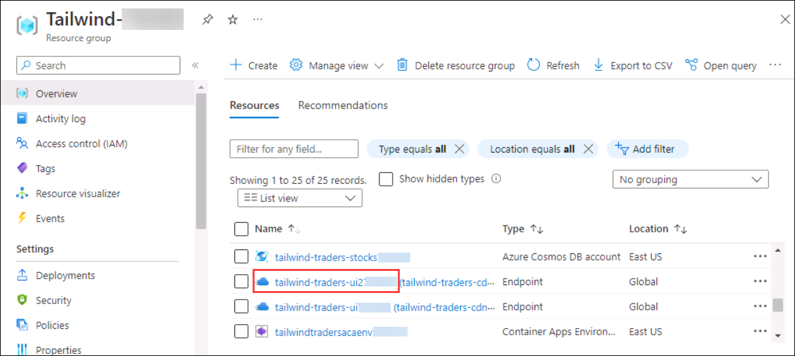   
   
1. Click on **Endpoint hostname**. It'll open a browser tab where you will be visual that the Tailwind Traders app has been hosted successfully.

    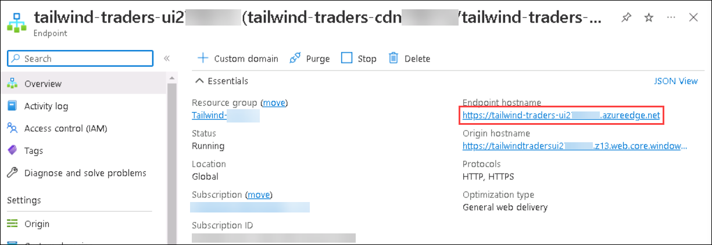 
    
    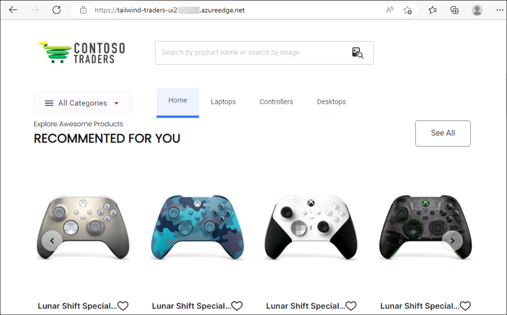  
    
### Task 7: Editing the GitHub Workflow File using Codespace

The last task automated building and updating only one of the Docker images. In this task, we will update the workflow file with a more appropriate workflow for the structure of our repository. This task will end with a file named `docker-publish.yml` that will rebuild and publish Docker images as their respective code is updated.

1. From the GitHub browser tab, follow the steps given below and click on **Create codespace on main** ***(3)***.

   - click on **Code** ***(1)***, 
   - Select the **Codespace** ***(2)*** tab

   
   
1. You'll be redirected to a new codespace tab in the browser. Please wait until the codespace is configured.

   
   
1. From the explorer side blade, navigate to **.github/workflows** and select **docker-publish.yml** ***(1)*** file.

   
   
1. Remove the commands from line 7 to 14 from the workflow file. In line 6 update the branch name to **master** from **main**.

   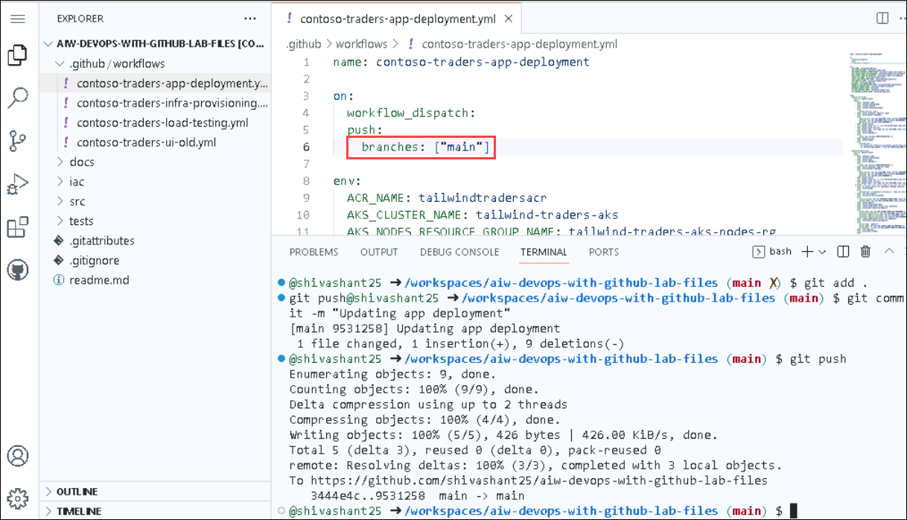
   
1. Using the terminal from codespace, run the following commands to commit this change to your repo and to push the change to GitHub.

   ```pwsh
   git add .
   git commit -m "Updating app deployment"
   git push
   ```
   
    
   > **Note**: This will update the workflow and will **not** run the "Update the ... Docker image" jobs.

1. Navigate back to the GitHub browser, select the **Actions** ***(1)*** tab and review the **workflow** ***(2)*** created automatically for the changes made. 

   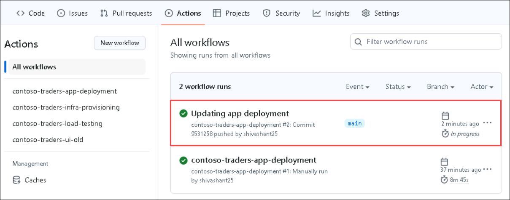

1. Click on the **Next** button present in the bottom-right corner of this lab guide.
   
   
