# Exercise 2: Continuous Integration

In this exercise, you are going to set up the local infrastructure using Docker containers. There are three images you will be working with: fabrikam-init, fabrikam-api, and fabrikam-web. you will also build automation in GitHub for updating and republishing our Docker images when the code changes.

### Task 1: Access the lab files.

In this task, you'll access and explore the code repository of the web app using Visual Studio Code. Visual Studio Code is a cross-platform, lightweight but powerful source code editor.

1. From the VM desktop, double-click on the **Visual Studio Code** desktop icon to open the application.

   
   
1. In **Visual Studio Code**, click on **File** **(1)** at the left top and select **Open Folder** **(2)**.

   

1. In the **Open Folder** tab, navigate to the following path `C:\Workspaces\lab\mcw-continuous-delivery-lab-files` to open your local GitHub repository and click on **Select Folder**.

   
    
1. You may receive a prompt: Do you trust the authors of the files in this folder? select the **checkbox** **(1)** the box and click on **Yes, I trust the authors** **(2)**.

   
   
1. You'll be to see the lab files in Visual Studio code and explore the code files.

   

### Task 2: Start the Docker application.

In this task, you'll initiate the docker application to host your application locally. Docker is an open platform for developing, shipping, and running applications. Docker enables you to separate your applications from your infrastructure so you can deliver software quickly. With Docker, you can manage your infrastructure in the same ways you manage your applications

1. Minimize the browser and open the **Docker application** from the LabVM desktop. You may find that docker is stopping abruptly, try starting it multiple times to fix it.

   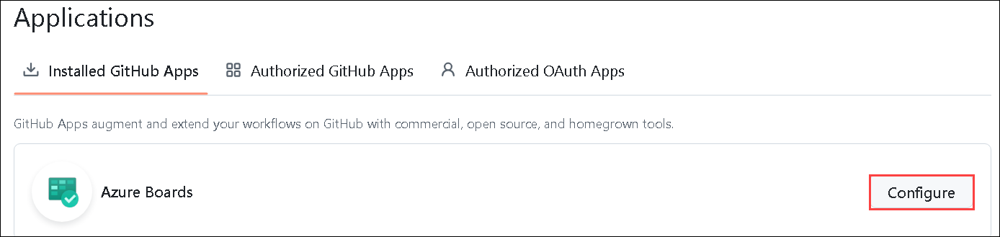
  
   >**Note**: If you get a warning pop-up saying **Windows 17762 deprecated**. Please click on **OK**. The Docker application might take a few seconds to open, please wait till the application opens.
   
1. Click on **Start**.

   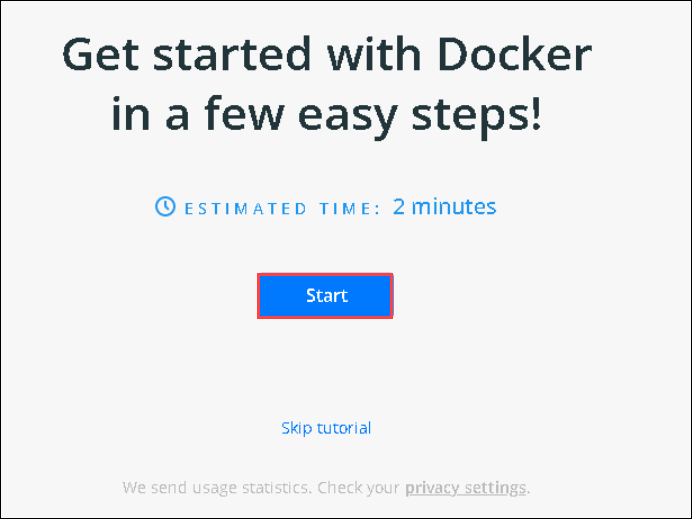

1. Skip the tutorial pop-up by clicking on **Skip tutorial** situated in the bottom-left corner of the application.

   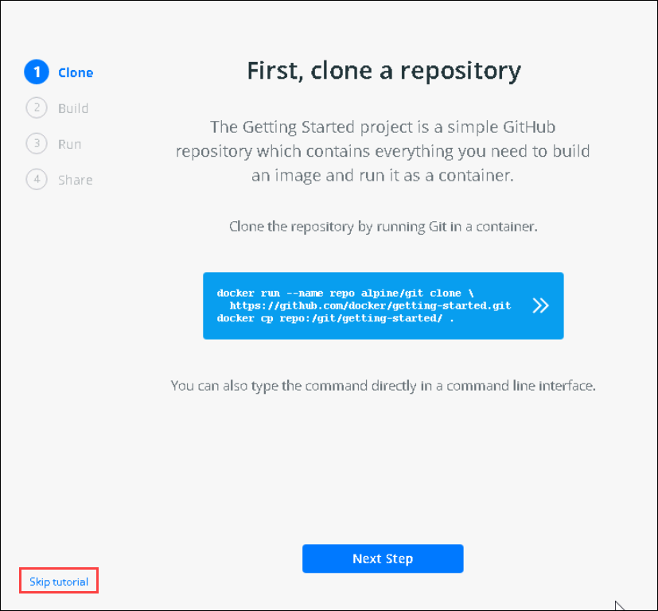
   
1. **Copy** the command from the docker application page and **save it** in a notepad for future use.

   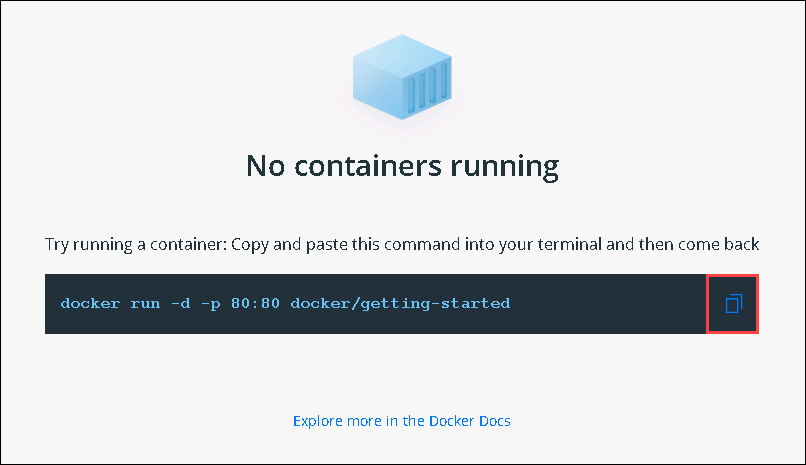
   
   >**Note**: If the Docker application is taking more than 10 mins to start. Please follow the steps from the `https://github.com/CloudLabs-MCW/MCW-Continuous-delivery-in-Azure-DevOps/blob/microsoft-devops-with-github-v2/Hands-on%20lab/docker-install.md` link and start the Docker again.
   
1. Open the Visual Studio Code application which was accessed in the previous task. Select **Terminal** ***(1)*** and click on **New Terminal** ***(2)*** to open the terminal. It will open a new PowerShell session which you'll be using throughout the lab.

   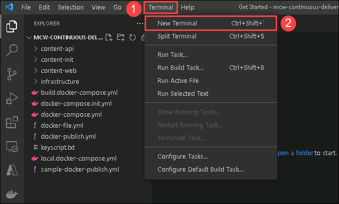
   
1. Paste the **docker run** command which you had copied earlier and wait till the execution completes.

   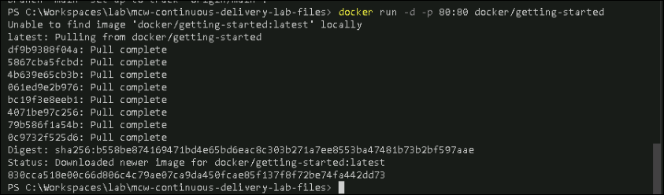
   
1. After the execution completes, open the **Docker application**. You should be able to see a container in a running state. This confirms the running of the Docker application.

   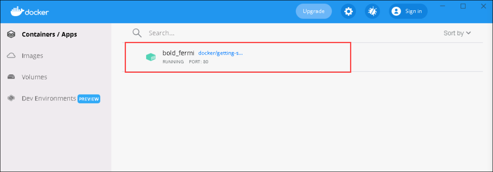

### Task 3: Set up Local Infrastructure

In this task, You will set up the local infrastructure using Docker containers. You'll be wokring with three docker images:fabrikam-init, fabrikam-api, and fabrikam-web.

11. Now you are going to set up the local infrastructure using Docker containers. There are three images you will be working with:

  - `fabrikam-init`
  - `fabrikam-api`
  - `fabrikam-web`

  You will need to make some edits to files before running these locally. In this task, you will confirm that the Docker infrastructure works locally.
  
  >**Note**: You should replace three instances of `<yourgithubaccount>` - one instance in `docker-compose.init.yml` and two instances in `docker-compose.yml`.
   
1. Openthe Visual Studio Code application. From the Explorer, open the `docker-compose-init.yml` ***(1)***  and replace `<yourgithubaccount>` ***(2)*** value in line no. 6 with your GitHub username. After updating save the file using CTRL+S.
   
   
   
   >**Note**: The `<yourgithubaccount>` value must be in **lowercase**, if your GitHub account user name is in uppercase letters please change it to lowercase in Github. [Github Username Change](https://docs.github.com/en/account-and-profile/setting-up-and-managing-your-github-user-account/managing-user-account-settings/changing-your-github-username)
    
1. From the Explorer, open the `docker-compose.yml`(1) and replace `<yourgithubaccount>` value in line no. 4 and 9 with your GitHub account name. After updating save the file using CTRL+S.    

   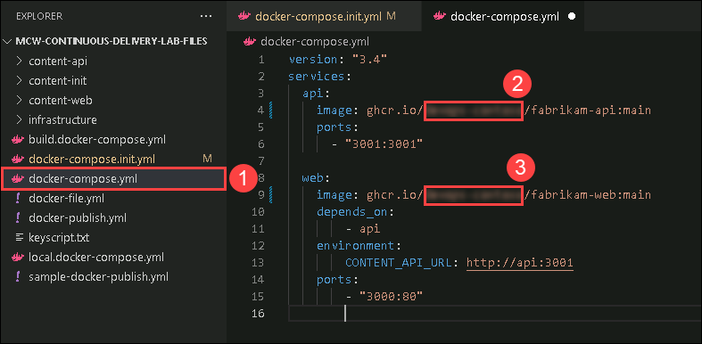
   
1. Open a **New Terminal** in the Visual Studio Code by selecting **Terminal (1)** and then on **New Terminal (2)**.

   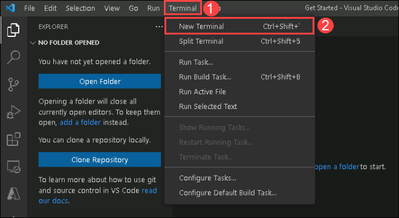
    
   >**Note**: These commands execution may take around 10-15 minutes to complete.

   Run the following commands in the terminal to build and run the docker-compose YAML files edited in the previous steps.
    
   ```pwsh
   cd C:\Workspaces\lab\mcw-continuous-delivery-lab-files
   docker-compose -f .\docker-compose.yml -f .\local.docker-compose.yml -f .\docker-compose.init.yml build
   docker-compose -f .\docker-compose.yml -f .\local.docker-compose.yml -f .\docker-compose.init.yml up
   ```
    
   
   
1. Verify that you can browse to `http://localhost:3000` in a browser and arrive at the Fabrikam conference website.

   
    
1. Leave this terminal in running and open a new terminal.
   
### Task 4: Create the Project Repo

In this task, you'll access the GitHub enterprise account and create a new repository to store the infrastructure.

In this task, you will create an account in [GitHub](https://github.com) and use `git` to add lab files to a new repository.

1. In a new browser tab open ```https://www.github.com``` and Log in with your personal GitHub account.

    > **Note** : You have to use your own GitHub account. If you don't have a GitHub account then navigate to the following link ```https://github.com/join``` and create one.
    
1. In the upper-right corner, expand the user **drop-down menu** ***(1)*** and select **Your repositories** ***(2)***.

   

1. Next to the search criteria, locate and select the **New** button.

   

1. On the **Create a new repository** screen, name the repository ```mcw-continuous-delivery-lab-files``` ***(1)***, select **Private** ***(2)*** and click on **Create repository** ***(3)***  button.

   
   
   >**Note**: Please make sure the delete the Repo and create a new one. 

1. On the **Quick setup** screen, copy the **HTTPS** GitHub URL for your new repository, and **save it** in a notepad for future use.

   
   
1. Navigate back to the **Visual Studio Code** application in which the terminal is already open. In the terminal, click on the **drop-down** button and select **PowerShell** to open a fresh PowerShell terminal tab

   

   >**Note**: From the terminal, you can switch between the multiple terminal tabs which is one of the handy features of VS Code.

   

1. In the Visual Studio Code, run the below commands in the terminal to set your **username** and **email**, which Git uses for commits. Make sure to replace your email and username.
   
     ```pwsh
     cd C:\Workspaces\lab\mcw-continuous-delivery-lab-files
     git config --global user.email "you@example.com"
     git config --global user.name "Your UserName"
     ```
     
   
     
    - Initialize the folder as a git repository, commit, and submit contents to the remote GitHub branch `main` in the lab files repository created in Step 1. Make sure to replace `<your_github_repository-url>` with the value you copied in step 5.

      > **Note**: The URI of the lab files GitHub repository created in Step 1 will differ from that in the example below.

      ```pwsh
      git init
      git add .
      git commit -m "Initial commit"
      git branch -M main
      git remote add origin <your_github_repository-url>
      git push -u origin main
      ```
      
    - After running the above commands, you will be prompted with a pop-up window to sign in to GitHub. Select **Sign in with your Browser** on the **Connect to GitHub** pop-up window.

       
     
   - If you are re-directed to the Git Credential Manager page, sign in to GitHub using your personal GitHub account credentials.

       
       
   - After you are prompted with the message **Authorization Succeeded**, close the tab and continue with the next task.
   
### Task 5: Create GitHub Personal Access Token

In this task, you'll create personal access token which will be used in workflows to access GitHub. 

1. Navigate back to the browser tab in which **GitHub**. In the upper-right corner of your GitHub page, click your profile photo, then click **Settings** ***(1)*** and in the left sidebar click **Developer settings** ***(2)***.

   
   
1. In the left hand sidebar, click **Personal access tokens** ***(1)*** and select **Generate new token** ***(2)*** button on the right. Provide the GitHub password if prompted. 
   
   
   
1. Select the scopes or permissions you would like to grant this token

   - **Note**: Enter this value in the note field, **<inject key="DeploymentID" enableCopy="false" />-token** ***(1)***
    
   - **Select scopes** ***(2)***:

     * repo - Full control of private repositories
     * workflow - Update GitHub Action workflows
     * write:packages - Upload packages to GitHub Package Registry
     * delete:packages - Delete packages from GitHub Package Registry
     * read:org - Read org and team membership, read org projects
  
   
   
   - Click **Generate token**.

     
     
1. Click on the Copy icon to copy the token to your clipboard and save it on your notepad. For security reasons, after you navigate off the page, you will not be able to see the token again. **DO NOT COMMIT THIS TO YOUR REPO!**

   
     
### Task 6: Build and push using GitHub Actions

In this exercise, you will build automation in GitHub for updating and republishing our Docker images when the code changes. You will create a workflow file using the GitHub interface and its GitHub Actions workflow editor. This will get you familiar with how to create and edit an action through the GitHub website.

1. From Azure Portal Dashboard, click on Resource groups from the Navigate panel to see the resource groups.

    
   
1. Select **Tailwind-<inject key="DeploymentID" enableCopy="false" />** resource group from the list.

    
   
1. Select **productsdb** SQL database from the list of resources.

    
   
1. Under Settings side blade, select **Connection strings** ***(1)*** and copy the **ADO.NET (SQL authentication)** ***(2)*** connection string from ADO.NET tab. 

     
 
1. In your GitHub lab files repository, select the **Settings** tab from the lab files repository.

   
   
1. Under **Security**, expand **Secrets** ***(1)*** by clicking the drop-down and select **Actions** ***(2)*** blade from the left navigation bar. Select the **New repository secret** ***(3)*** button.

   
    
1.  under **Actions Secrets/New secret** page, enter the below mentioned details and Click on **Add secret** ***(3)***.

   - **Name** : Enter **TAILWINDTRADERS_PRODUCTSDB_CONNECTION_STRING** ***(1)***
   - **Value** : **<inject key="Acr Password" />** ***(2)***
   
   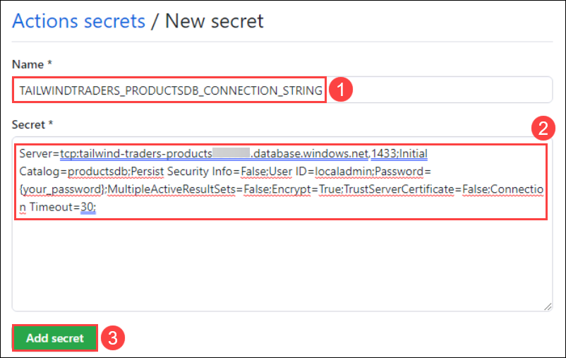    
   
1. Go to Environment details, Click on **Service principle Credentials** and copy the **Application Id (Client Id)** , **client Secret** , **subscription Id** and **tenant Id**.

   
   
   - Replace the values that you copied in below Json. You will be using in this step.
   
   ```json
   {
      "clientId": "zzzzzzzz-zzzz-zzzz-zzzz-zzzzzzzzzzzz",
      "clientSecret": "client-secret",
      "tenantId": "zzzzzzzz-zzzz-zzzz-zzzz-zzzzzzzzzzzz",
      "subscriptionId": "zzzzzzzz-zzzz-zzzz-zzzz-zzzzzzzzzzzz"
   }
   ```
   
1. Under **Actions Secrets/New secret** page, enter the below mentioned details and Click on **Add secret** ***(3)***.

   - **Name** : Enter **TAILWINDTRADERS_TESTING_SERVICEPRINCIPAL** ***(1)***
   - **Value** : Paste the service principal details in json format ***(2)***
   
   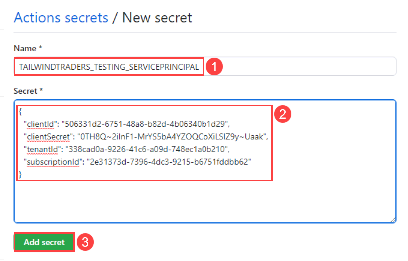
   
1. Similarly, under **Actions Secrets/New secret** page, enter the below mentioned details and Click on **Add secret** ***(3)***.

   - **Name** : Enter **TAILWINDTRADERS_ACR_PASSWORD** ***(1)***
   - **Value** : **<inject key="Acr Password" />** ***(2)***
   
   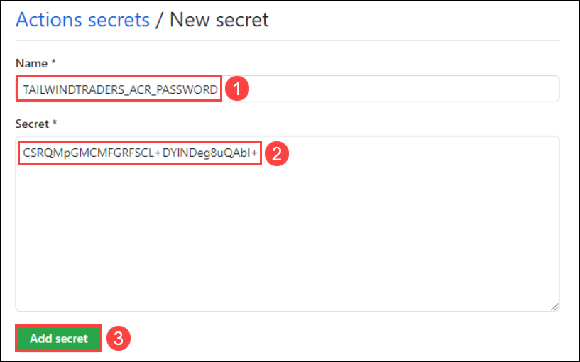 
   
1. Under **Actions Secrets/New secret** page, enter the below mentioned details and Click on **Add secret** ***(3)***.

   - **Name** : Enter **TAILWINDTRADERS_SUFFIX** ***(1)***
   - **Value** : **Tailwind-<inject key="DeploymentID" enableCopy="false" />** ***(2)***
   
   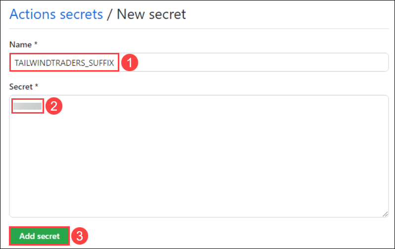
   
1. From your GitHub repository, select **Actions** ***(1)*** tab. Select the **tailwindd-traders-carts** ***(2)*** workflow from the side blade, Click on the  **drop-down** ***(3)*** next Run workflow button, and select **Run workflow** ***(4)***.

   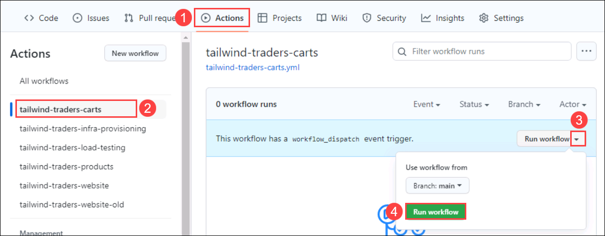
   
1. Navigate back to Actions tab and select the **tailwind-traders-carts** workflow. This workflow builds the docker image, which is pushed to container registry. The same image is pushed to Azure container application.

   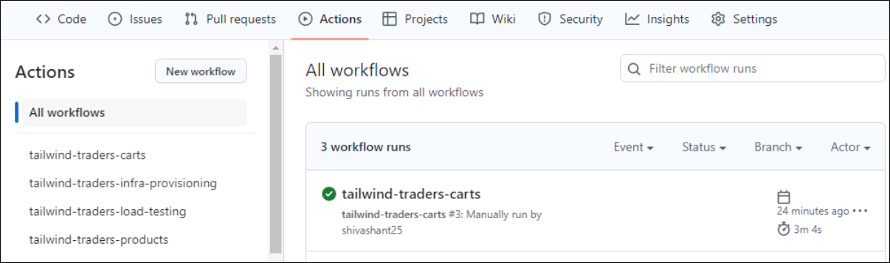
   
   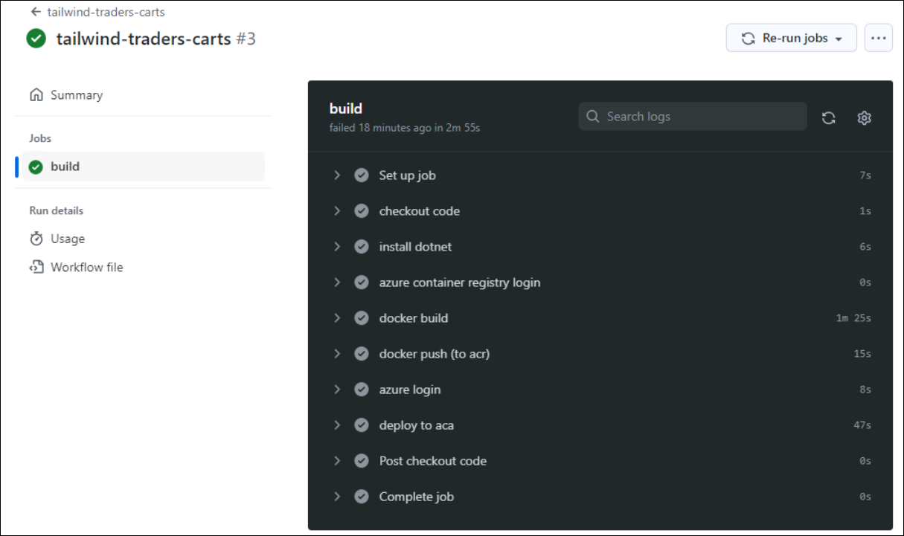   

1. From your GitHub repository, select **Actions** ***(1)*** tab. Select the **tailwind-traders-products** ***(2)*** workflow from the side blade, Click on the  **drop-down** ***(3)*** next Run workflow button, and select **Run workflow** ***(4)***.

   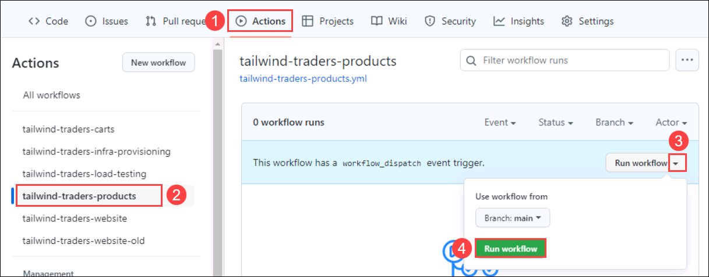
   
1. Navigate back to Actions tab and select the **tailwind-traders-products** workflow. This workflow builds the docker image, which is pushed to container registry. The same image is pushed to Azure container application. This workflow   

   
   
   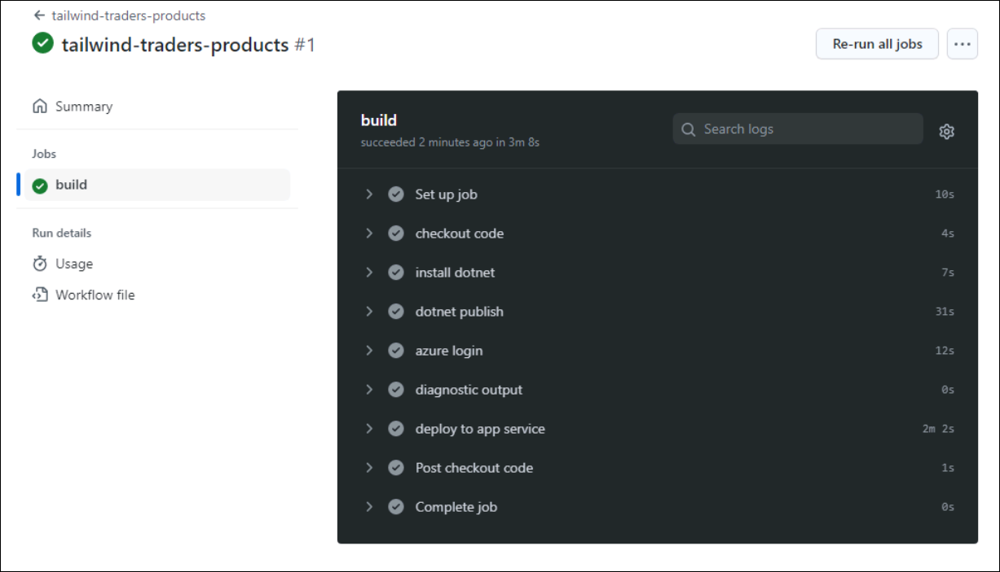  
   
   
   
   
   
   
   
   
   
   
   
   
   
   
   
   
   
   
   
   
   
   
   
   
   
1. Select the **Actions** ***(1)*** tab in your GitHub repository, scroll down and find the **Publish Docker Container** ***(2)*** workflow under the **Continuous Integration Workflows** and select **Configure** ***(3)***. This will create a file named `docker-publish.yml`.

   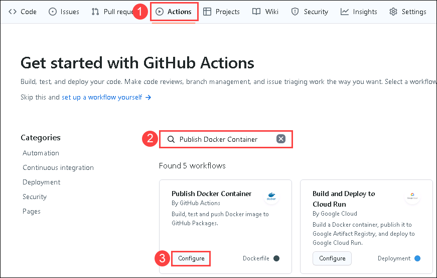
   
1. Copy the code from `https://raw.githubusercontent.com/CloudLabs-MCW/MCW-Continuous-delivery-in-Azure-DevOps/microsoft-devops-with-github-v2/Hands-on%20lab/docker-flow.yml` ***(1)*** link. Select **Start commit** ***(2)***. Be sure that **Commit directly to the `main` branch** is selected. Finally, select **Commit new file** ***(3)***.

   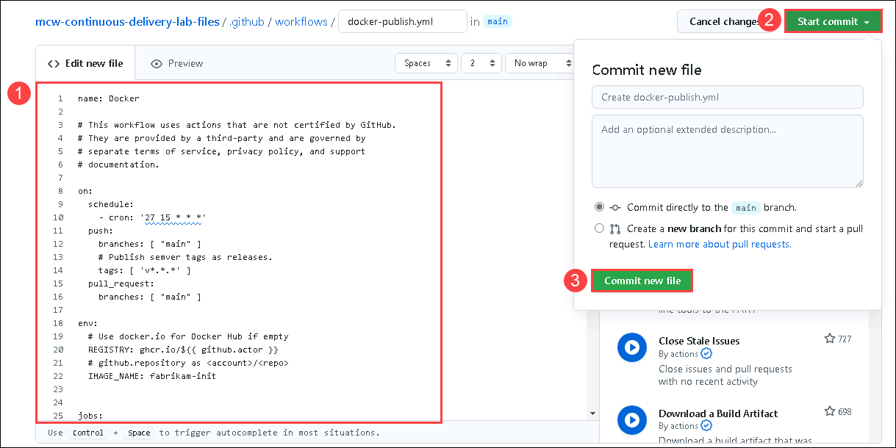
   
1. The GitHub Action is now running and will automatically build and push the container to the GitHub registry.

   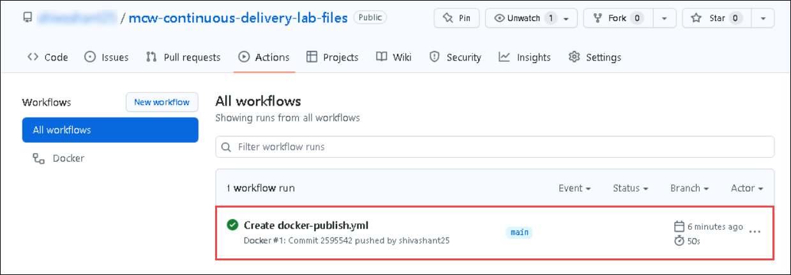

   
   
### Task 7: Editing the GitHub Workflow File using Codespace

The last task automated building and updating only one of the Docker images. In this task, we will update the workflow file with a more appropriate workflow for the structure of our repository. This task will end with a file named `docker-publish.yml` that will rebuild and publish Docker images as their respective code is updated.

1. From the GitHub browser tab, follow the steps given below and click on **Create codespace on main** ***(3)***.

   - click on **Code** ***(1)***, 
   - Select the **Codespace** ***(2)*** tab

   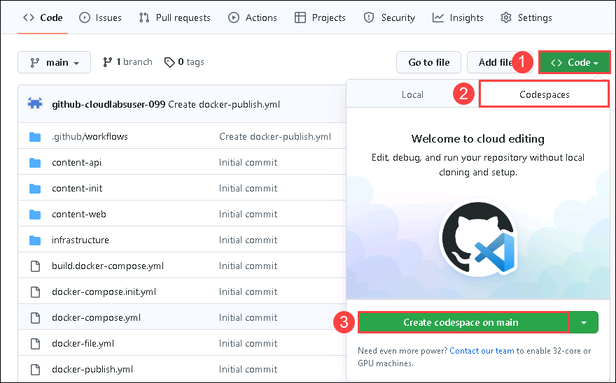
   
1. You'll be redirected to a new codespace tab in the browser. Please wait until the codespace is configured.

   
   
1. From the explorer side blade, select **docker-publish.yml** ***(1)*** file and copy all the content of the file ***(2)***.

   
   
1. From the explorer side blade, navigate to **.github.workflows** ***(1)*** directory and replace the content of **docker-publish.yml** ***(2)*** file with the code copied in last step. After updating the file, press CTRL+S to save the file. 

   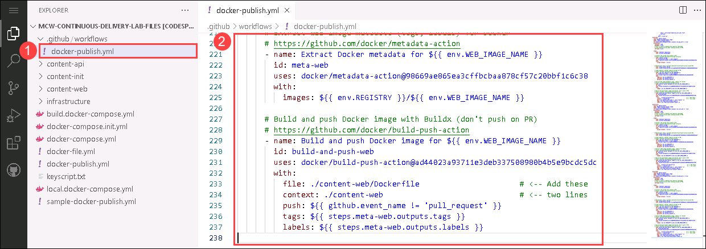
   
1. Using the terminal from codespace, run the following commands to commit this change to your repo and to push the change to GitHub.

   ```pwsh
   git add .
   git commit -m "Updating workflow to update Docker images only when there are changes"
   git push
   ```
   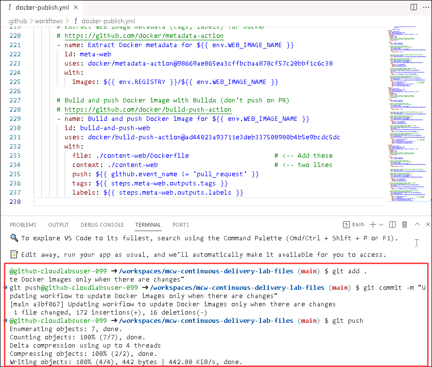
    
   > **Note**: This will update the workflow and will **not** run the "Update the ... Docker image" jobs.

1. Navigate back to the GitHub browser, select the **Actions** ***(1)*** tab and review the **workflow** ***(2)*** created automatically for the changes made. 

   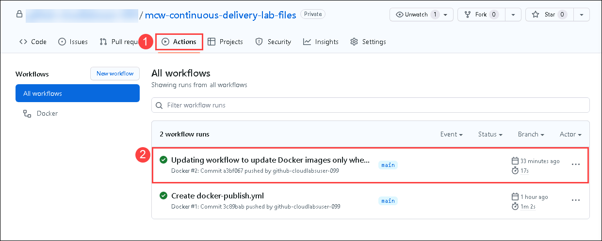

1. Navigate back to codespace browser tab, select **content-api** ***(1)*** folder and open the **DockerFile** ***(2)***. Add the following comment to the top of `Dockerfile` ***(3)***. After updating the file, press CTRL+S to save the file. 

   ```yaml
   # Testing
   ```
   
    
   
1. Using the terminal from codespace, run the following commands to commit this change to your repo and to push the change to GitHub.

   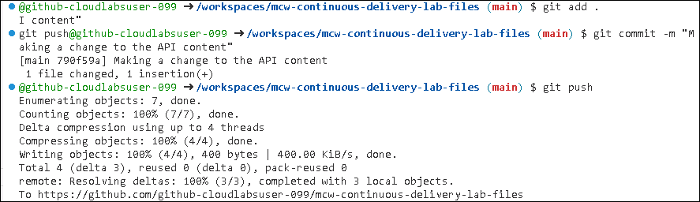 
   
1. Navigate back to GitHub browser, select the **Actions** ***(1)*** tab and review the **workflow** ***(2)***. The workflow will run the "Update the API Docker image" job and skip the other 2 "Update the ... Docker image" jobs.

   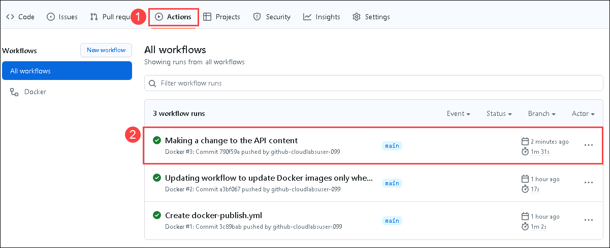 
   
1. Navigate back to codespace browser tab, select **content-api** ***(1)*** folder and open the **DockerFile** ***(2)***. Add the following comment to the top of `Dockerfile` ***(3)***. After updating the file, press CTRL+S to save the file. 

   ```yaml
   # Testing
   ```
   
   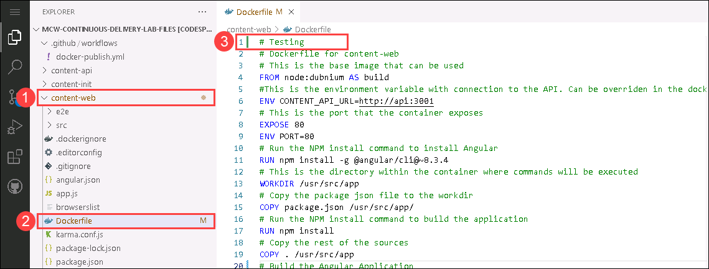 
   
1. Navigate back to codespace browser tab, select **content-init** ***(1)*** folder and open the **DockerFile** ***(2)***. Add the following comment to the top of `Dockerfile` ***(3)***. After updating the file, press CTRL+S to save the file. 

   ```yaml
   # Testing
   ```
   
   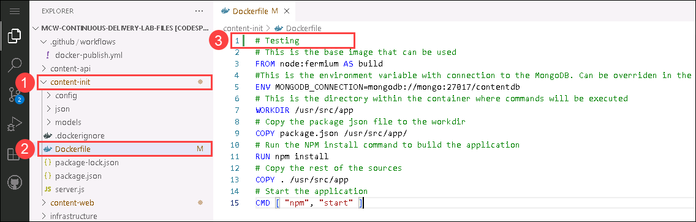
   
1. Using the terminal from codespace, run the following commands to commit this change to your repo and to push the change to GitHub.

   ```pwsh
   git add .
   git commit -m "Updating Web and Init content"
   git push
   ```
   
   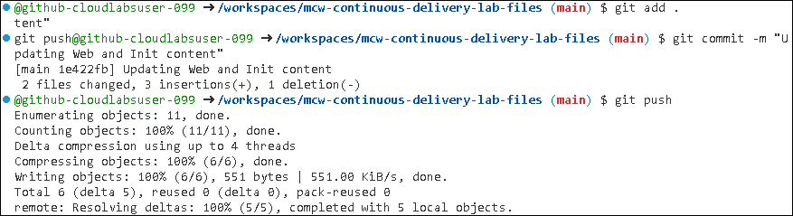
   
1. Navigate back to GitHub browser, select the **Actions** ***(1)*** tab and review the **workflow** ***(2)***. The workflow will run the "Update the Web Docker image" and "Update the Init Docker image" jobs. It will skip the "Update the API Docker image" job.

   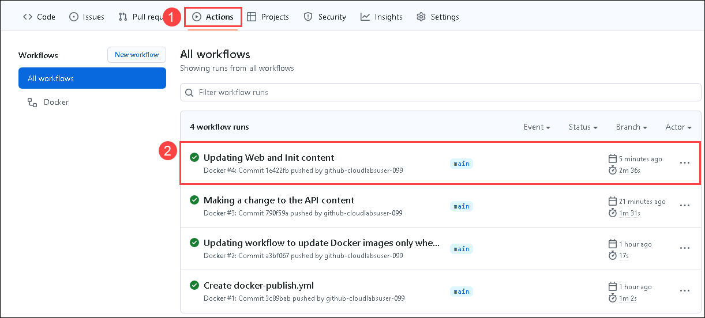 

1. Click on the **Next** button present in the bottom-right corner of this lab guide.
   
   
