## Exercise 4: Azure Boards and Test plans

### Task 1: Connect Azure Board with GitHub

We can automate our project tracking with the Azure Board integration for GitHub. In this task, you will connect your Azure DevOps project's board to your GitHub repository.

1. In your browser open GitHub Marketplace by navigating to the below URL:

    ``` 
    https://github.com/marketplace/azure-boards
    ```

    

1. Scroll to the bottom of the page and select `Install it for Free`.

   
   
1. On the next page, select **Complete order and begin installation**.

1. Select the lab files repository `mcw-continuous-delivery-lab-files` which you created earlier and click on **Install & Authorize**.

   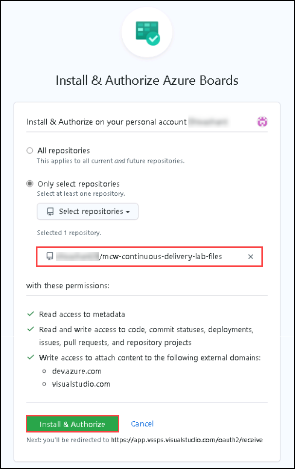
    
   >**Note**: If you see the message **You’ve already purchased this on all of your GitHub accounts** this indicates Azure Boards integration is already used in your account, follow the below steps.
   
   - Scroll to the top of the Azure Boards Marketplace page and select **grant this app access to your GitHub account**.
   
   
   
   - Select the lab files repository `mcw-continuous-delivery-lab-files` which you created earlier and click on **Install & Authorize**.

   
    
1. Select the **aiw-devops** Azure DevOps organization and select the Fabrikam project then click on **Continue**

   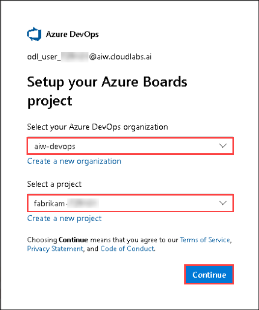

1. When the integration succeeds, you will be taken to the Azure DevOps Board. In the onboarding tutorial click on **Create** to create an initial Issue in the `To Do` Column.

   
    
1. Now click on **Create and link a pull request** to create a pull request associated with your Issue.

   

1. Open the new Issue that the onboarding tutorial creates and observe the GitHub pull request and comments that are linked to the Azure DevOps board Issue.

   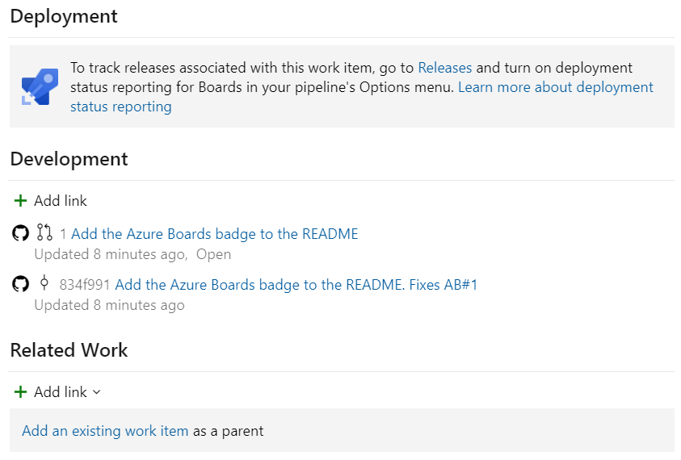

1. In GitHub, browse to the `Pull Requests` tab of the lab files repository created in [Task 1 of the Before the HOL Instructions] and open the pull request that was created in the onboarding tutorial for the Azure Boards Integration App. Note the `AB#1` annotation in the pull request comments - this annotation signals to Azure DevOps that this pull request comment should be linked to Issue #1 in Azure Boards.

   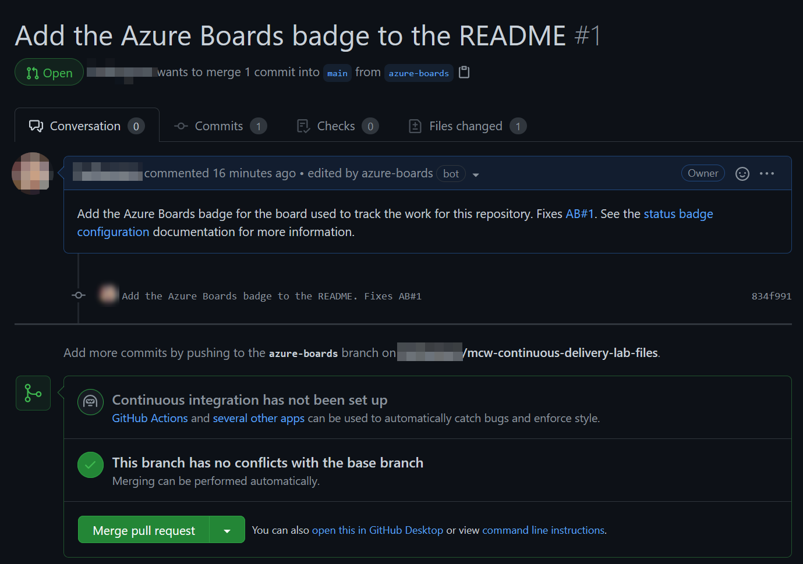

1. Select the `Files changed` tab within the pull request detail and observe the change to the README.md associated with this pull request. After reviewing the changes, go back to the `Conversation` tab and select the `Merge pull request` button and confirm the following prompt to merge the pull request into the `main` branch.

   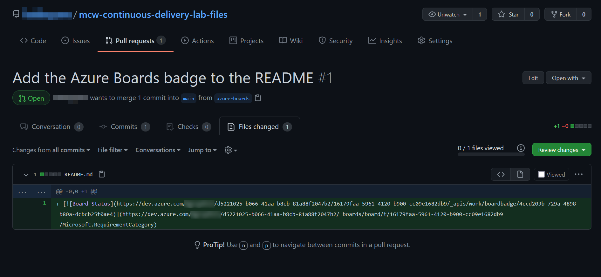

1. In Azure DevOps Boards, find the work item and observe that the issue has been moved to the `Done` column on completion of the pull request.

   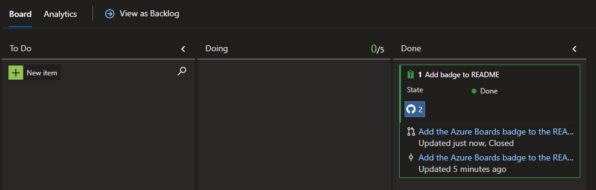
   
### Task 2: Link GitHub Pull requests to Boards items   

1. In Azure Boards tab, Click on **New Item** ***(1)***, provide **Deploy WebApp** as description and create a new work item.

   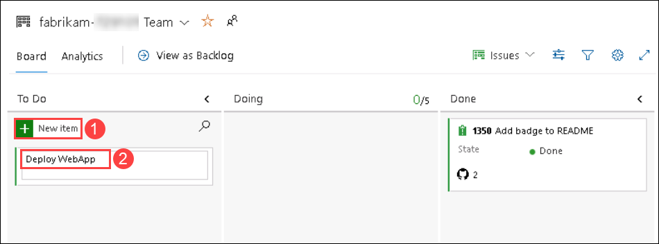
   
1. After creating a work item, Please note down the Work item ID which will be used in the further steps.

   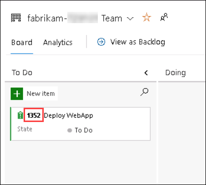
   
 1. Go to Environment details click on **Service principle Credentials** copy **Application id(clientId)** , **clientSecret(secretkey)** , **subscriptionId** and **tenantId** 
    
    
    
    Replace the values that you copied in the below Json.
    ```pwsh
    {
        "clientId": "...",
        "clientSecret": "...",
        "subscriptionId": "...",
        "tenantId": "...",
        "activeDirectoryEndpointUrl": "https://login.microsoftonline.com",
        "resourceManagerEndpointUrl": "https://management.azure.com/",
        "activeDirectoryGraphResourceId": "https://graph.windows.net/",
        "sqlManagementEndpointUrl": "https://management.core.windows.net:8443/",
        "galleryEndpointUrl": "https://gallery.azure.com/",
        "managementEndpointUrl": "https://management.core.windows.net/"
    }
    ```
    
    Copy the complete JSON output to your clipboard.
   
1. In your GitHub lab files repository, select the **Settings** tab from the lab files repository.

   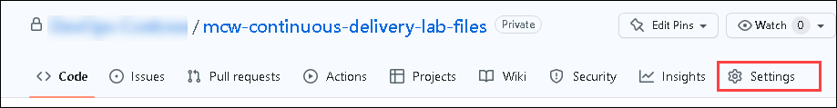
   
1. Under **Security**, expand **Secrets** ***(1)*** by clicking the drop-down and select **Actions** ***(2)*** blade from the left navigation bar. Select the **New repository** ***(3)*** secret` button.

   
   
1. Under **Actions Secrets/New secret** page, enter the below mentioned details and Click on **Add secret** ***(3)***.  

1. Under **Actions Secrets/New secret** page, enter the below mentioned details and Click on **Add secret** ***(3)***.

   - **Name** : Enter **AZURE_CREDENTIALS** ***(1)***
   - **Value** : Paste the **JSON output** ***(2)*** copied in the previous step.

   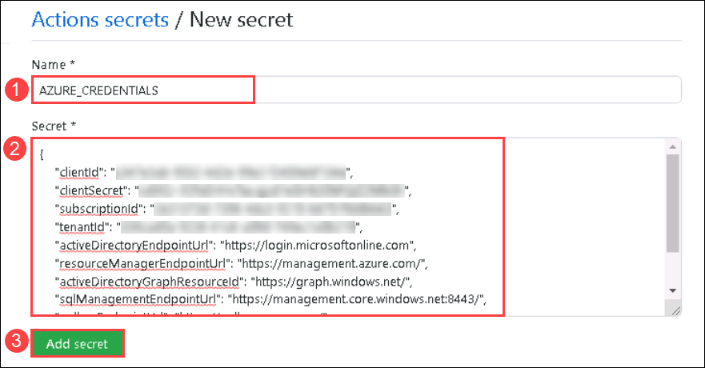
   
1. Select the **Code** ***(1)*** tab in your GitHub repository,  Navigate to **mcw-continuous-delivery-lab-files/.github/workflows/** ***(2)*** and select **docker-publish.yml** ***(3)*** file.

   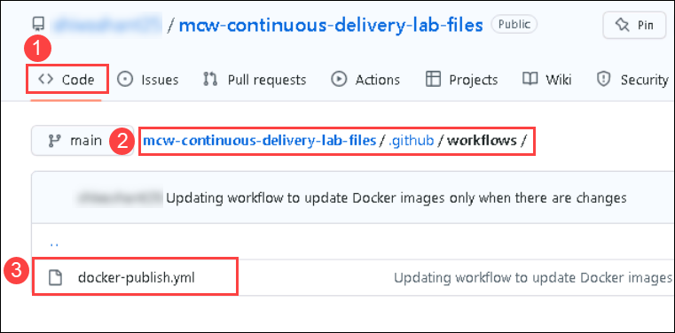
   
1. Copy the code from `https://raw.githubusercontent.com/CloudLabs-MCW/MCW-Continuous-delivery-in-Azure-DevOps/microsoft-devops-with-github-v2/Hands-on%20lab/docker-flow.yml` ***(1)*** link and paste it in the end of the file. Make sure there are no identation errors.

   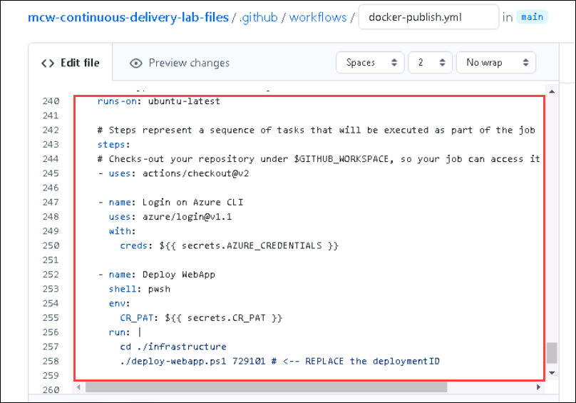
   
1. Click on **Start commit** ***(1)***, provide the details mentioned below and click on **Propose changes** ***(5)***.

   - Provide `workitem ID Updated` ***(2)*** as title. Make sure provide the same **Workitem ID** which was created in earlier step in Azure DevOps.
   - Select **Create a new branch for this commit and start a pull request** ***(3)***  and name new branch as **deploy webapp** ***(4)***.

   
   
1. On Open a pull request tab, Click on **Create pull request** 

   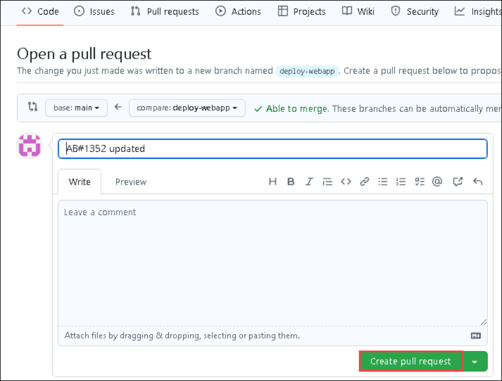
   
1. Navigate to **Azure Boards**. Open the **workitem** ***(1)*** created in earlier step.

   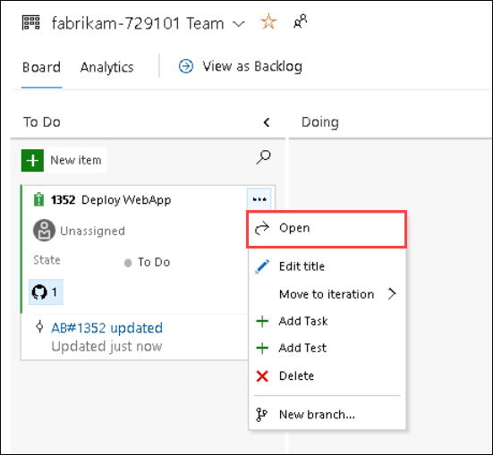

1. Observe that the **Pull request** has been linked to the workitem.

   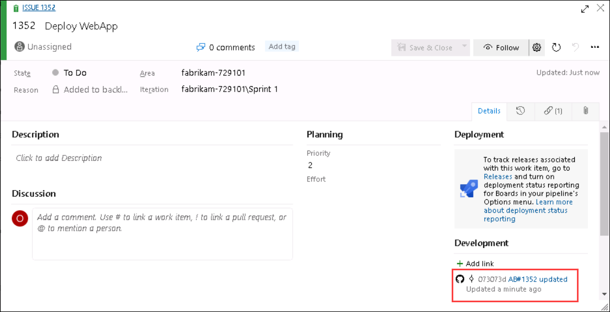
   
1.  Navigate back to GitHub browser tab and select **Pull requests** tab.

   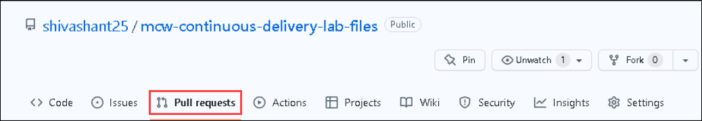
   
1. Open the PR created from **deploy-webapp** branch and select **Merge pull request**.

   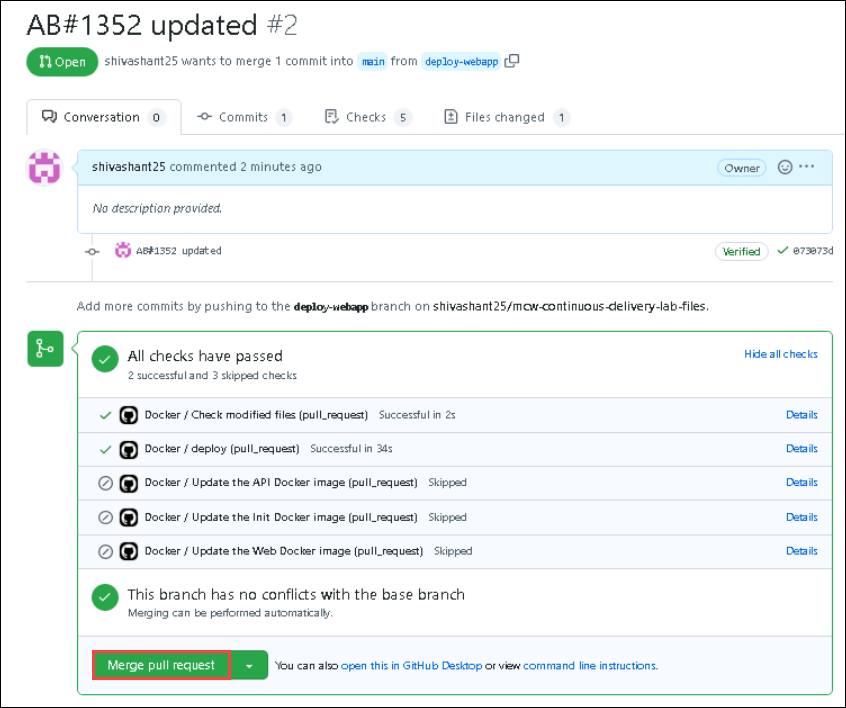
   
1. Update the desciption as **fixed AB#{workitemID} updated** and select **confirm merge**.

   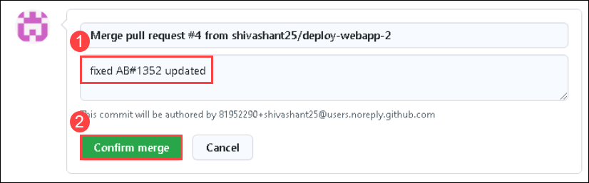
   
1. Navigate back Azure Boards tab and notice that the **workitem** has been marked as **done**.

   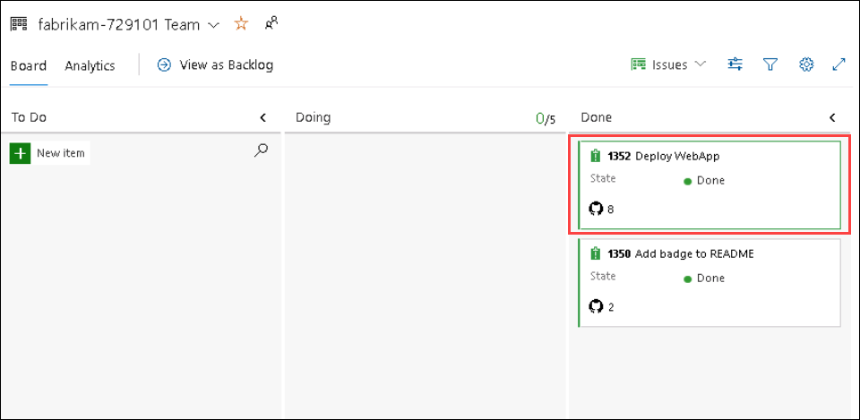
   
   
