# Exercise 3: Azure Boards and Test plans

Duration: 60 minutes

In this exercise, you'll explore Azure boards and Azure test plans. Azure Boards provides software development teams with the interactive and customizable tools they need to manage their software projects. Azure Test Plans provides rich and powerful tools everyone in the team can use to drive quality and collaboration throughout the development process. The easy-to-use, browser-based test management solution provides all the capabilities required for planned manual testing.

### Task 1: Connect Azure Board with GitHub

In this task, you will connect your Azure DevOps project's board to your GitHub repository using the Azure Boards app for GitHub to support the integration between Azure Boards and GitHub. This app is free for both public and private repositories. You'll also explore work items. 

1. In your browser open GitHub Marketplace by navigating to the below URL:

    ``` 
    https://github.com/marketplace/azure-boards
    ```

    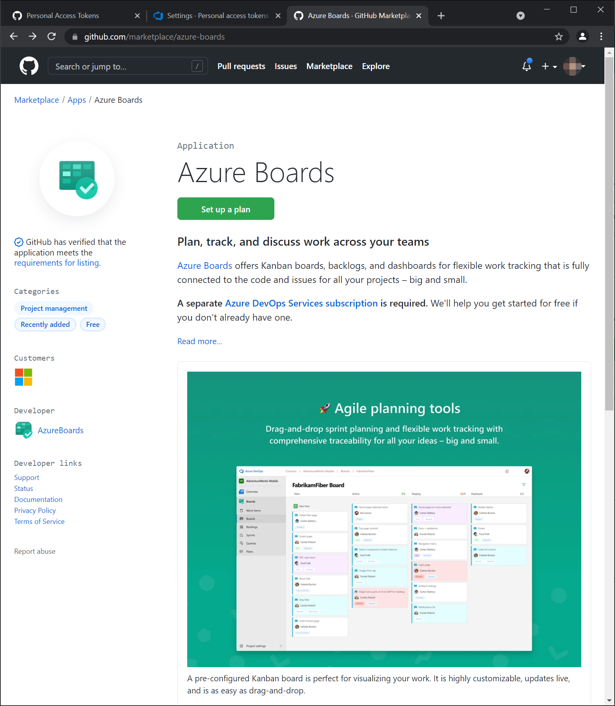

1. Scroll to the bottom of the page and select `Install it for Free.`

   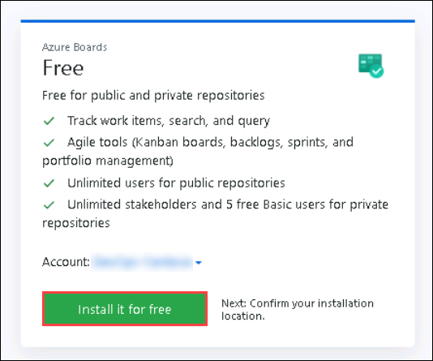
   
1. On the next page, select **Complete order and begin installation**.

1. Select the lab files repository `aiw-devops-with-github-lab-files` which you created earlier and click on **Install & Authorize**.

   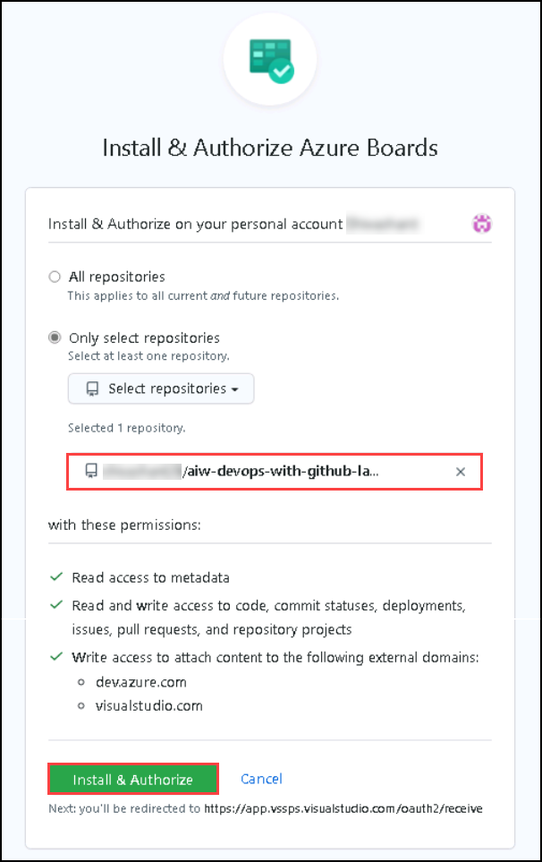
    
   >**Note**: If you see the message **You’ve already purchased this on all of your GitHub accounts** this indicates Azure Boards integration is already used in your account, follow the below steps.
   
   - Scroll to the top of the Azure Boards Marketplace page and select **grant this app access to your GitHub account**.
   
   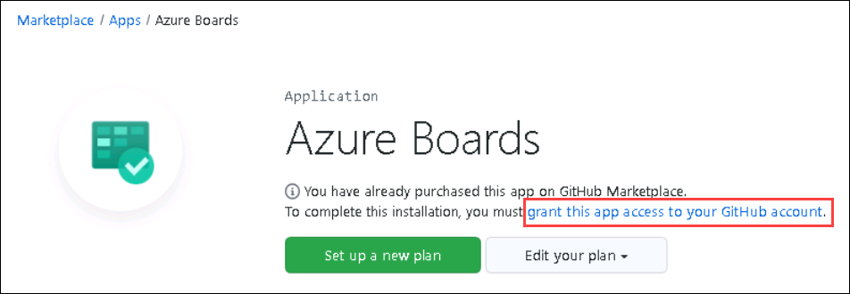
   
   - Select the lab files repository `aiw-devops-with-github-lab-files` which you created earlier and click on **Install & Authorize**.

   

   - Select the cloudlabs **Email** <inject key="AzureAdUserEmail"></inject>
     
   - Now enter the password and **click** on **Sign in**.

    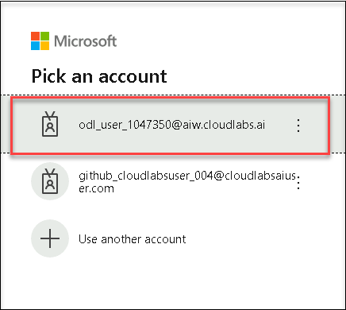.
    
1. Select the **aiw-devops (1)** Azure DevOps organization and select the **Contosotraders (2)** project then click on **Continue (3)**

   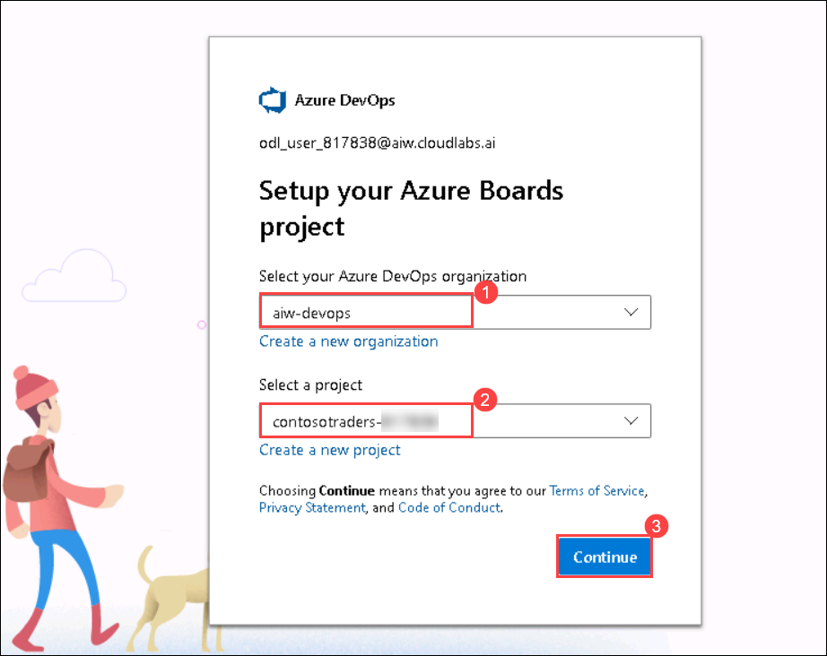

1. When the integration succeeds, you will be taken to the Azure DevOps Board. In the onboarding tutorial click on **Create** to create an initial Issue in the `To Do` Column.

    >**Note**: Make sure to reduce the screen resolution in your browser window if you are not able to view the **Create** and **Create and link a pull request** options in the onboarding tutorial page.

   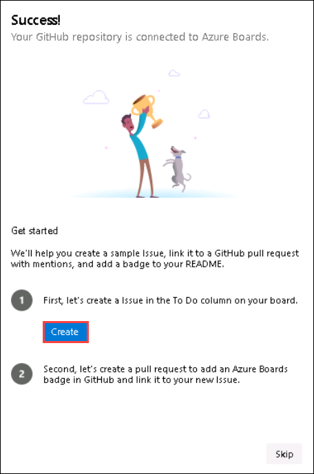
    
1. Now click on **Create and link a pull request** to create a pull request associated with your Issue.

   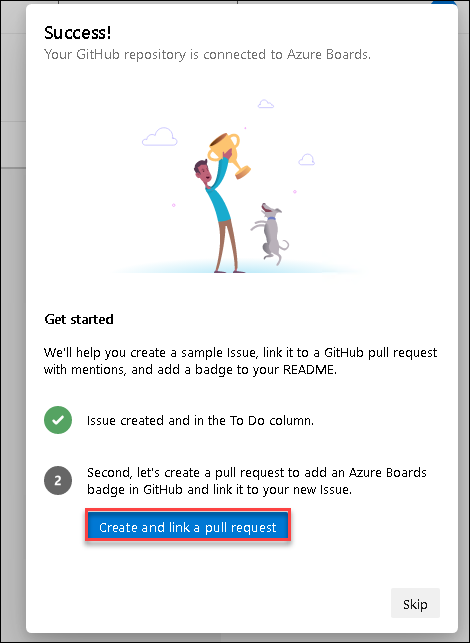

1. Click on **View work item**.


   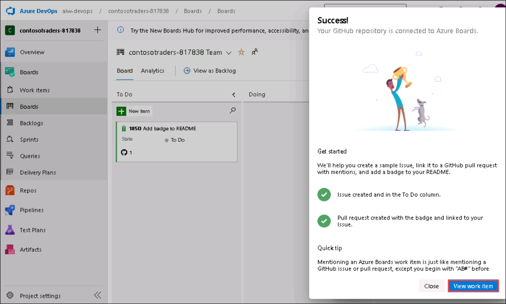
   
3. Open the new Issue that the onboarding tutorial creates and observe the GitHub pull request and comments that are linked to the Azure DevOps board Issue.

   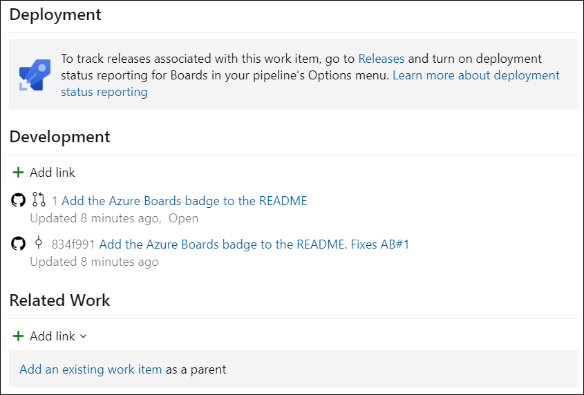

1. In GitHub, browse to the `Pull Requests` tab of the lab files repository created in [Task 1 of the Before the HOL Instructions] and open the pull request that was created in the onboarding tutorial for the Azure Boards Integration App. Note the `AB#1` annotation in the pull request comments - this annotation signals to Azure DevOps that this pull request comment should be linked to Issue #1 in Azure Boards.

   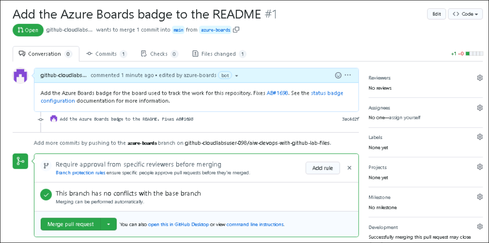

1. Select the `Files changed` tab within the pull request detail and observe the change to the README.md associated with this pull request. After reviewing the changes, go back to the `Conversation` tab and select the `Merge pull request` button and confirm the following prompt to merge the pull request into the `main` branch.

   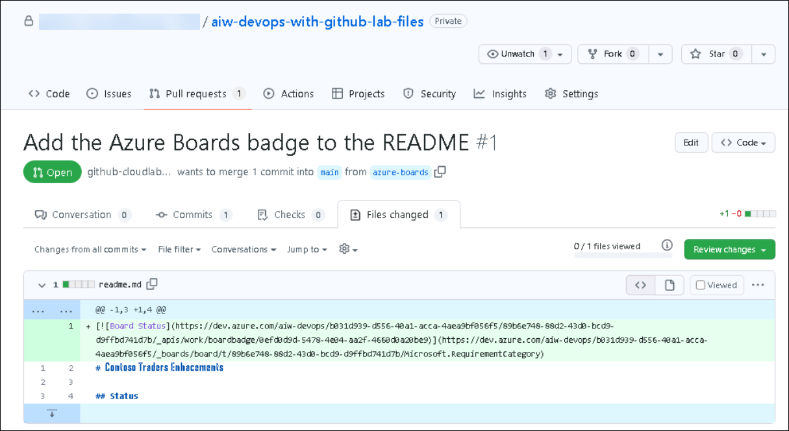

1. In Azure DevOps Boards, find the work item and observe that the issue has been moved to the `Done` column on completion of the pull request.

   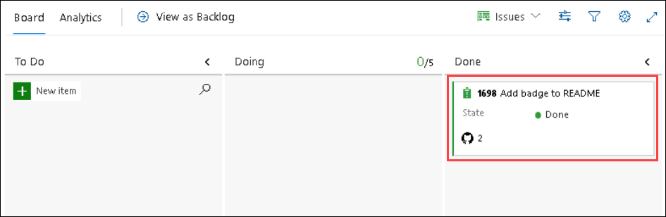
   
### Task 2: Link GitHub Pull requests to Boards items

In this task, you'll make changes in GitHub and link a PR to Azure boards using syntax and monitor the work item.

1. In the Azure Boards tab, click on **New Item** ***(1)***, provide **Update carts** **(2)** as a description and create a new work item.

   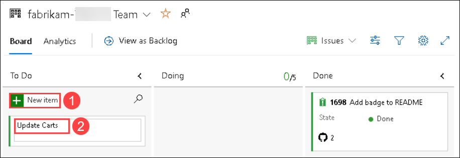
   
1. After creating a work item, Please note down the Work item ID which will be used in the further steps.

   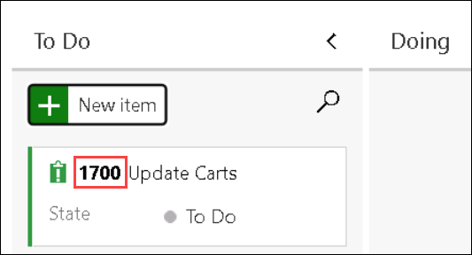
   
1. Select the **Code** ***(1)*** tab in your GitHub repository, navigate to **aiw-devops-with-github-lab-files/.github/workflows/** ***(2)*** and select **contoso-traders-provisioning-deployment.yml** ***(3)*** file.

   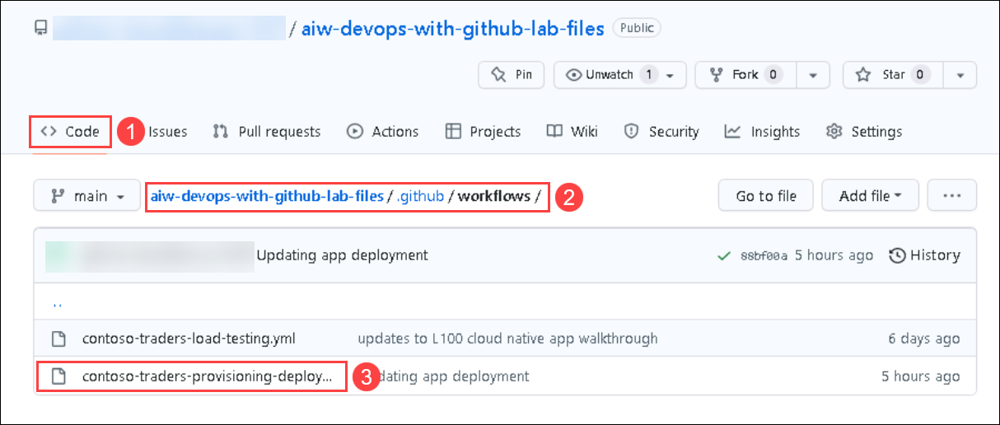
   
1. Copy `#test azure boards` code and paste it in line number 1 of the file. Make sure there are no indentation errors.

   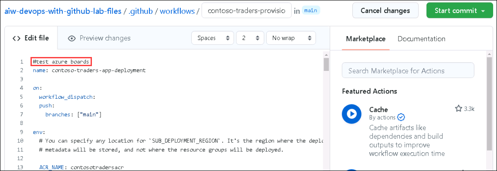
   
1. Click on **Commit Changes** ***(1)***, provide the details mentioned below and click on **Propose changes** ***(5)***.

   - Provide `workitem ID Updated` ***(2)*** as title. Make sure to provide the same **Work item ID** which was created in the earlier step in Azure DevOps.
   - Select **Create a new branch for this commit and start a pull request** ***(3)***  and name new branch as **update carts** ***(4)***.

   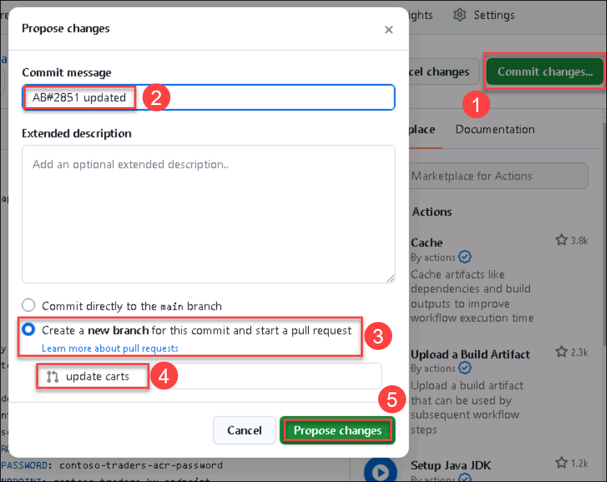
   
1. On Open a pull request tab, Click on **Create pull request** 

   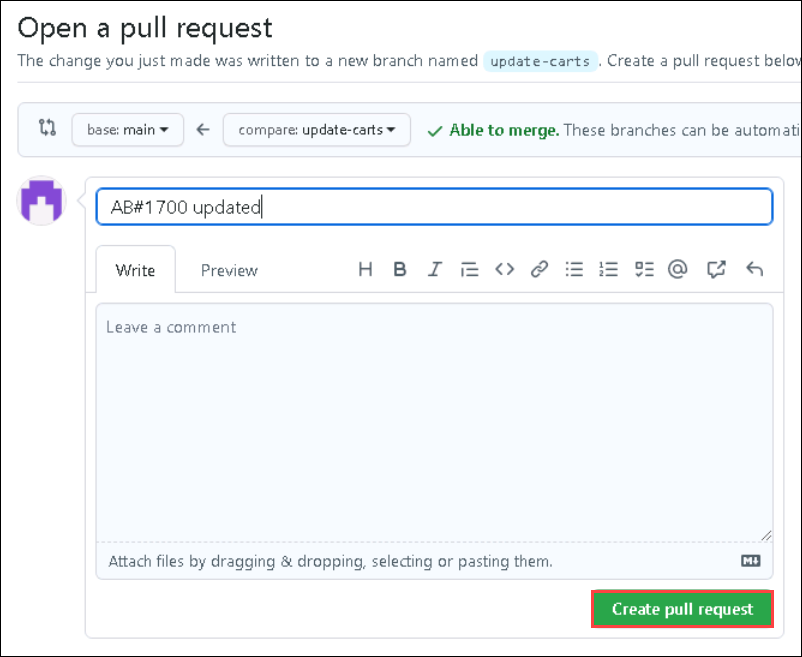
   
1. Navigate to **Azure Boards**. Open the **work item** ***(1)*** created in earlier step.

   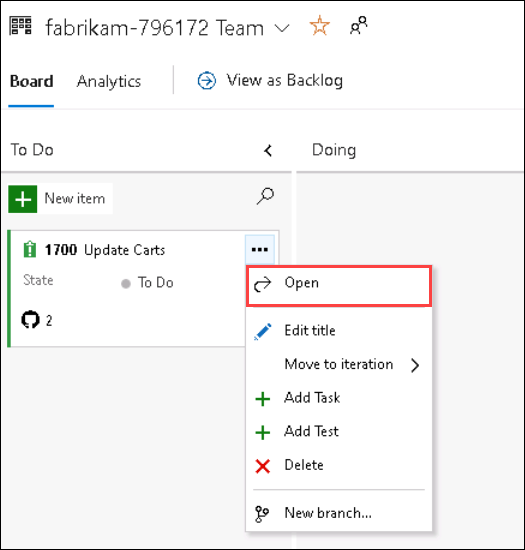

1. Observe that the **Pull request** has been linked to the workitem.

   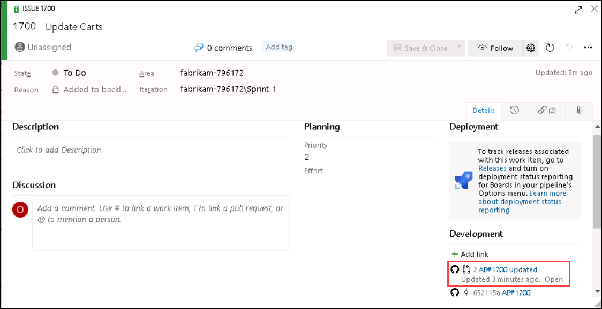
   
1. Navigate back to GitHub browser tab and select **Pull requests** tab.

   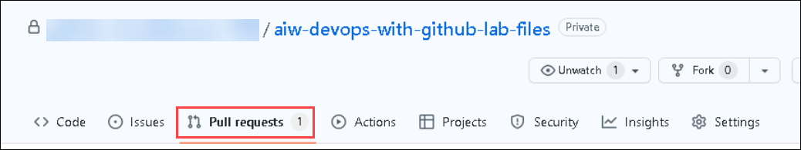
   
1. Open the PR created from **updated carts** branch and select **Merge pull request**.

   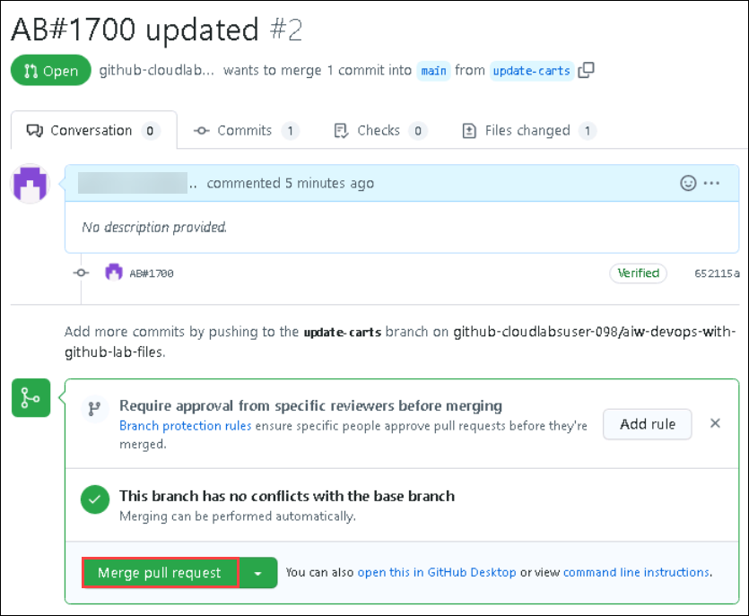
   
1. Update the description as **fixed AB#{workitemID} updated** and select **confirm merge**.

   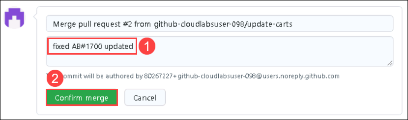
   
1. Navigate back Azure Boards tab and notice that the **work item** has been marked as **done**.

   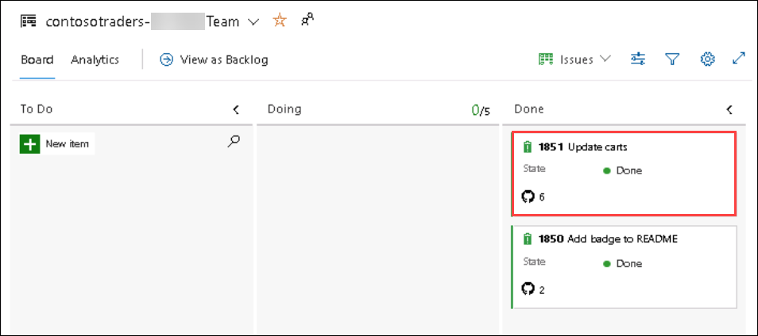
   
## Task 3: Configure Azure Test plan

In this task, you'll set up an Azure test plan and perform manual testing for the application.

1. From the Azure DevOps tab, select **Test plans** from the side blade.

   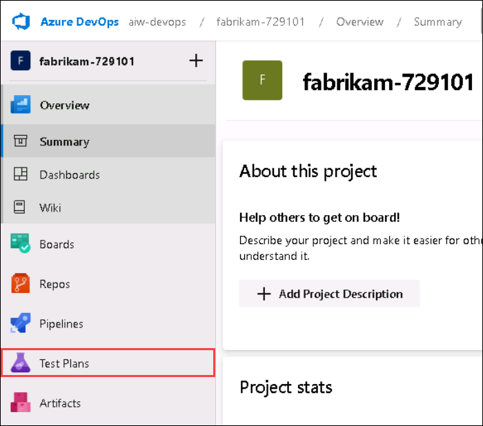
   
1. From the Test plans tab, click on **+ New Test Plan**

   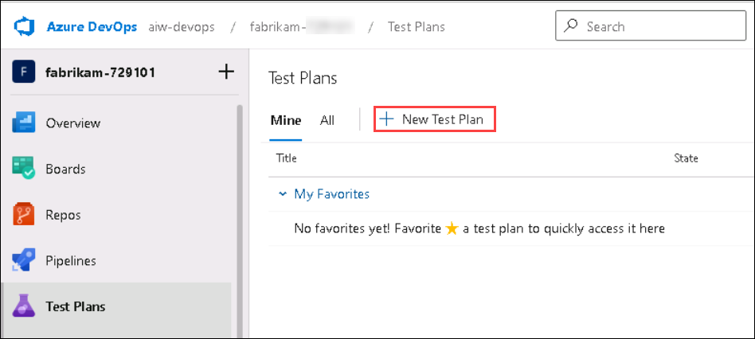
   
1. In the New Test Plan tab, provide the following details and click on **Create** ***(4)***.

   - Name: **TestPlan-<inject key="DeploymentID" enableCopy="false" />** ***(1)***
   - Area Path: **contosotraders-<inject key="DeploymentID" enableCopy="false" />** ***(2)***
   - Iteration: Leave it to **deafault** ***(3)***
   
      
   
1. From contosotraders-<inject key="DeploymentID" enableCopy="false" /> test plan tab, select **more options** ***(1)*** button, hover over **New Suite** ***(2)***, and select **Static suite** ***(3)***.

   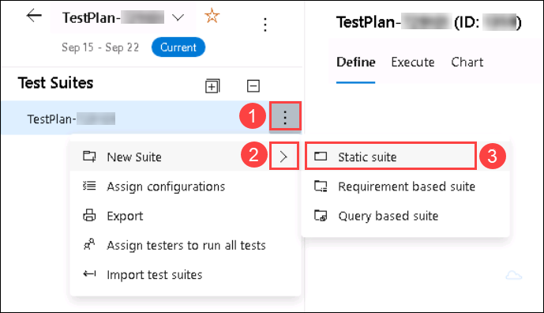   

1. Create a new suite as **TestSuite-<inject key="DeploymentID" enableCopy="false" />**.

   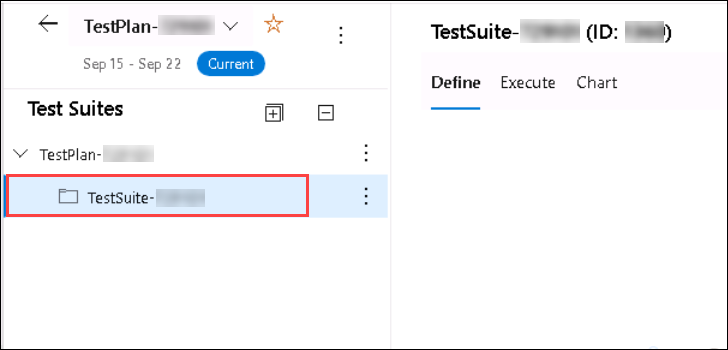  
   
1. From the Test plans tab, click on **New Test case**.

   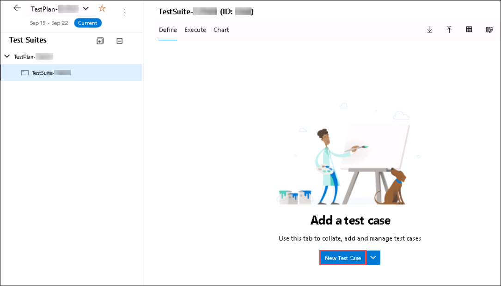    
   
1. In the New Test Case pop-up, provide the following details and click on **Save & Close** ***(10)***

   - Name: **Validate the web app** ***(1)***
   - Steps:
     - 1. Actions: **Access the Contoso Traders app** ***(2)*** Expected result: **Succeeded** ***(3)***          
     - 2. Actions: **Access the Laptop page** ***(4)*** Expected result: **Succeeded** ***(5)***  
     - 3. Actions: **Access the Controllers page** ***(6)*** Expected result: **Succeeded** ***(7)***
     - 4. Actions: **Access the Desktop page** ***(8)*** Expected result: **Succeeded** ***(9)***

   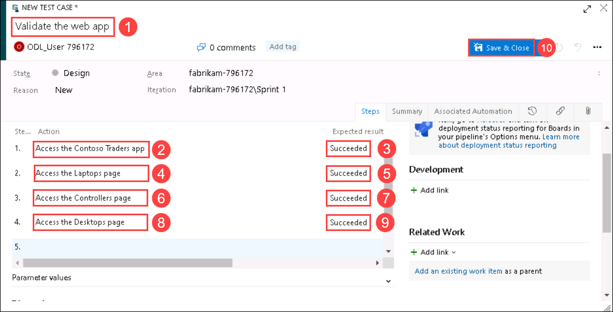 

1. From the Test plans tab, navigate to **Execute** ***(1)*** tab, select the **validate the web app** ***(2)*** test point and click on **Run for web app** ***(3)***.

   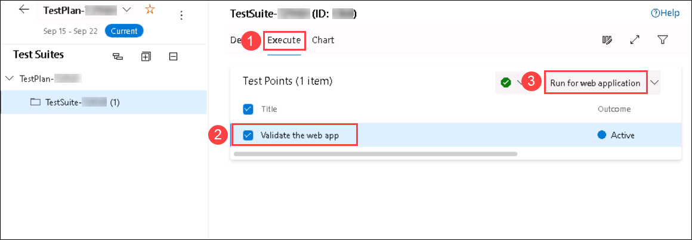
   
1. A web-based runner will be opened. Manual testing of the web app can performed. Keep this page open, we will use the runner in upcoming steps.

   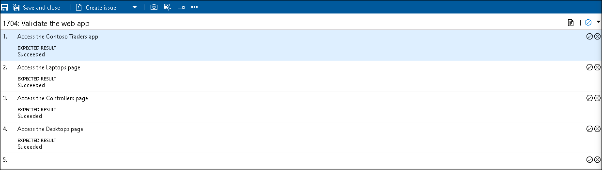
   
1. Navigate to Azure Portal, click on Resource groups from the Navigate panel to see the resource groups.

    
   
1. Select **contoso-traders-<inject key="DeploymentID" enableCopy="false" />** resource group from the list.

   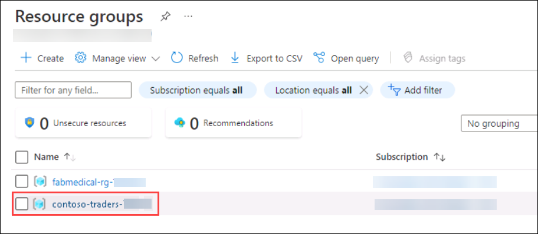   
   
1. Select **contoso-traders-ui2<inject key="DeploymentID" enableCopy="false" />** endpoint from the list of resources.

   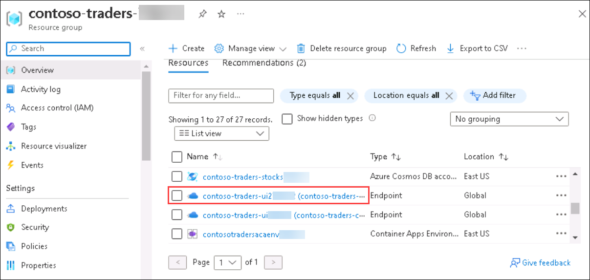   
   
1. Click on **Endpoint hostname**. It'll open a browser tab where you will be visual that the contoso traders app has been hosted successfully.

      

1. Verify the availability of the web app, Laptops page, Controllers page, and Desktops page. Simultaneously using the runner page, perform the testing by marking the steps according to the availability of the web pages and click on **Save & close** ***(1)***.

   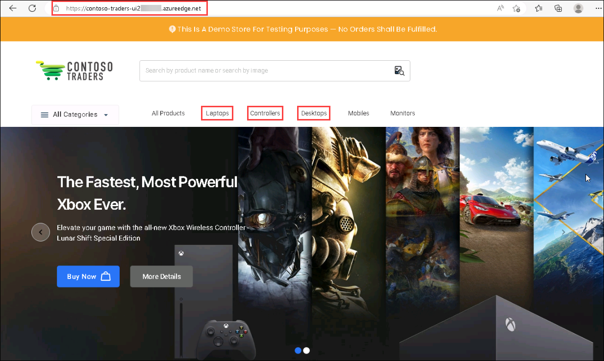
   
   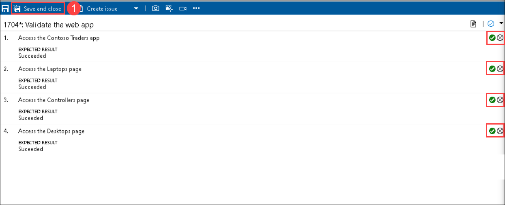   
   
1. From the execute tab, Verify the **outcome** of the manual testing. The outcome will be in a passed state if the web app worked as expected and vice versa.

   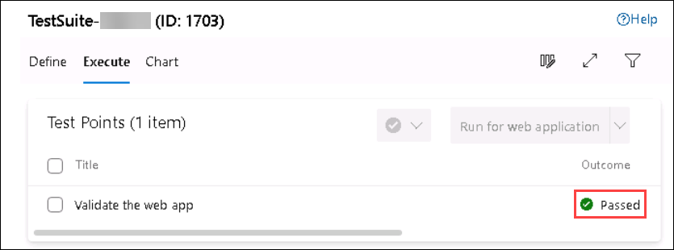
   
1. Navigate to **chart** ***(1)***, click on **+ New** ***(2)*** and select **+ New test case chart** ***(3)***.

   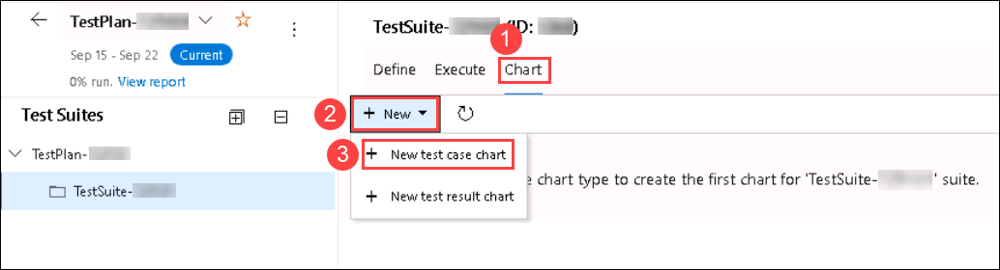
   
1. In the Configure chart pop up, select **Bar** ***(1)*** as chart type, **Activated By** ***(2)*** for Group by option, and click on **OK** ***(3)***.

   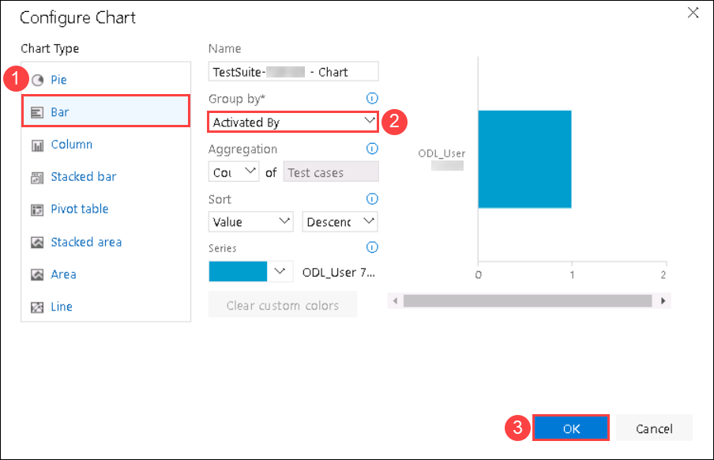              
   
1. You'll be able to visualize the chart. You can explore more by making changes in the chart, and by running multiple test cycles.

   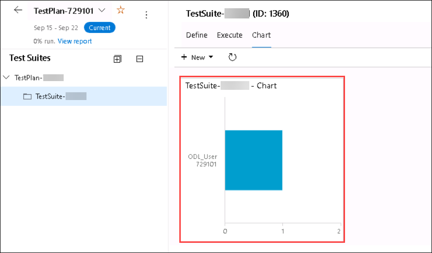      

1. Click on the **Next** button present in the bottom-right corner of this lab guide.

## Summary

In this exercise, you explored the features of Azure boards and configured Azure Test plans for the application.
