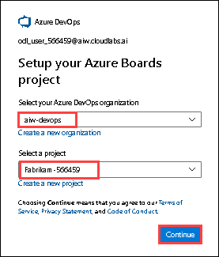
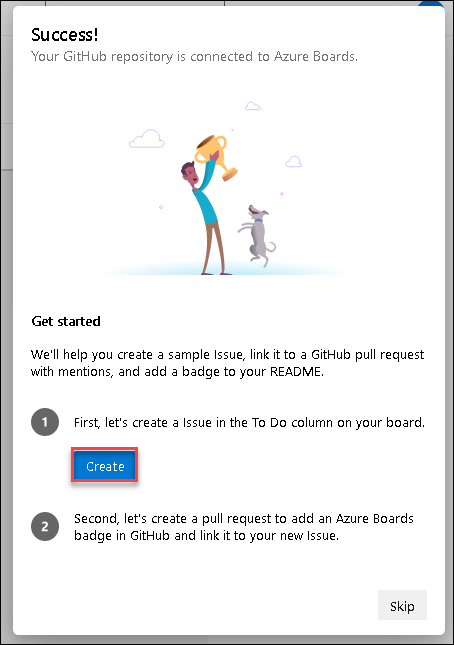

## Exercise 4: Azure Boards and Test plans

### Task 1: Connect Azure Board with GitHub

We can automate our project tracking with the Azure Board integration for GitHub. In this task, you will connect your Azure DevOps project's board to your GitHub repository.

1. In your browser open GitHub Marketplace by navigating to the below URL:

    ``` 
    https://github.com/marketplace/azure-boards
    ```

    

1. Scroll to the bottom of the page and select `Install it for Free`.

   
   
1. On the next page, select **Complete order and begin installation**.

4. Select the lab files repository `mcw-continuous-delivery-lab-files` which you created earlier and click on **Install & Authorize**.

   
    
   >**Note**: If you see the message **You’ve already purchased this on all of your GitHub accounts** this indicates Azure Boards integration is already used in your account, follow the below steps.
   
   - Scroll to the top of the Azure Boards Marketplace page and select **grant this app access to your GitHub account**.
   
   
   
   - Select the lab files repository `mcw-continuous-delivery-lab-files` which you created earlier and click on **Install & Authorize**.

   
    
5. Select the **aiw-devops** Azure DevOps organization and select the Fabrikam project then click on **Continue**

    

6. When the integration succeeds, you will be taken to the Azure DevOps Board. In the onboarding tutorial click on **Create** to create an initial Issue in the `To Do` Column.

    
    
7. Now click on **Create and link a pull request** to create a pull request associated with your Issue.

    

8. Open the new Issue that the onboarding tutorial creates and observe the GitHub pull request and comments that are linked to the Azure DevOps board Issue.

    

9. In GitHub, browse to the `Pull Requests` tab of the lab files repository created in [Task 1 of the Before the HOL Instructions] and open the pull request that was created in the onboarding tutorial for the Azure Boards Integration App. Note the `AB#1` annotation in the pull request comments - this annotation signals to Azure DevOps that this pull request comment should be linked to Issue #1 in Azure Boards.

    

10. Select the `Files changed` tab within the pull request detail and observe the change to the README.md associated with this pull request. After reviewing the changes, go back to the `Conversation` tab and select the `Merge pull request` button and confirm the following prompt to merge the pull request into the `main` branch.

    

11. In Azure DevOps Boards, find the work item and observe that the issue has been moved to the `Done` column on completion of the pull request.

    
