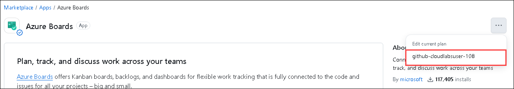
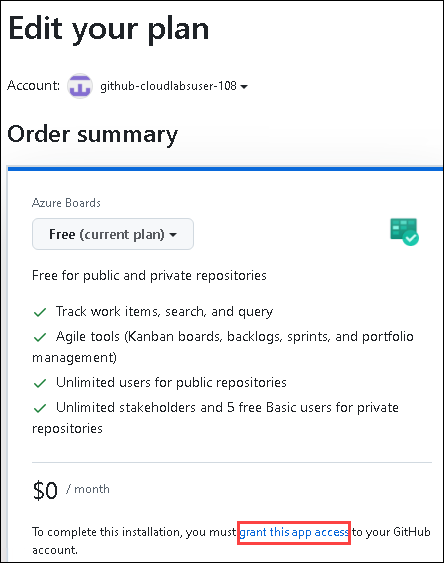
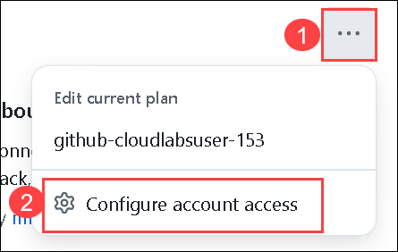
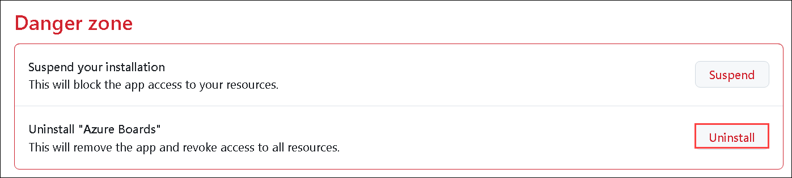
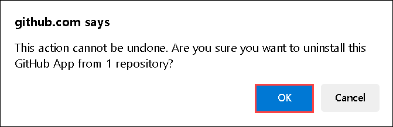

# Exercise 3: Azure Boards and Test Plans

### Estimated Duration: 100 minutes

In this exercise, you'll explore Azure boards and Azure test plans. Azure Boards provides software development teams with the interactive and customizable tools they need to manage their software projects. Azure Test Plans provides rich and powerful tools everyone in the team can use to drive quality and collaboration throughout the development process. The easy-to-use, browser-based test management solution provides all the capabilities required for planned manual testing.

## Lab Objectives

In this lab, you will perform:

- Task 1: Connect Azure Board with GitHub
- Task 2: Link GitHub Pull requests to Boards items
- Task 3: Configure Azure Test plan

## Task 1: Connect Azure Board with GitHub

In this task, you will connect your Azure DevOps project's board to your GitHub repository using the Azure Boards app for GitHub to support the integration between Azure Boards and GitHub. This app is free for both public and private repositories. You'll also explore work items.

1. In your browser open GitHub Marketplace by navigating to the below URL:

   ```
   https://github.com/marketplace/azure-boards
   ```

   

1. Scroll to the bottom of the page and select `Install it for Free.`

   

1. In review your order page enter the billing information and click on **save**

   > **Note:** If the **Install it for free** button is greyed out  with the message **You’ve already purchased this on all of your GitHub accounts** this indicates Azure Boards integration is already used in your account, follow the below steps and please proceed from step number 4.

     - Scroll to the top of the Azure Boards Marketplace page and click on the elipsis and select the github user.

         

     - Click on **grant this app access**.

         

     - Select the lab files repository `aiw-devops-with-github-lab-files` which you created earlier and click on **Install & Authorize**.

         

     - Copy the URL of the Azure Devops URL and navigate to the **IN-PRIVATE** window.

   - Select the cloudlabs **Email** <inject key="AzureAdUserEmail"></inject>
   - Now enter the password and **click** on **Sign in**.

        

1. On the next page, select **Complete order and begin installation**.

   >**Note :** If Azure Boards is already installed, follow the below steps to uninstall it.

   - Click on the **... (ellipse) (1)** from top right corner and select **Configure account access (2)**

     
   
   - On the Applications pane in the Installed Github Apps tab click on **Configure** for Azure Boards.

     

   - Scroll down and click on **Uninstall** for **Uninstall 'Azure Boards'** under Danger zone.

     

   - On the github.com says pop-up click on **OK**

     

   - Now navigate back to `https://github.com/marketplace/azure-boards` and click on **Install** under **Plans and pricing**

1. Select the lab files repository `aiw-devops-with-github-lab-files` which you created earlier and click on **Install & Authorize**.

   

1. Select the **aiw-devops (1)** Azure DevOps organization and select the **Contosotraders-<inject key="DeploymentID" enableCopy="false" /> (2)** project then click  on **Continue (3)**.

   

## Task 2: Link GitHub Pull requests to Boards items

In this task, you'll make changes in GitHub link a PR to Azure boards using syntax, and monitor the work item.

1. In the Azure Boards tab, click on **New Item** **_(1)_**, provide **Update carts** **(2)** as a description and create a new work item by hitting **enter**.

   

1. After creating a work item, Please note down the Work item ID which will be used in the further steps.

   

1. Select the **Code** **(1)** tab in your GitHub repository, navigate to **aiw-devops-with-github-lab-files/.github/workflows/** **(2)** and select **contoso-traders-provisioning-deployment.yml** **(3)** file.

   

1. Copy `#test azure boards` code and paste it into line number 1 of the file. Make sure there are no indentation errors.

   

1. Click on **Commit Changes** **(1)**, provide the details mentioned below and click on **Propose changes** **(5)**.

   - Provide `workitem ID Updated` **(2)** as title. Make sure to provide the same **Work item ID** that was created in the earlier step in Azure DevOps.
   - Select **Create a new branch for this commit and start a pull request** **(3)** and name the new branch as **update carts** **(4)**.

     

1. On Open a pull request tab, Click on **Create pull request**

   

1. Navigate to **Azure Boards**. Open the **work item** **(1)** created in the earlier step.

   

1. Navigate back to the GitHub browser tab and select **Pull requests** tab.

   

1. Open the PR created from **updated carts** branch and select **Merge pull request**.

   

1. Update the description as **AB#{workitemID} updated** and select **confirm merge**.

   

1. Navigate back Azure Boards tab and notice that the **work item** has been marked as **done**.

   

## Task 3: Configure Azure Test plan

In this task, you'll set up an Azure test plan and perform manual testing for the application.

1. From the Azure DevOps tab, select **Test plans** from the side blade.

   

1. From the Test plans tab, click on **+ New Test Plan**

   

1. In the New Test Plan tab, provide the following details and click on **Create** **(4)**.

   - Name: **TestPlan-<inject key="DeploymentID" enableCopy="false" />** **(1)**
   - Area Path: **contosotraders-<inject key="DeploymentID" enableCopy="false" />** **(2)**
   - Iteration: Leave it to **default** **(3)**

     

1. From contosotraders-<inject key="DeploymentID" enableCopy="false" /> test plan tab, select **more options** **(1)** button, hover over **New Suite** **(2)**, and select **Static suite** **(3)**.

   

1. Create a new suite as **TestSuite-<inject key="DeploymentID" enableCopy="false" />**.

   

1. From the Test plans tab, click on **New Test case**.

   

1. In the New Test Case pop-up, provide the following details and click on **Save & Close** **(10)**

   - Name: **Validate the web app** **(1)**
   - Steps:
     - 1. Actions: **Access the Contoso Traders app** **(2)** Expected result: **Succeeded** **(3)**
     - 2. Actions: **Access the Laptop page** **(4)** Expected result: **Succeeded** **(5)**
     - 3. Actions: **Access the Controllers page** **(6)** Expected result: **Succeeded** **(7)**
     - 4. Actions: **Access the Desktop page** **(8)** Expected result: **Succeeded** **(9)**

     

1. From the Test plans tab, navigate to **Execute** **(1)** tab, select the **validate the web app** **(2)** test point and click on **Run for web application** **(3)**.

   

1. A web-based runner will be opened. Manual testing of the web app can be performed. Keep this page open, we will use the runner in upcoming steps.

   

1. Navigate to Azure Portal, and click on Resource groups from the Navigate panel to see the resource groups.

   

1. Select **contoso-traders-<inject key="DeploymentID" enableCopy="false" />** resource group from the list.

   

1. Select **contoso-traders-ui2<inject key="DeploymentID" enableCopy="false" />** endpoint from the list of resources.

   

1. Click on **Endpoint hostname**. It'll open a browser tab where you will be visual that the contoso traders app has been hosted successfully.

   

1. Verify the availability of the web app, Laptops page, Controllers page, and Desktops page. Simultaneously using the runner page, perform the testing by marking the steps according to the availability of the web pages and click on **Save & close** **(1)**.

   

   

1. From the execute tab, Verify the **outcome** of the manual testing. The outcome will be in a passed state if the web app worked as expected and vice versa.

   

1. Navigate to **chart** **(1)**, click on **+ New** **(2)** and select **+ New test case chart** **(3)**.

   

1. In the Configure chart pop up, select **Bar** **(1)** as chart type, **Activated By** **(2)** for Group by option, and click on **OK** **(3)**.

   

1. You'll be able to visualize the chart. You can explore more by making changes in the chart, and by running multiple test cycles.

   

>**Congratulations** on completing the Task! Now, it's time to validate it. Here are the steps:
 > - Hit the Validate button for the corresponding task. If you receive a success message, you have successfully validated the lab. 
 > - If not, carefully read the error message and retry the step, following the instructions in the lab guide.
 > - If you need any assistance, please contact us at cloudlabs-support@spektrasystems.com.

   <validation step="33638c78-3fac-4987-accd-3df1a2e578f2" />

## Summary

In this exercise, you explored the features of Azure boards and configured Azure Test plans for the application.

### You have successfully completed the lab!
