# Exercise 3: Explore GitHub advance security features 

Duration 60 minutes

Once the Fabrikamk Medical Conferences developer workflow has been deployed, we can apply the github advance security features.

## Task 1:
**Help references**


## Task 2: Enabling Github Dependabot 

## Task 3: Enabling Codescanning and CodeQL alerts 

What is codescanning? 
Code scanning is a feature that you use to analyze the code in a GitHub repository to find security vulnerabilities and coding errors. Any problems identified by the analysis are shown in GitHub.

1. Make sure your repository is public

   **Note:** If the repository visibility is private, go to the settings of the repository and change the visibility to public.
   
1. Go to seetings tab of the repository, then under security tab select code security and analysis.
   Click on Setup button of the code scanning. 

   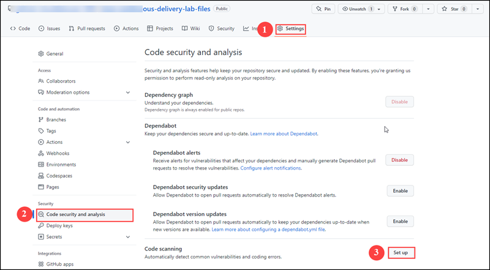
   

1. By reaching into Codescanning pane under security tab, click on configure codeQL alerts.


   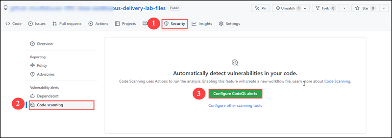
   
  
1. It will generate a workflow codeql-analysis.yml. Review the yml file, you can find how many languages supported by codeQL and click on Start Commit, then click on      commit new file
  
  
   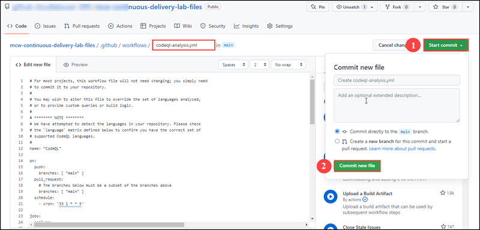
  
  
  
      **Note** For most projects, this workflow file will not need changing; you simply need to commit it to your repository. You may wish to alter this file to             override the set of languages analyzed or to provide custom queries or build logic.
  
  1. Under Actions tab you can see the workflow committed successfully.
    
      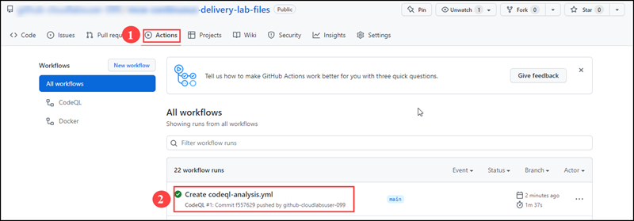
  
  
1. Go to Codescanning under security tab you can see code scanning alerts enabled. Click on View alerts
   
   
    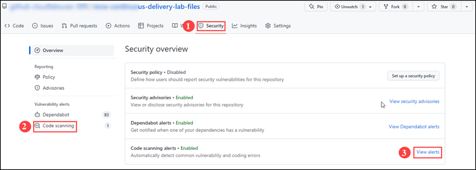
    
    
 1. Click on the Missing rate Limiting alert and find on which line the alert showing, it will be on 73 line of the App.js file.


    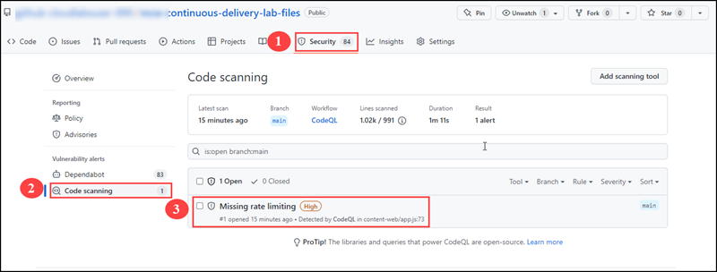
    
    Under security tab you can see the Missing rate Limiting in App.js file under Content-web folder
    
    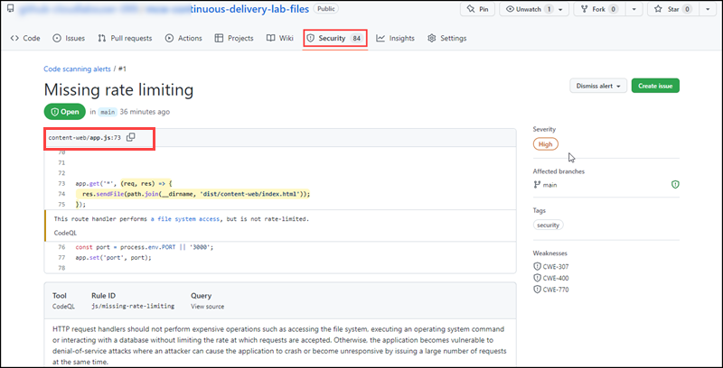
    
  1. Open App.js file from the content-web folder and Add the following code after the 6th line of App.js file
  
     ```pwsh
       // set up rate limiter: maximum of five requests per minute
        var RateLimit = require('express-rate-limit');
       var limiter = new RateLimit({
        windowMs: 1*60*1000, // 1 minute
        max: 5
        });
      ```
         
      
      After adding the code it will looks like this
      
      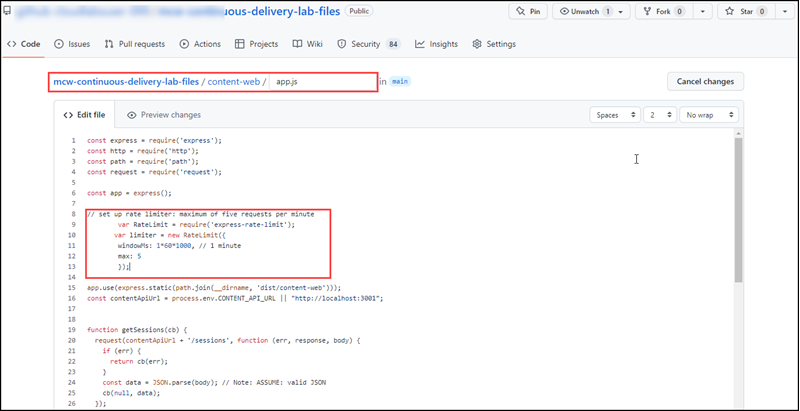
      
  1. Add the following code before the alert line which would be 79 starts with app.get('*', (req, res) => {
   
      ```pwsh
        // apply rate limiter to all requests
        app.use(limiter);
      ```
    
   1. After adding the code it will looks like this
        
      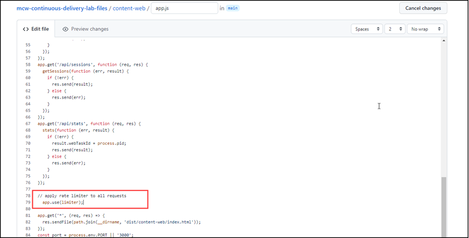
      
 1. After adding the entire code go down and  click commit the file. It will successfully commit.
 
    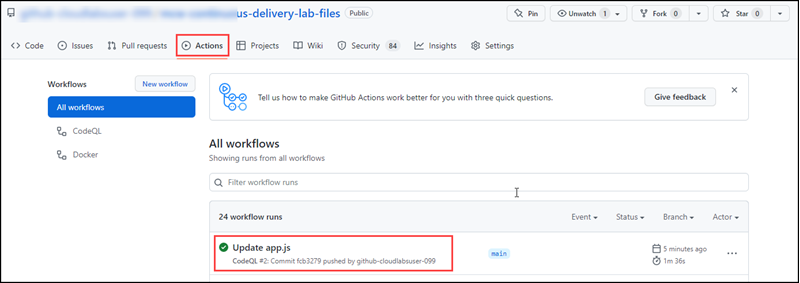
  
  1. Go to codescanning under security tab, you can see the missing rate limit cleared.
  
      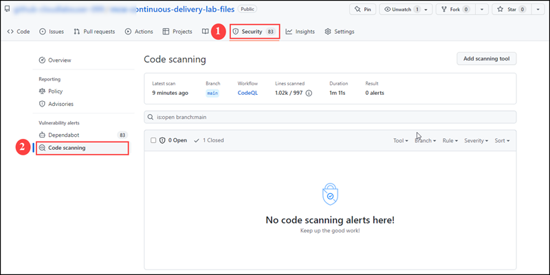

      
 ## Task 4: Repository security advisories  
 
 You can use GitHub Security Advisories to privately discuss, fix, and publish information about security vulnerabilities in your repository.  Anyone with admin permissions to a repository can create a security advisory. Anyone with admin permissions to a repository also has admin permissions to all security advisories in that repository. People with admin permissions to a security advisory can add collaborators, and collaborators have write permissions to the security advisory.
 
 1. Create Security Repository advisories
 
     Go to Security tab and then select advisories and then select New draft security advisory option.
     
     
     
  1. In the affected Product section Select the ecosystem as composer, provide the package name as **mcw-continuous-delivery-lab-files/content-web/app.js**, provide     affected version as <1.2 and patched version as 1.2 and provide severity as high
  
      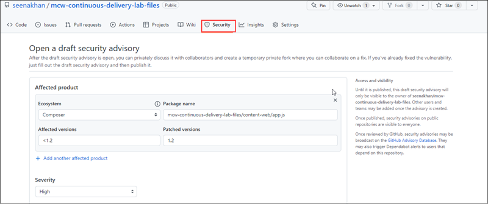
     
   1. In the Common Weakness Enumerator Section provide CWE-284 which stands Improper Access Control havinig Missing Rate Limiting, provide the title if its not generated automatically as **Improper Access Control in mcw-continuous-delivery-lab-files/content-web/app.js**
    
      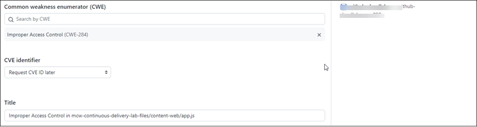
      
   1. In the description box include the following:
       Impact
      _What kind of vulnerability is it? Who is impacted?_

      HTTP request handlers should not perform expensive operations such as accessing the file system, executing an operating system command or interacting with a      database without limiting the rate at which requests are accepted. Otherwise, the application becomes vulnerable to denial-of-service attacks where an attacker can cause the application to crash or become unresponsive by issuing a large number of requests at the same time.

       Patches
      _Has the problem been patched? What versions should users upgrade to?_

      It is patched and rectified the error. Please use 1.2 version


       Workarounds
      _ Is there a way for users to fix or remediate the vulnerability without upgrading?_

      // set up rate limiter: maximum of five requests per minute
      var RateLimit = require('express-rate-limit');
      var limiter = new RateLimit({
       windowMs: 1*60*1000, // 1 minute
        max: 5
        });

       // apply rate limiter to all requests
       app.use(limiter);

       Added the above code in app.js

       References
      _Are there any links users can visit to find out more?_

      https://github.com/OWASP/API-Security/blob/master/2019/en/src/0xa4-lack-of-resources-and-rate-limiting.md
      https://codeql.github.com/codeql-query-help/javascript/js-missing-rate-limiting/
    
  1. After filled the description box fill the Credit section with current user name. Then click on Create draft security advisory.
 
     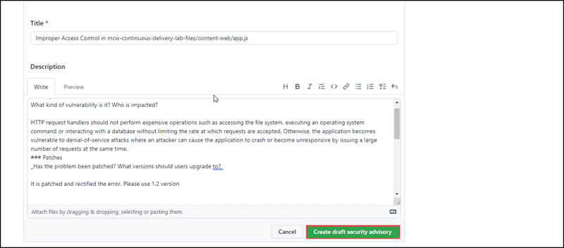
    
 1. Once created the security advisory go to start a temporary private fork, it is used to collaborate on a patch for this advisory.

    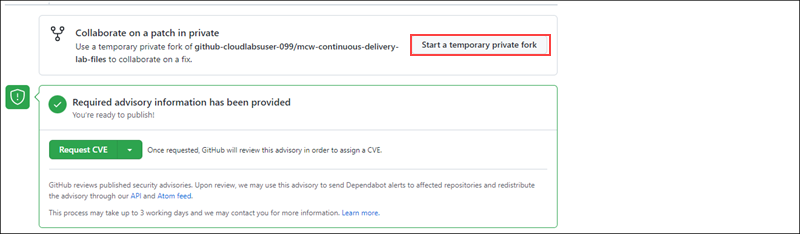
  
 1. After having the temporary fork you can request for a CVE, it is used for GitHub reviews published security advisories. Upon review, we may use this advisory to send Dependabot alerts to affected repositories and redistribute the advisory through our API and Atom feed.

**Note: This process may take up to 3 working days.
Please do not close the security repository.
 
  
  

 
 
 

  
  

    
