# Exercise 3: Explore GitHub advance security features 

In this exercise, you'll explore GitHub Enterprise features which is GitHub advance security features. You'll configure and explore about Code scanning, CodeQL alerts, Repository security advisories, and GitHub Dependabots.  

## Task 1: Enabling Code scanning and CodeQL alerts 

In this task, you'll configure Code scanning and explore CodeQL alerts. Code scanning is a feature that you use to analyze the code in a GitHub repository to find security vulnerabilities and coding errors. Any problems identified by the analysis are shown in GitHub.

**Note**: To perform this task, the GitHub repository should be public. If the repository visibility is private, please go to the settings of the repository and change the visibility to public.
   
1. Select the **setings** ***(1)*** tab from thr GitHub browser tab. Click on **code security and analysis** ***(2)*** under security side blade and then Click on **Set up**  ***(3)*** to enable code scanning. 

   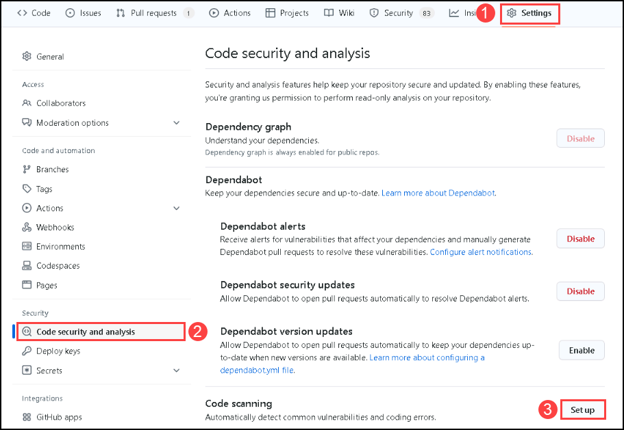  

1. Naivigate to **Security** ***(1)*** tab, select **Code scanning** ***(2)*** from the side blade and click on **Configure CodeQL alerts** ***(3)***.

   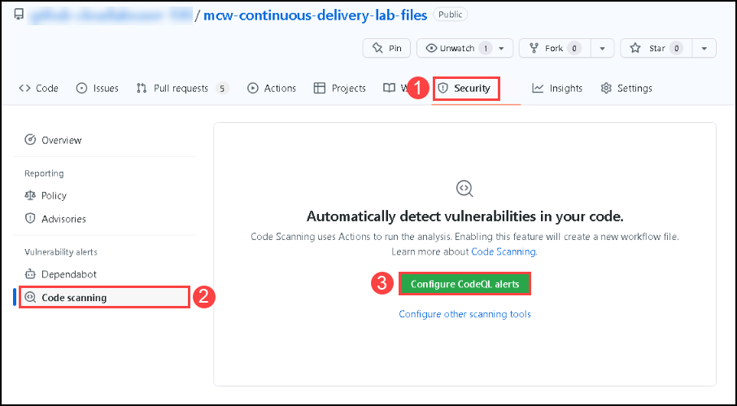  

1. A workflow **codeql-analysis.yml** ***(1)***. Review the yaml file, select **Start Commit** ***(2)*** and click on **commit new file** ***(3)***.
  
   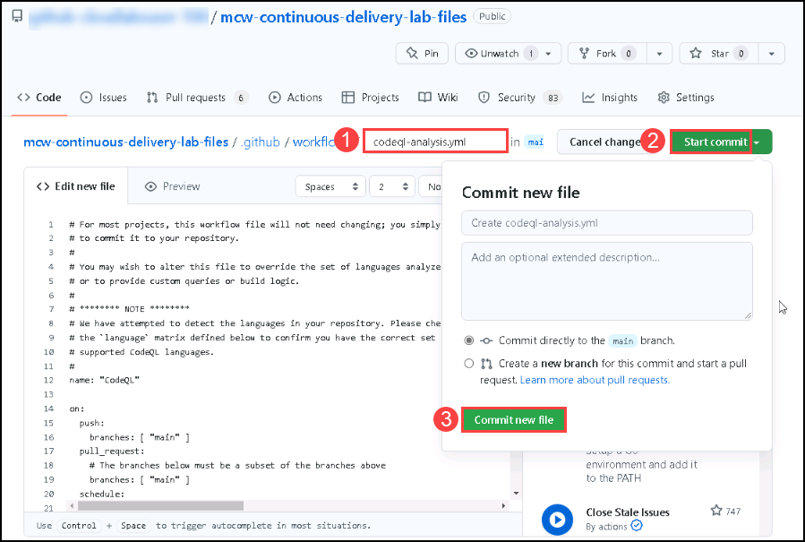 
  
1. Navigate to **Actions** ***(1)*** tab, You can review the **workflow** ***(2)*** run.
    
   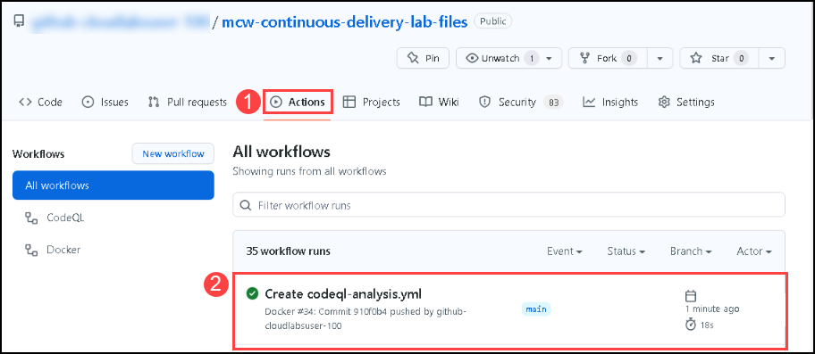 
  
1. Navigate to **Security** ***(1)*** tab, select **Code scanning** ***(2)*** and click on **View alerts** ***(3)***.
   
   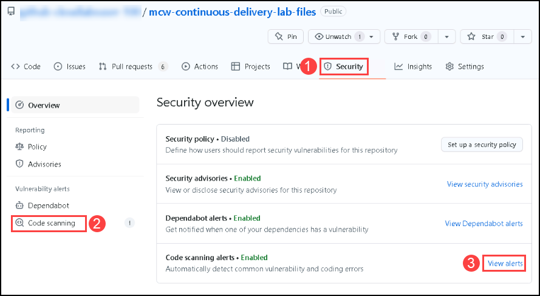
    
1. Click on the **Missing rate Limiting** alert. The alert will be for 73 line in App.js file.

   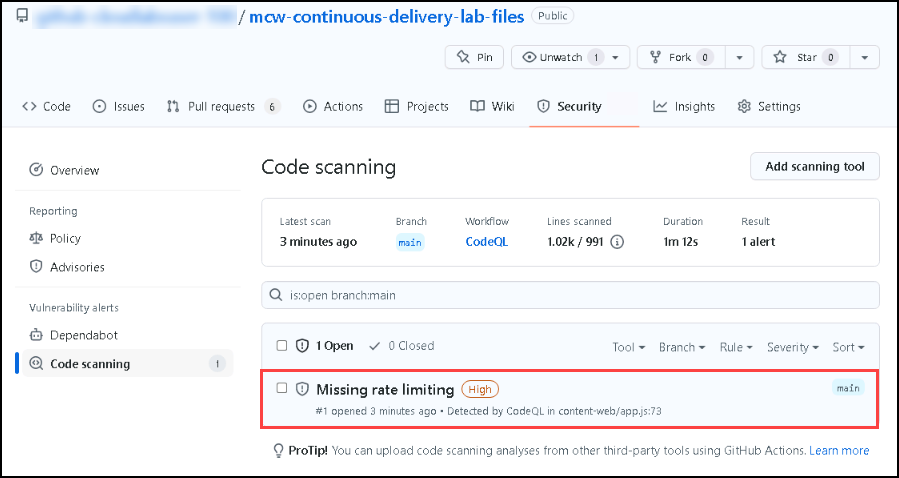
    
1. You'll find the Missing rate Limiting in App.js file under Content-web folder.
    
   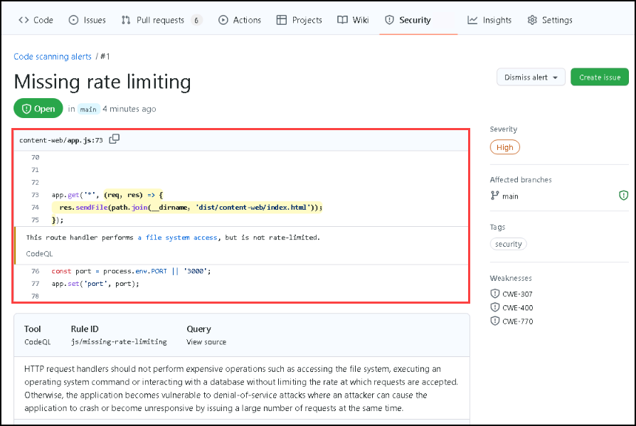
    
1. Navigate to **Code** ***(1)***, go to **mcw-continuous-delivery-lab-files/content-web**  ***(2)*** folder and edit the **app.js** file. Add the following the **content** ***(3)*** from line 7.
  
   ```pwsh
     // set up rate limiter: maximum of five requests per minute
        var RateLimit = require('express-rate-limit');
        var limiter = new RateLimit({
        windowMs: 1*60*1000, // 1 minute
        max: 5
        });
   ```
   
   After adding the code it will looks like this
      
   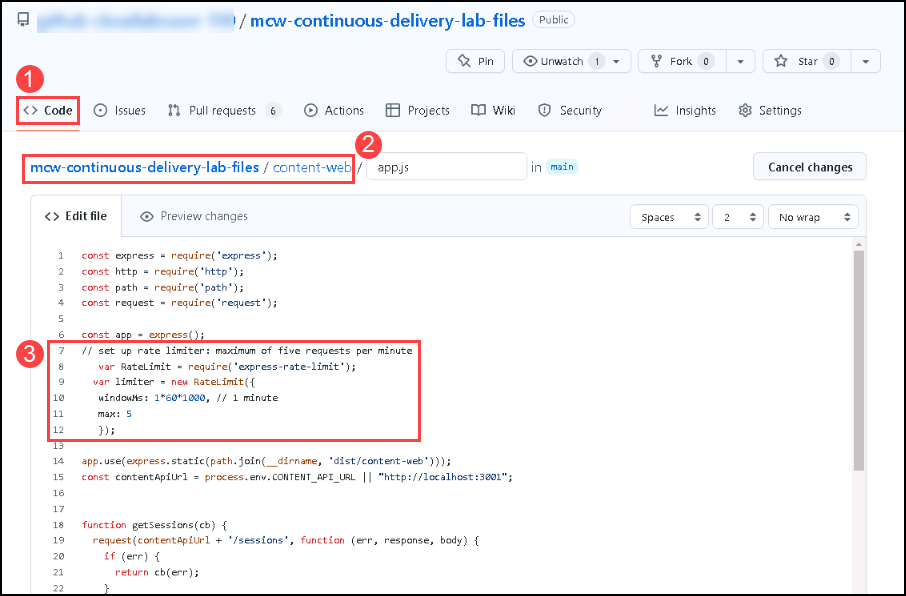
      
1. In the same app.js file, Add the following content in the line 79 just before the `app.get('*', (req, res) =>{` line. 
   
   ```pwsh
      // apply rate limiter to all requests
      app.use(limiter);
   ```
    
   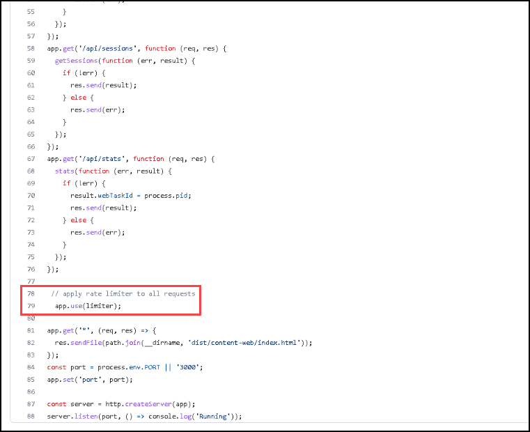
      
1. After adding the code, scroll down and  click on **Commit changes**. 
 
   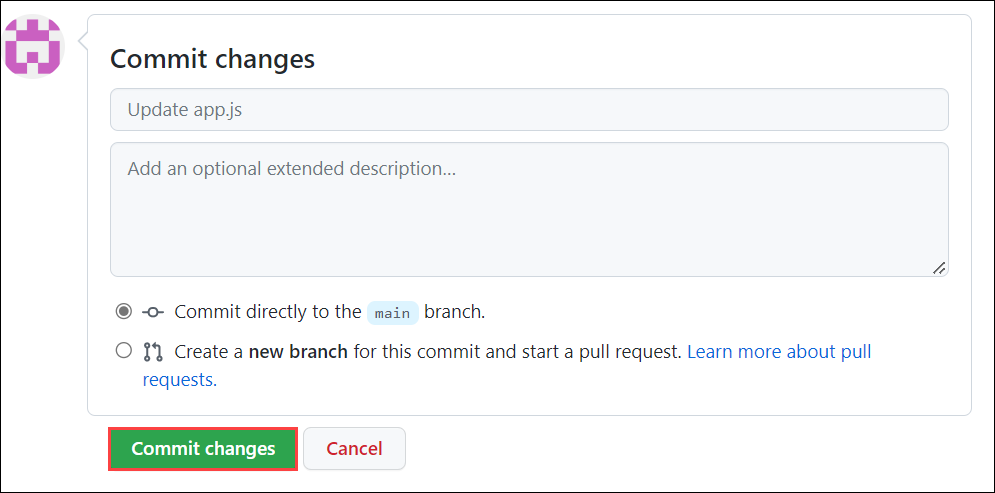
   
1. Navigate to **Actions** tab, review the **update app.js** workflow.

   
  
1. Navigate to **Security** ***(1)*** tab, select **Code scanning** ***(2)***. You'll be able visualise that the **Missing rate Limiting** alert has been resolved.
   
   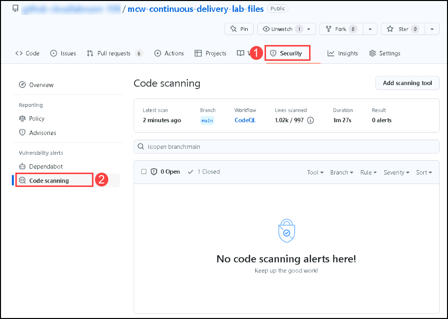
    
## Task 2: Repository security advisories  
 
In this task, you'll enable Repository security advisories. You can use GitHub Security Advisories to privately discuss, fix, and publish information about security vulnerabilities in your repository.  Anyone with admin permissions to a repository can create a security advisory.
 
1. Naivigate to **Security** ***(1)*** tab, select **Advisories** ***(2)*** from the side blade and click on **New draft security advisory** ***(3)***.

   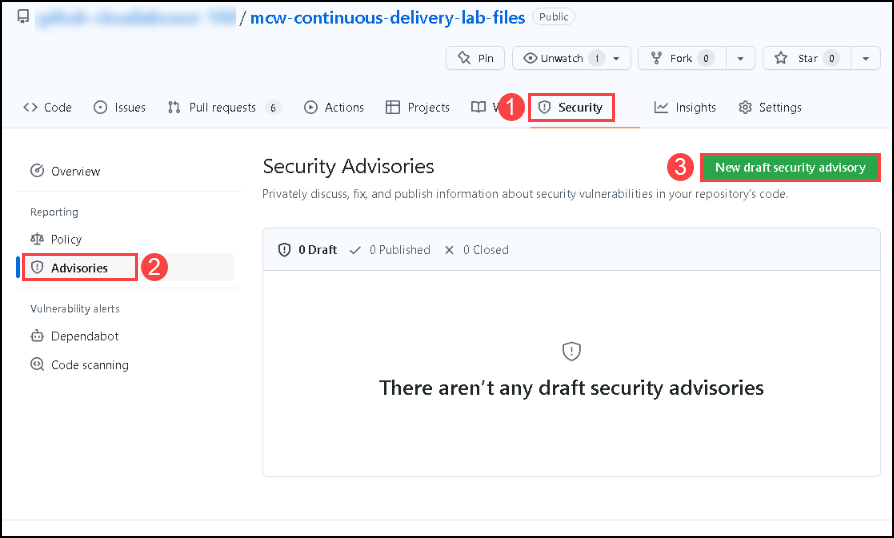  

     
1. In the Open a draft security advisory tab, provide the following the details.
     
   - Ecosystem: **composer** ***(1)***
   - Package name: **mcw-continuous-delivery-lab-files/content-web/app.js** ***(2)***
   - Affected version: **<1.2** ***(3)***
   - Patched version: **1.2** ***(4)***
   - Severity: **High** ***(5)***
  
   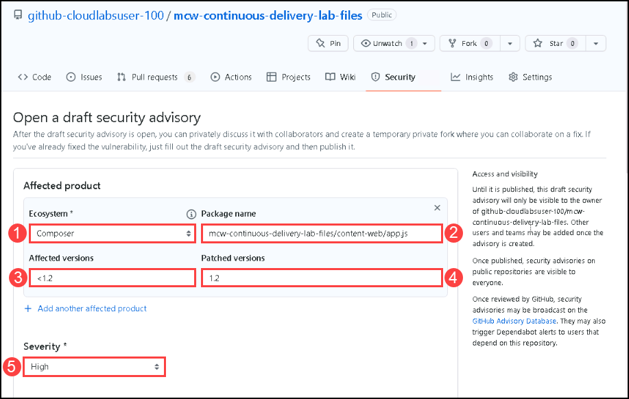
     
1. In the Common Weakness Enumerator Section, provide the following the details and Create **draft security advisory** ***(5)***

   - Common Weakness Enumerator (CWE): **Improper Access Control (CWE-284)** ***(1)***
   - CVE identifier: **Request CVE ID later** ***(2)***
   - Title: **Improper Access Control in mcw-continuous-delivery-lab-files/content-web/app.js** ***(3)***
   - Description: **Add** ***(4)*** the below mentioned details.

   ```
   Impact
   What kind of vulnerability is it? Who is impacted?

   HTTP request handlers should not perform expensive operations such as accessing the file system, executing an operating system command or interacting with a        database without limiting the rate at which requests are accepted. Otherwise, the application becomes vulnerable to denial-of-service attacks where an attacker      can cause the application to crash or become unresponsive by issuing a large number of requests at the same time.

   Patches
   Has the problem been patched? What versions should users upgrade to?

   It is patched and rectified the error. Please use 1.2 version

   Workarounds
   Is there a way for users to fix or remediate the vulnerability without upgrading?

   // set up rate limiter: maximum of five requests per minute
   var RateLimit = require('express-rate-limit');
   var limiter = new RateLimit({
   windowMs: 1601000, // 1 minute
   max: 5
   });

   // apply rate limiter to all requests
   app.use(limiter);

   Added the above code in app.js

   References
   Are there any links users can visit to find out more?

   https://github.com/OWASP/API-Security/blob/master/2019/en/src/0xa4-lack-of-resources-and-rate-limiting.md
   https://codeql.github.com/codeql-query-help/javascript/js-missing-rate-limiting/
   ```
    
   
   
 1. Once thw security advisory is created, click on **start a temporary private fork**. It is used to collaborate on a patch for this advisory.

    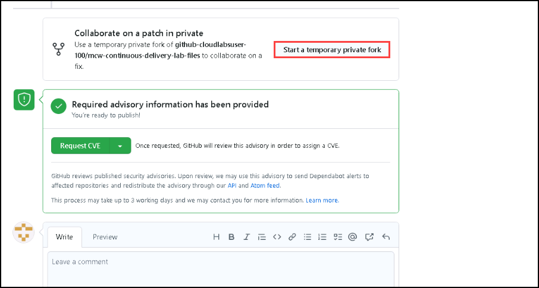
  
 1. After having the temporary fork you can request for a CVE, it is used for GitHub reviews published security advisories. Upon review, we may use this advisory to send Dependabot alerts to affected repositories and redistribute the advisory through our API and Atom feed.

**Note**: This process may take up to 3 working days. Please do not close the security repository.
 
### Task 4: Using Dependabot

In this task, you'll will use Dependabot to track the versions of the packages we use in our GitHub repository and create pull requests to update packages for us.

1. In your lab files GitHub repository, navigate to the `Security` tab. Select the `Enable Dependabot alerts` button.

   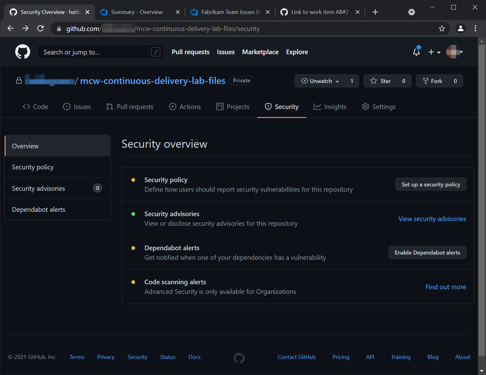

1. You should arrive at the `Security & analysis` blade under the `Settings` tab. Enable `Dependabot security updates`.

   > **Note**: Enabling the `Dependabot security updates` will also automatically enable `Dependency graph` and `Dependabot alerts`.

   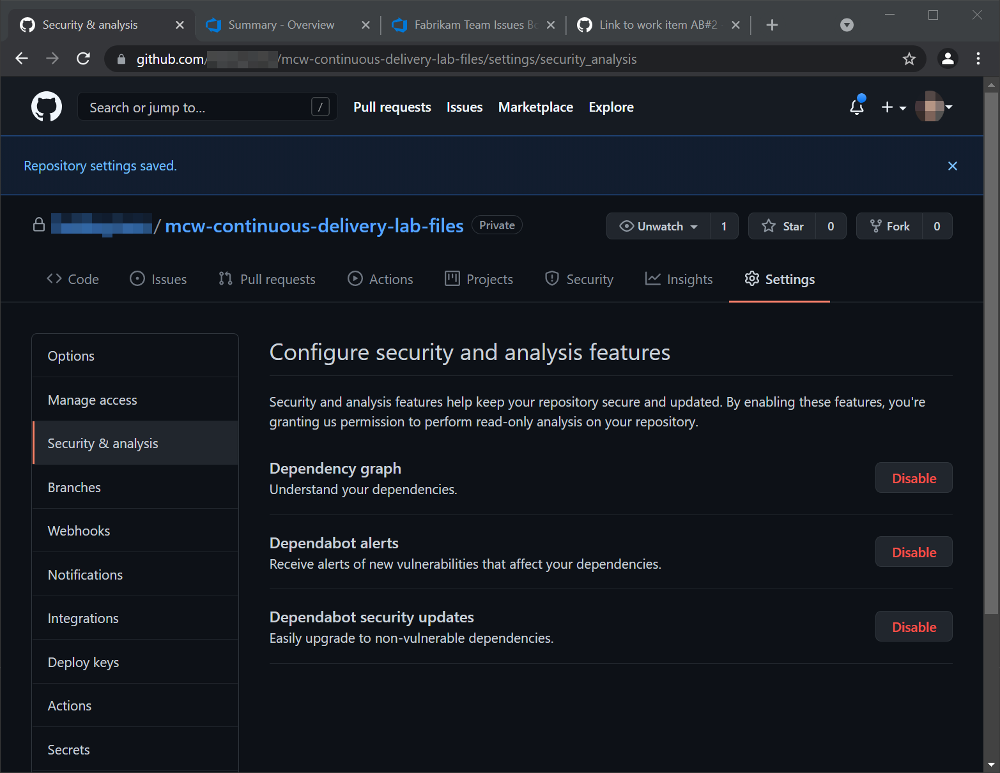

   > **Note**: The alerts for the repository may take some time to appear. The rest of the steps for this task rely on the alerts to be present. You can continue with the next exercise as this is an independent task and doesn't affect the lab. Please visit this task later and complete the task.

1. To observe Dependabot issues, navigate to the `Security` tab and select the `View Dependabot alerts` link. You should arrive at the `Dependabot alerts` blade in the `Security` tab.

   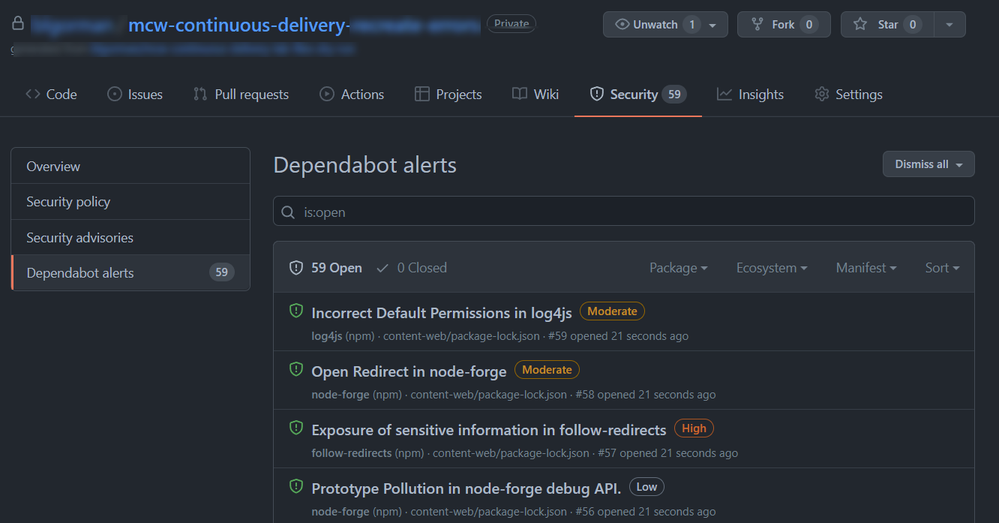

1. Sort the Dependabot alerts by `Package name`. Locate the `handlebars` vulnerability by typing `handlebars` in the search box under the `Package` dropdown menu.

   

1. Select any of the `handlebars` Dependabot alert entries to see the alert detail. After reviewing the alert, select `Create Dependabot security update` and wait a few moments for GitHub to create the security update.

   

   

1. In the `Pull Requests` tab, find the Dependabot security patch pull request and merge it to your main branch.

   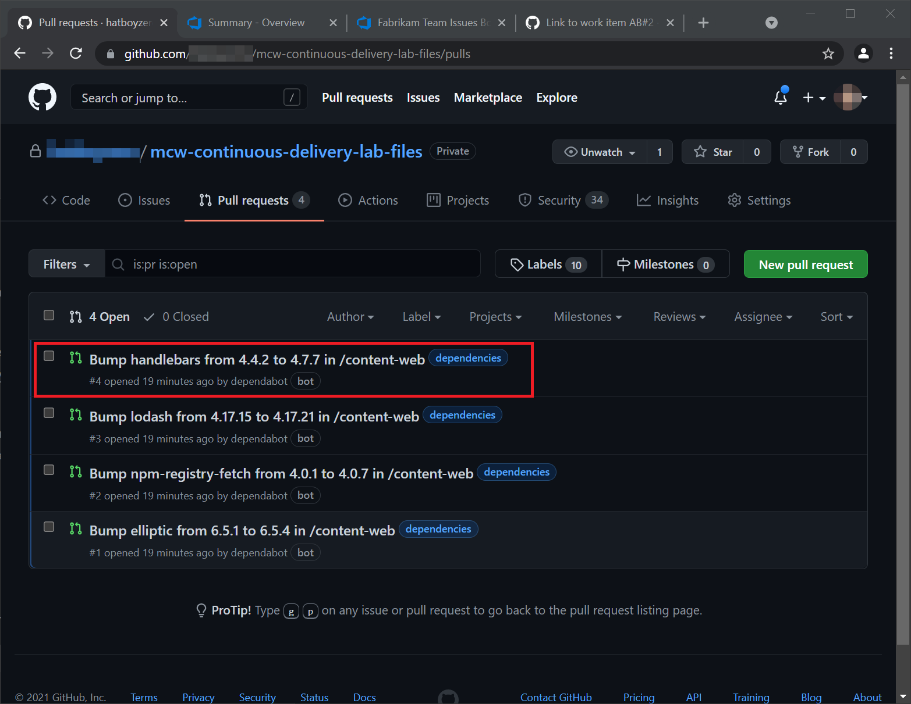

   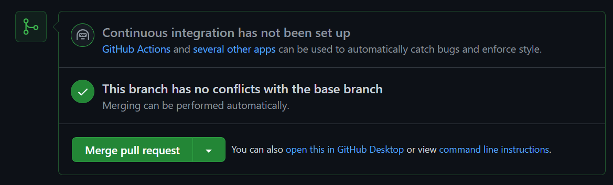
    
   >**Note**: In case if you see any errors with merge request. Retry step 4 to step 6 by selecting any other`handlebars` Dependabot alert.

1. Pull the latest changes from your GitHub repository to your local GitHub folder.

   ```pwsh
   cd C:\Workspaces\lab\mcw-continuous-delivery-lab-files  # This path may vary depending on how
                                                            # you set up your lab files repository
   git pull
   ```
1. Click on the **Next** button present in the bottom-right corner of this lab guide.  
    

