## Exercise 6: Monitoring and Load Testing (Optional)

In this exercise, we will add monitoring and logging to gain insight on the application's usage in the cloud. Then create Azure load testing, which is a fully managed load-testing service that enables you to generate high-scale loads. The service simulates traffic for your applications, regardless of where they're hosted. Developers, testers, and quality assurance (QA) engineers can use it to optimise application performance, scalability, or capacity. We will also explore Azure Chaos Studio, which helps you measure, understand, and improve your cloud application and service resilience.
### Task 1: Set up Application Insights

1. Open the `deploy-appinsights.ps1` PowerShell script present in the `C:\Workspaces\lab\mcw-continuous-delivery-lab-files\infrastructure` folder and replace studentprefix value with **<inject key="Deploymentid" />** on the first line.

    ```pwsh
    $studentsuffix = "Your 3 letter abbreviation here"                                  # <-- Modify this
    $resourcegroupName = "fabmedical-rg-" + $studentsuffix
    $location1 = "westeurope"
    $appInsights = "fabmedicalai-" + $studentsuffix
    ```

2. Navigate back to the PowerShell terminal on Visual Studio and run the below-mentioned command:

     ```
     cd C:\Workspaces\lab\mcw-continuous-delivery-lab-files\infrastructure
    ./deploy-appinsights.ps1
    ```
    
3. Now the Azure Application insights is created and `AI Instrumentation Key` specified in the output.

    ```bash
    The installed extension 'application-insights' is in preview.
    AI Instrumentation Key="55cade0c-197e-4489-961c-51e2e6423ea2"
    ```

4. Using PowerShell navigate to the `./content-web` folder in your GitHub lab files repository by running the below-mentioned command.

   ```
   cd ..
   cd .\content-web
   
   ```
   
5. Now using PowerShell, execute the following command to install JavaScript support for Application Insights via NPM to the web application frontend.

    ```bash
    npm install applicationinsights --save
    ```

6. In this step we'll updating the `app.js` file by adding and configuring Application Insights for the web application frontend in the local folder. Please run the command mentioned below.
   
    `Copy-Item -Path C:\Workspaces\lab\mcw-continuous-delivery-lab-files\keyscript.txt -Destination C:\Workspaces\lab\mcw-continuous-delivery-lab-files\content-web\app.js -PassThru`
    
    `$instrumentationKey` = $(az monitor app-insights component create --app fabmedicalai-<inject key="DeploymentID" enableCopy="false" /> --location westeurope --kind web --resource-group fabmedical-rg-<inject key="DeploymentID" enableCopy="false" /> --application-type web --retention-time 120 --query instrumentationKey)
    
    `(Get-Content -Path "C:\Workspaces\lab\mcw-continuous-delivery-lab-files\content-web\app.js") | ForEach-Object {$_ -Replace "UPDATE AI Instrumentation Key", $instrumentationKey} | Set-Content -Path "C:\Workspaces\lab\mcw-continuous-delivery-lab-files\content-web\app.js"`

7. Add and commit changes to your GitHub lab-files repository. From the root of the repository, execute the following:

    ```pwsh
    git add .
    git commit -m "Added Application Insights"
    git push
    ```

8. Wait for the GitHub Actions for your lab files repository to complete before executing the next step.

      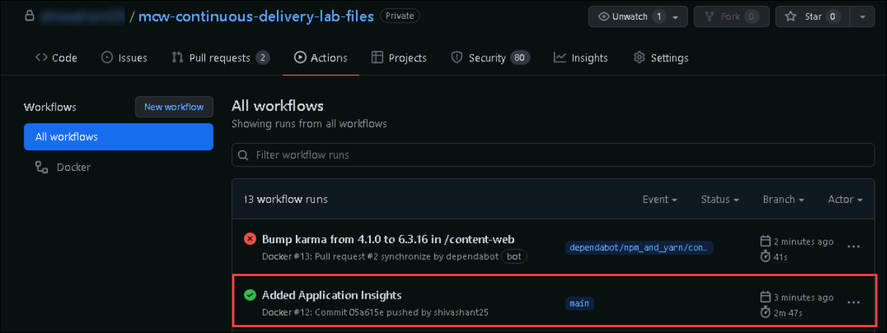

9. Redeploy the web application by running the below commands:

    ```
    cd C:\Workspaces\lab\mcw-continuous-delivery-lab-files\infrastructure
    ./deploy-webapp.ps1
    ```
    
10. Visit the deployed website and check Application Insights in the Azure Portal to see instrumentation data.

   >**Note**: It can take up to 24 hours to get the data and logs loaded in Azure Application Insights. You can skip this step and proceed with the next tasks.

   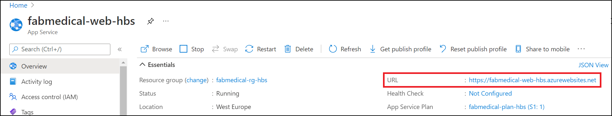

## Task 2: Set up Load Testing

In this task, you'll create Azure Load Testing instance and run a test using a JMeter file.

1. In the Azure Portal search for **Azure Load Testing (1)** and then click on it from the search results (2).

    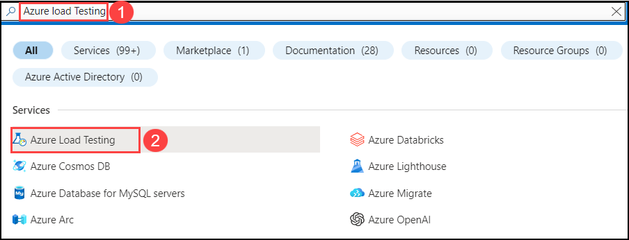

2. On the **Azure Load Testing** page click on **+ Create**.
   
    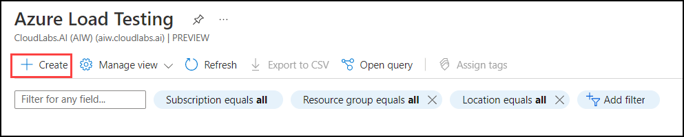
      
3.  On the **Creat a load testing resource** screen provide the following values and click on **Review + create (5)**.

    - Subscription(1): select the default subscription **(1)**
    - Resource Group(2): **fabmedical-rg-<inject key="DeploymentID" enableCopy="false" /> (2)**
    - Name: **fabmedical_LT_<inject key="DeploymentID" enableCopy="false" /> (3)** 
    - Region: Leave it to default **(4)**
    
     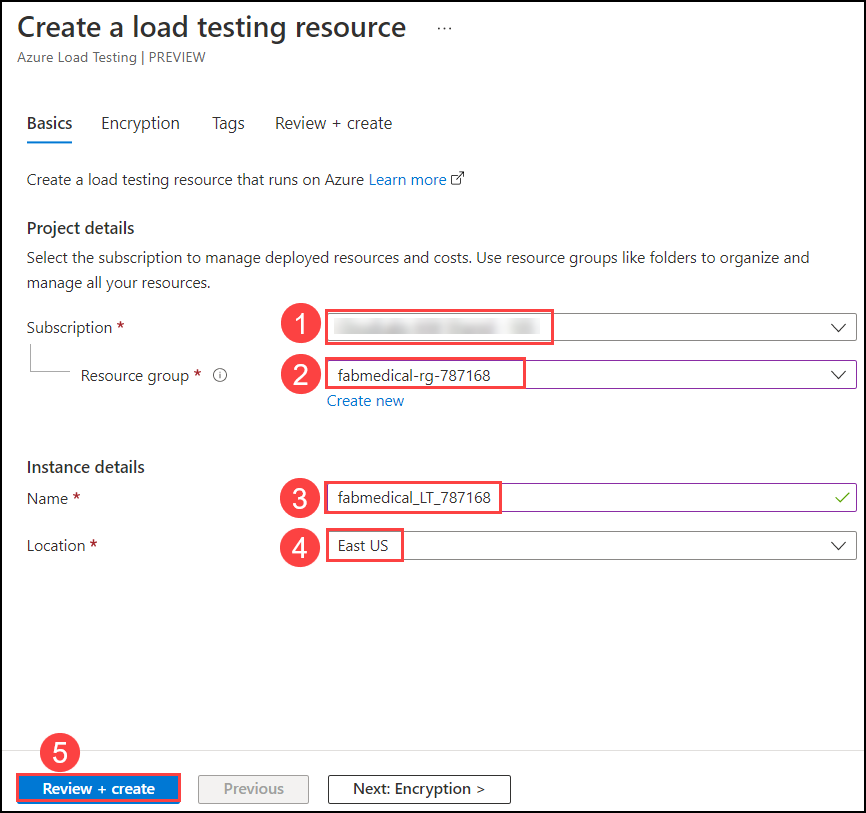
 
4. Review the deatils you provided, once the validation is successful, click on **Create**.
       
     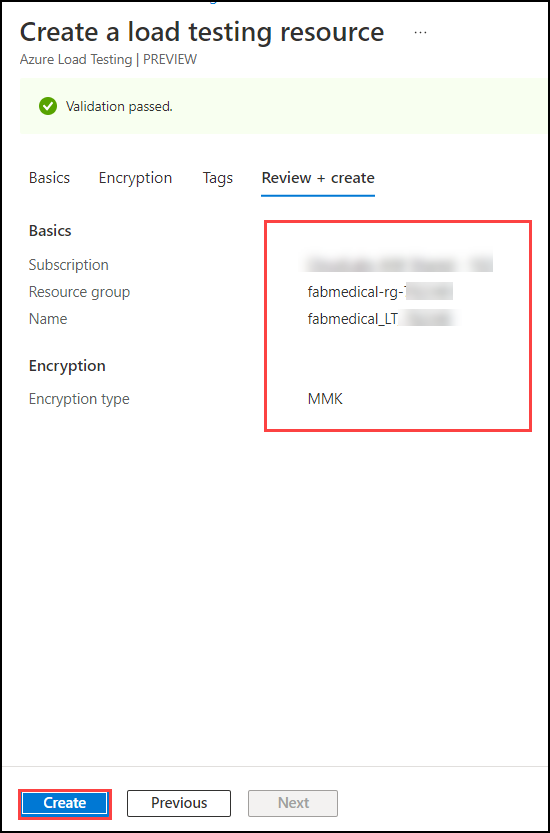

5.  Click on **Go to resource** on **Your deployment is completed** page.

     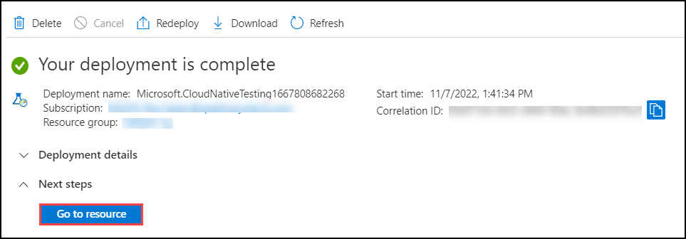

6.  On the left hand side pane, select **Tests (1)** and click on **+ Create (2)** and select **Upload a JMeter script (3)**.

     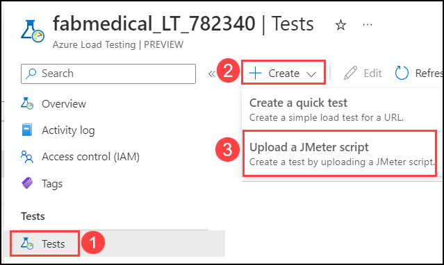

7.  On the **Create test** page, under basic tab provide the **Test name** as `Demo-test` **(1)** and for **Test discription** enter `Demo Load Testing` **(2)**, then click **Next:Test plan >** **(3)**.

     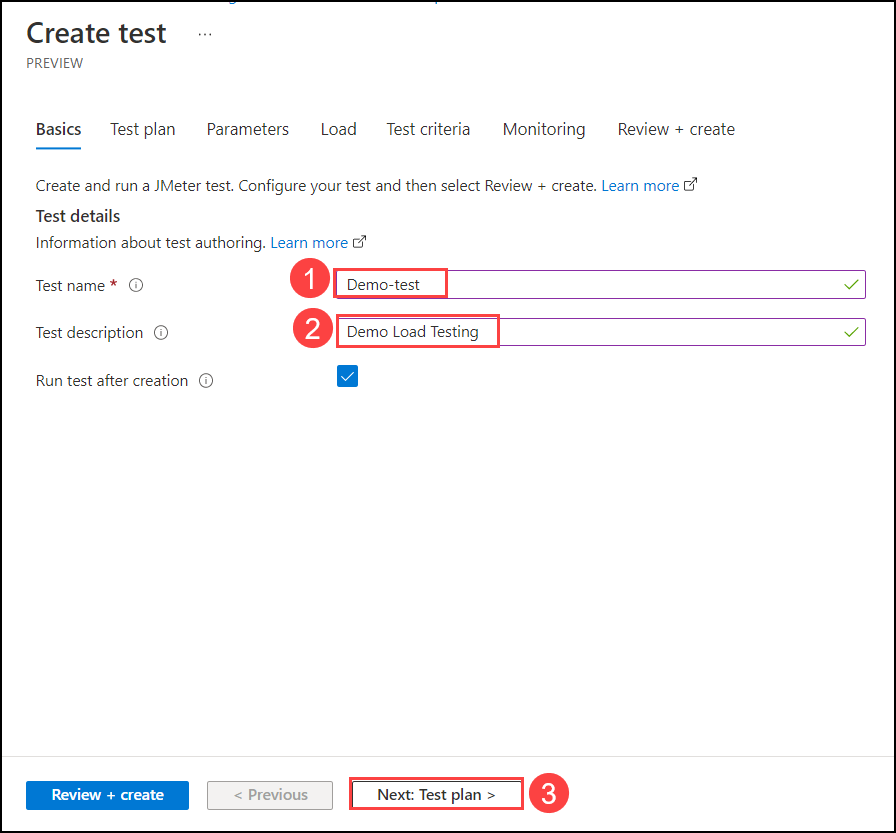

8. On your lab-vm open **Visual Studio Code** and navigate to the **test.jmx** file. Replace **Enter_your_end_point_URL** with**fabmedical-web-<inject key="DeploymentID" enableCopy="false" />** in line 33.
  
     > **Note**:  Your endpoint URL should look similar to this: **fabmedical-web-<inject key="DeploymentID" enableCopy="false" />.azurewebsites.net**.
 
     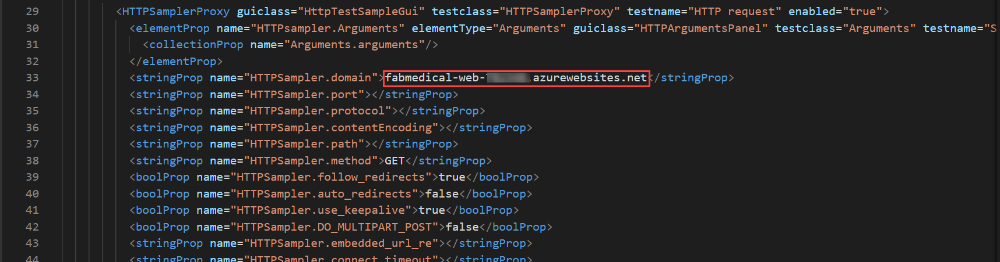
       
9. Next, on the **Test plan** tab, click on the file icon **(1)**, select the **test.jmx (3)** file, and select **Upload (3)**.
    
     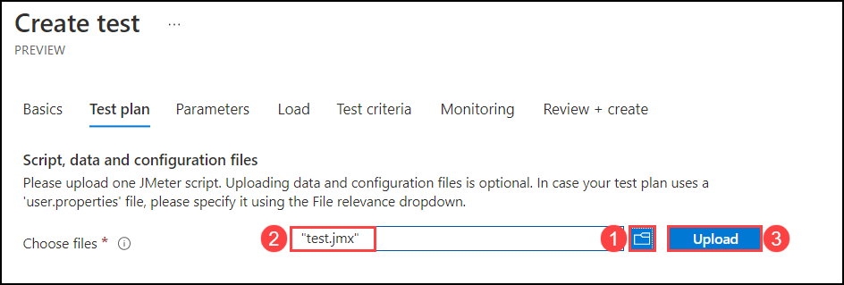

10. Once the file has completed uploading **(1)**, click on **Review + create (2)**.

     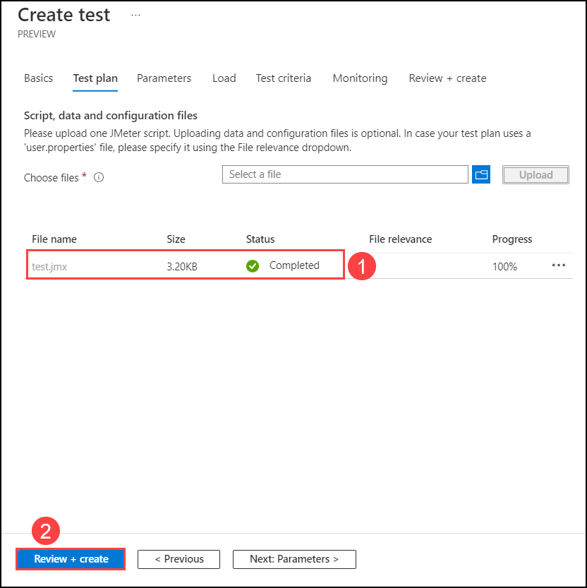

11. Once the test run is completed, you will be able to see **Client-side metrics**. Explore the given metrics output.

     
     
## Task 3: Explore Chaos Studio

In this task you will add **Targets** and create an **Expirement** on **Azure Chaos Studio** to check the resilience of the web appliccation that we created by adding  real faults and observe how our applications respond to real-world disruptions.

 1. Navigate to the **CosmoDB** instance **fabmedical-cdb-<inject key="DeploymentID" enableCopy="false" />** in the Azure portal, on the overview page, take note of the second list of **Read Locations** we will require this the further steps. 
 
    > **Note:** Notice there are two regions present in both **Read Locations** and **Write Locations** the primary region is where the resource is deployed and running, and the secondary region is the backup region. When performing the Chaos experiment, we will observe that the Cosmos DB instance will run undisturbed despite adding a fault. This is because the primary region is being replaced by the secondary or the backup region.
           
     

 2.   In the Azure Portal search for **Azure Chaos Studio** and then click on it from the search results.
   
      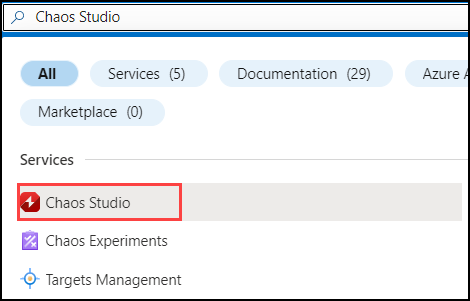

 3. In the **Azure Chaos Studio**, select **Targets** on the left menu.

      
      
 4. From the drop-down menu, select **fabmedical-rg-<inject key="DeploymentID" enableCopy="false" />** resource group.
 
       
     
 5. Click on the **fabmedical-cdb-<inject key="DeploymentID" enableCopy="false" />** **Cosmos DB** instance and form the drop-down for **Enable Targets (1)** choose **Enable service-direct targets (All resources) (2)**.

     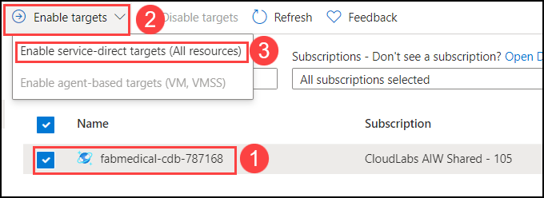
     
 6. Once the target is enabled, select **Expirements** on the left and click **+Create**.
 
     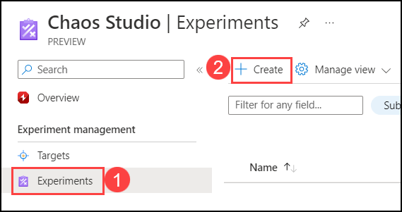
 
 7. On the **Create an experiment** page, under **Basics** tab provide the following values and select **Next:Experiment designer>** **(5)**.

    - Subscription: select the default subscription **(1)**
    - Resource Group: fabmedical-rg-<inject key="DeploymentID" enableCopy="false" /> **(2)**
    - Name: fabmedical-chaos-<inject key="DeploymentID" enableCopy="false" /> **(3)**
    - Region: Leave it to default **(4)**
 
     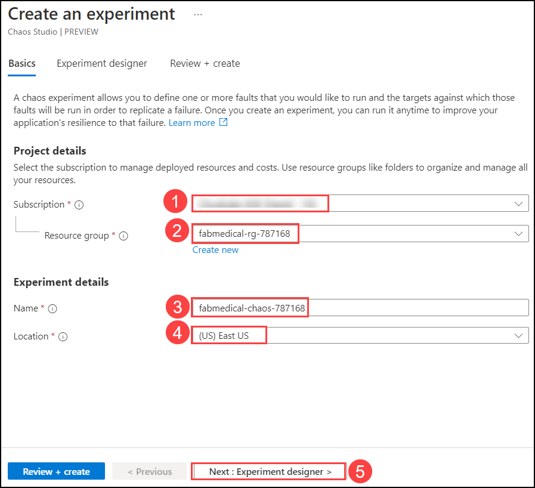
 
 8. On the **Experiment designer** page select **+ Add action (1)** and choose **Add fault (2)**.

      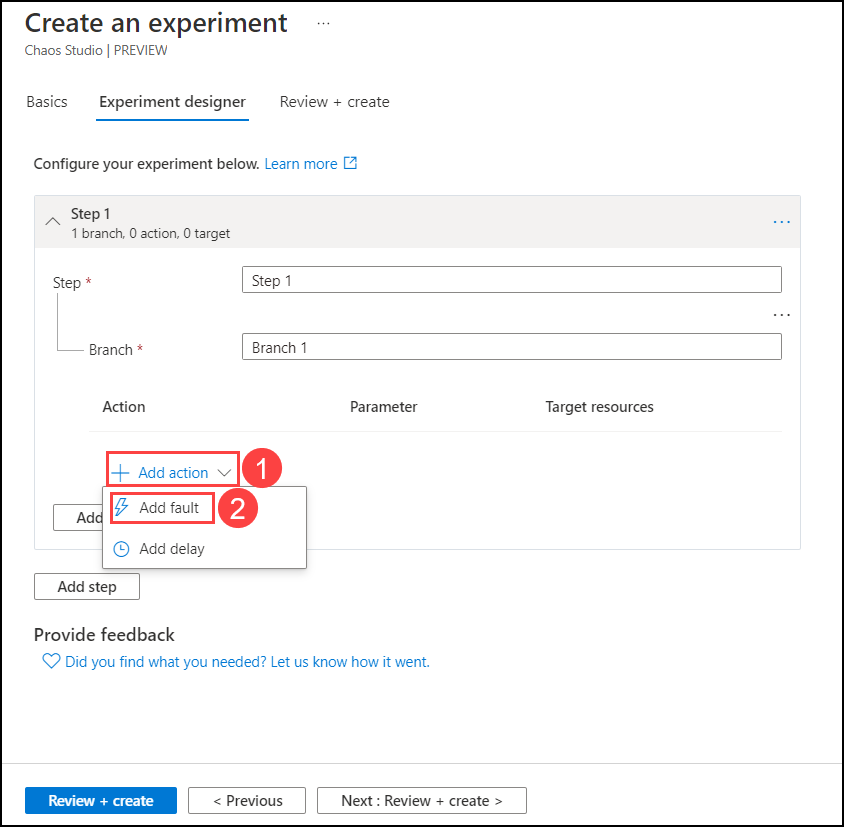
 
 9. On the **Add fault** page, select the following and select **Next:Target resources>** **(4)**.
   
     - Faults: CosmosDB Failover **(1)**
     - Duration (minutes): 5 **(2)**
     - Read region: Select the **Read Locations** you noted down in **Step-1** **(3)**
     
      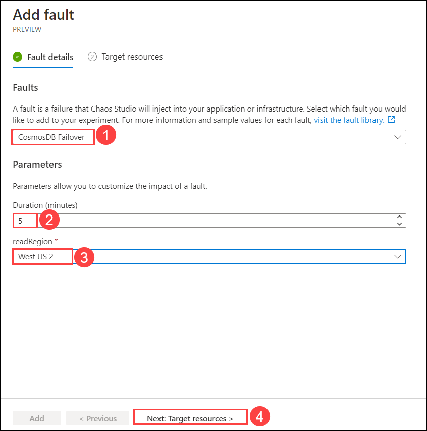
     
 10. On the  **Target resources** select the **CosmoDB** instance and **Add**.
  
       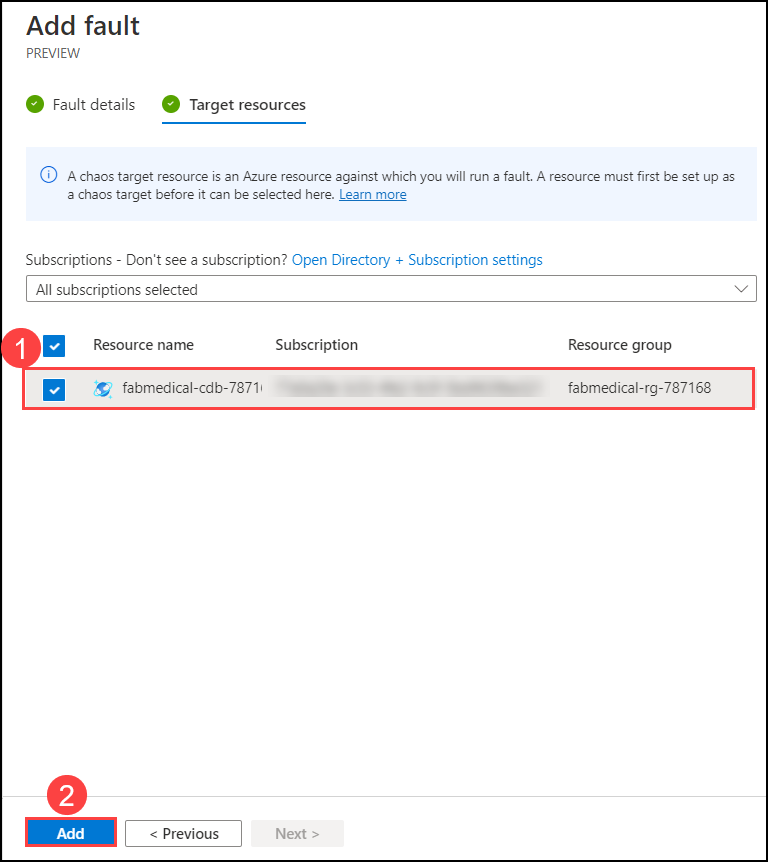
  
 11. Click on **Review + create**.
  
        
   
 12. On the **Review + create** click on **Create**.
  
       
  
 13. Navigate back to the **CosmosDB** instance and select **Access control (IAM) (1)**, click on **+ Add (2)** and select **Add role assignment (3)**. 
  
       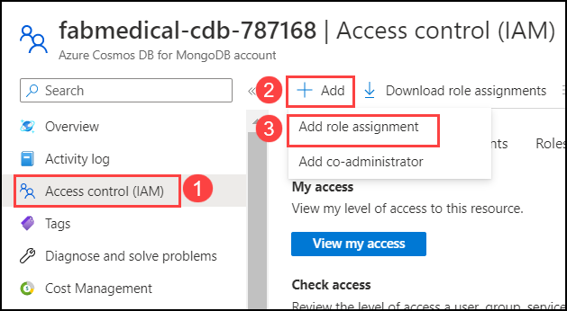
  
 14. In the **Add role assignment page** under **Role** tab  select **Owner (1)** and select **Next (2)**.
  
       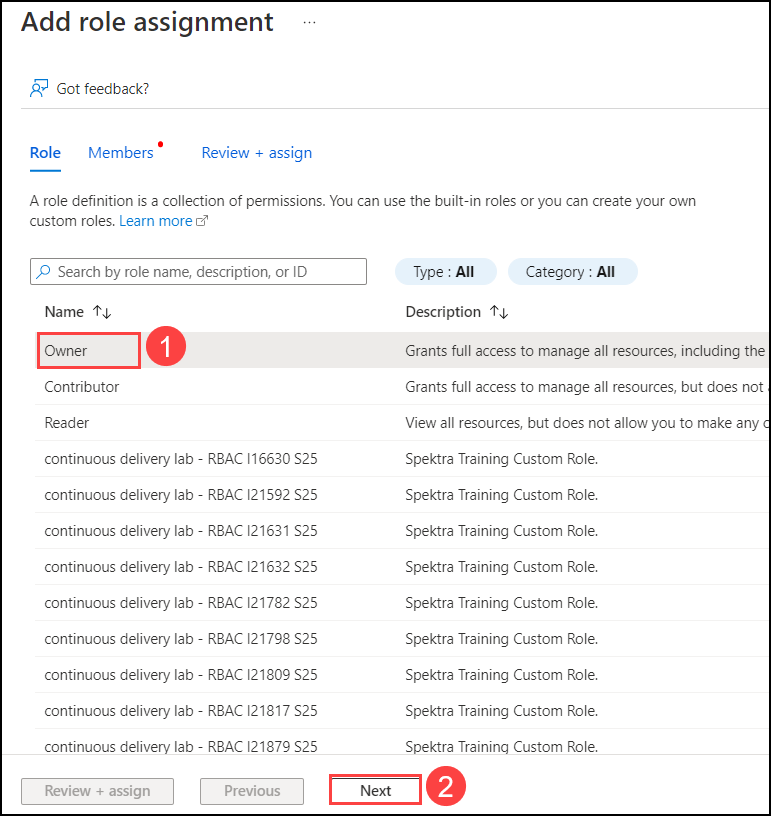
  
 15. Next on the **Members** tab select **Managed identity (1)**  for **Assign access to** , click on **+ Selected members (2)**  on the **Select managed identities** choose **Chaos Experiment (3)** for **Managed identity** select the experiment **fabmedical-chaos-<inject key="DeploymentID" enableCopy="false" /> (4)** click on **Select (5)**.  
   
      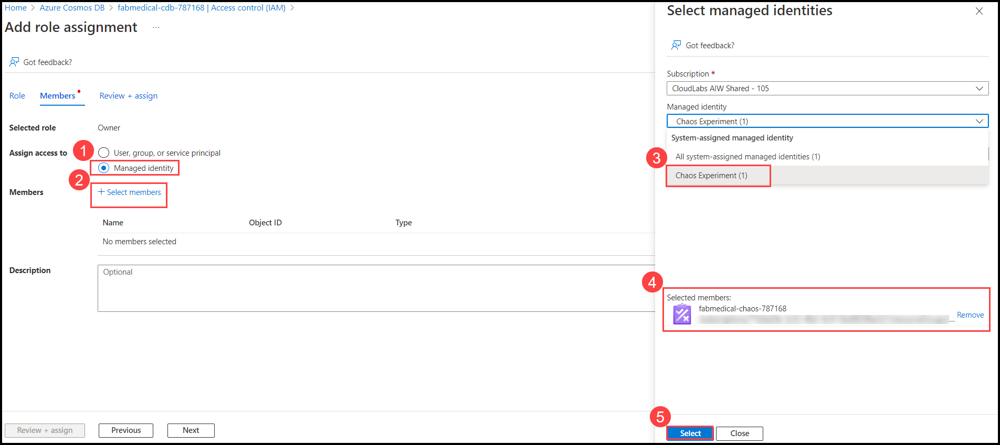
  
 16. Click on **Review + assign**. 
   
      
      
 17. On the Azure portal navigate back to the Chaos experiment you created **fabmedical-chaos-<inject key="DeploymentID" enableCopy="false" />** and click on **Start**.
  
      
 
 18. Select **Ok** for **Start this experiment** pop-up.

       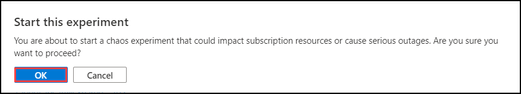
       
 19. Once the experiment status is **Success** click on **Details** to view the run preview.
 
      
 
 20. On the **Details** preview page select **Action (1)** and view the complete detail of the run on **Fault details** under **Successful targets (2)**.
 
        

 21. Navigate to **fabmedical-rg-<inject key="DeploymentID" enableCopy="false" />** resource group and open application insights **fabmedicalai-<inject key="DeploymentID" enableCopy="false" />**. On the app insights overview page click on **Availability tile**.
 
 
 
 22. Observe the availability of the application, after adding the **CosmosDB Failover**.
