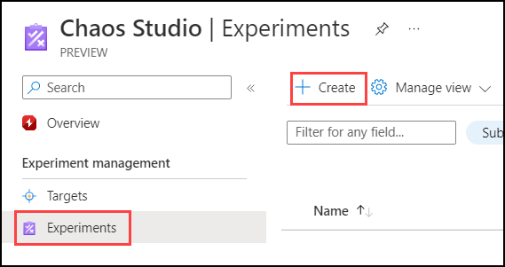
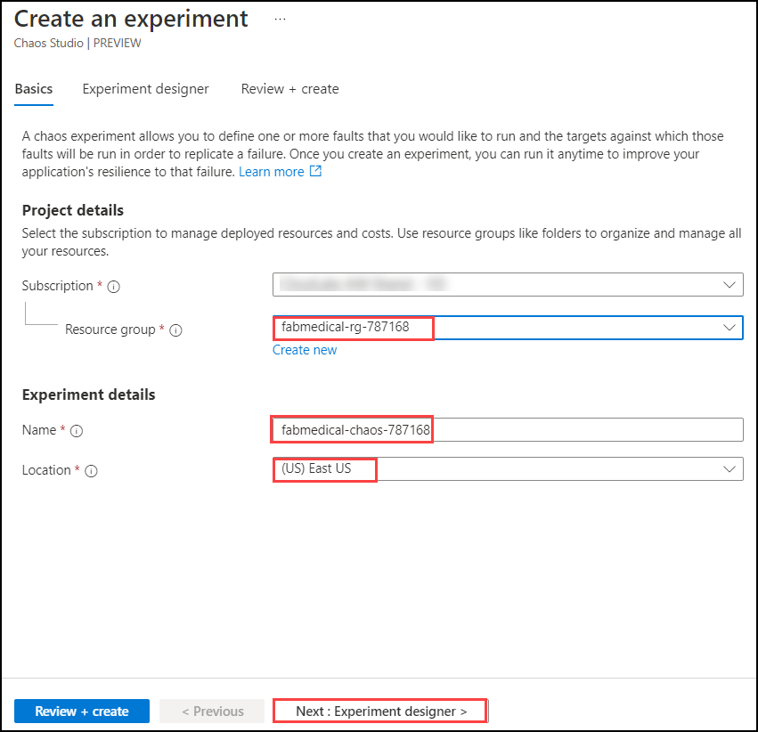
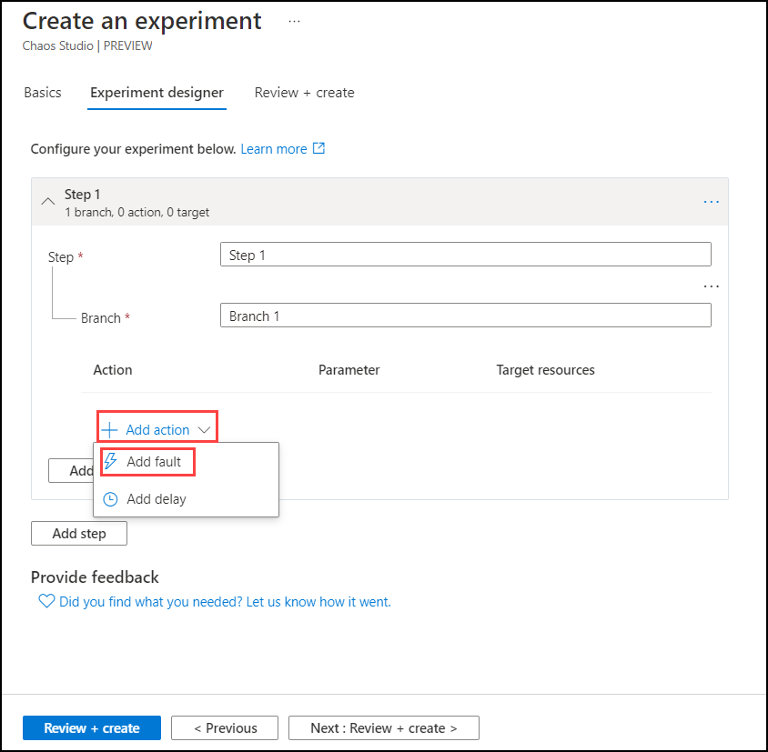
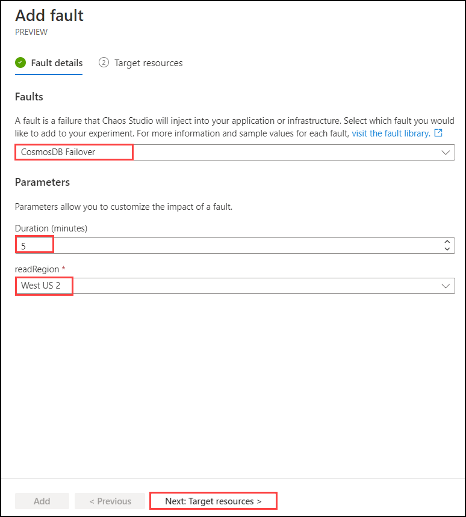
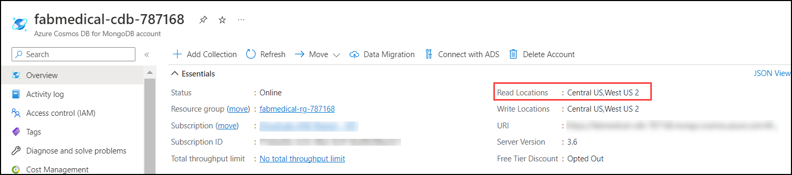
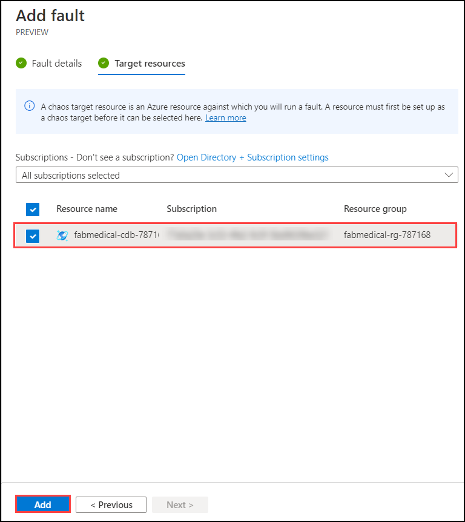
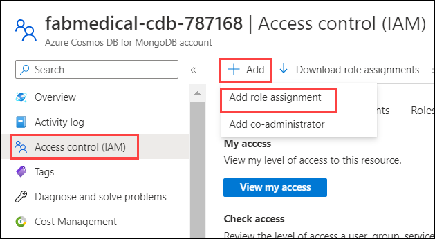
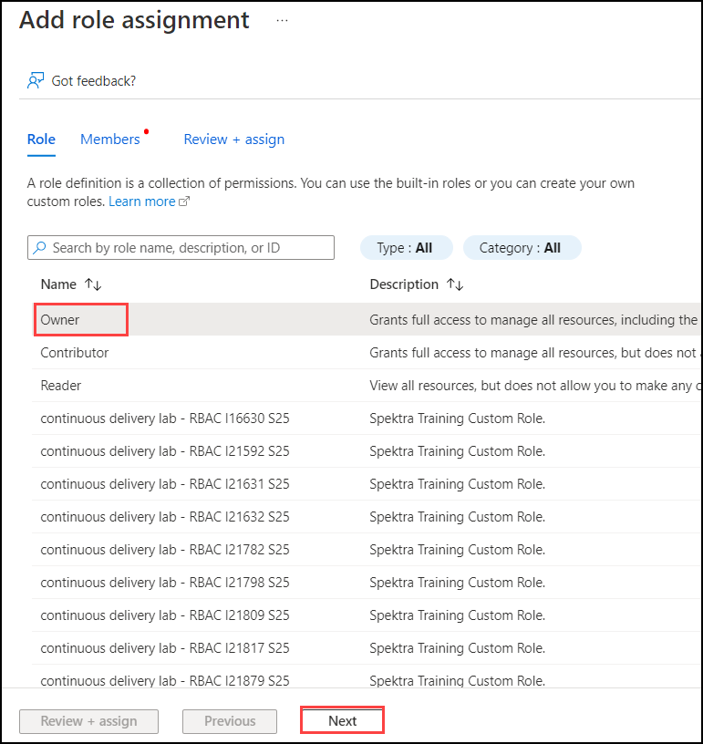
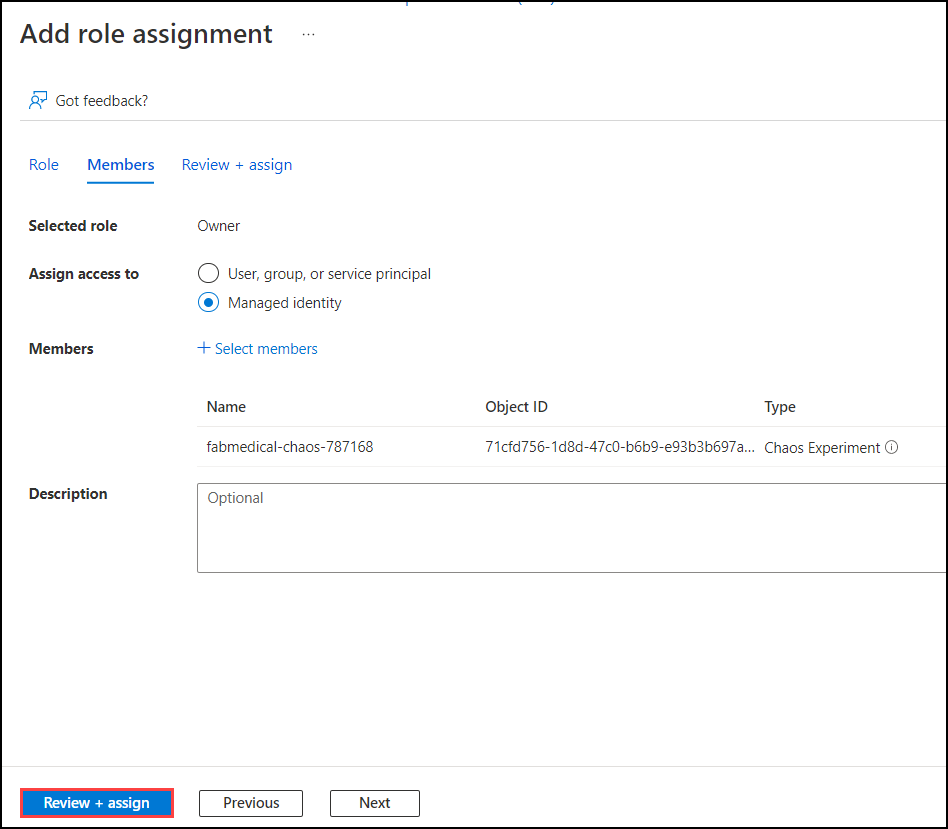
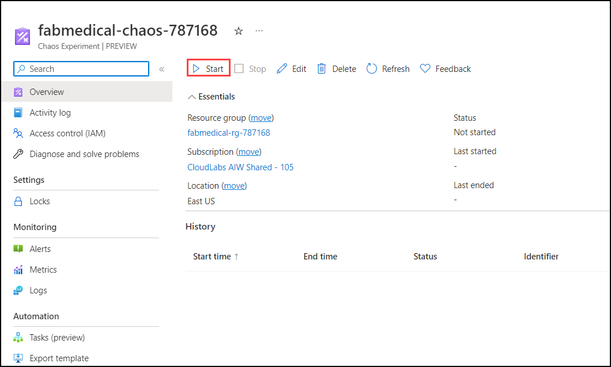

## Exercise 6: Monitoring and Load Testing (Optional)

Azure Load Testing Preview is a fully managed load-testing service that enables you to generate high-scale load. The service simulates traffic for your applications, regardless of where they're hosted. Developers, testers, and quality assurance (QA) engineers can use it to optimize application performance, scalability, or capacity.

## Task 1: Set up Load Testing

In this task you'll create **Azure Load Testing** instance and run a test using Jmeter file.

1. In the Azure Portal on **Search resources, services, and docs** search and select **Azure Load Testing**.

    

2. On the **Azure Load Testing** page click on **+ Create**.
   
    
      
3.  On the **Creat a load testing resource** screen provide the following values and click **Review + create**.

    - Subscription(1): Your Azure subscription for this lab from the drop-down
    - Resource Group(2): fabmedical-rg-<inject key="DeploymentID" enableCopy="false" />
    - Name: fabmedical_LT_<inject key="DeploymentID" enableCopy="false" />
    - Region: Leave default
    
     
 
4. Review the deatils you provided, once the validation is successful click on **Create**.
        
     

5.  Click on **Go to resource** on **Your deployment is completed** page.

     

6.  On the left, select **Tests (1)** and click on **+ Create (2)** and select **Upload a JMeter script (3)**.

     

7.  On **Create test** page under basic tab provide the **Test name** as `Demo-test` **(1)** and for **Test discription** enter `Demo Load Testing` **(2)**  then click **Next:Test plan >** **(3)**.

     

8. On your lab-vm navigate to **test.jmx** file and open using **Visual Studio Code**. In line 33 replace **Enter_your_end_point_URL** with the URL of **fabmedical-web-<inject key="DeploymentID" enableCopy="false" />**.
  
     > **Note**: Your end point URL should look similar to this **fabmedical-web-<inject key="DeploymentID" enableCopy="false" />.azurewebsites.net**.
  
     
       
9. Next on the **Test plan** tab click on the file icon **(1)** and select **test.jmx (3)** file and select **Upload (3)**.
    
     

10. Once the file has been uploaded click on **Review + create**.

     

11. Once the test run is completed you will be able to see **Client-side metrics**. Explore the given metrics output.

     
     
## Task 2: Explore Chaos Studio

In this task you will add **Targets** and create an **Expirement** on **Azure Chaos Studio** to check the resilience of the web appliccation that we created by adding  real faults and observe how our applications respond to real-world disruptions.

1. Navigate to Azure portal, on **Search resources, services, and docs** search and select **Azure Chaos Studio**.
      
      

2. In the **Azure Chaos Studio** select **Targets** on the left menu.

      
      
 3. Select **fabmedical-rg-<inject key="DeploymentID" enableCopy="false" />** resource group from the drop-down.
 
       
     
 4. Click on the **fabmedical-cdb-<inject key="DeploymentID" enableCopy="false" />** **Cosmos DB** instance and form the drop-down for **Enable Targets** choose **Enable service-direct targets (All resources)**.

     
     
 5. Once the target is enabled, select **Expirements** on the left and click **+Create**.
 
     
 
 6. On **Create an experiment** page under **Basics** tab provide the following values and select **Next:Experiment designer>**.
 
    - Subscription: Your Azure subscription for this lab from the drop-down
    - Resource Group: fabmedical-rg-<inject key="DeploymentID" enableCopy="false" />
    - Name: fabmedical-chaos-<inject key="DeploymentID" enableCopy="false" />
    - Region: Leave default
 
     
 
 7. On the **Experiment designer** page select **+ Add action** and choose **Add fault**.

      
 
 8. On the **Add fault** page, select the following and select Next: **Target resources**.
   
     - Faults: CosmosDB Failover
     - Duration (minutes): 5
     - Read region: Select the region 
     
      
       
    > **Note:** The **Read region** is available in the overview page of the **CosmoDB** instance. 
        
       
       
 
  9. On the  **Target resources** select the **CosmoDB** instance and **Add**.
  
       
  
  10. Click on **Review + create**.
  
        
   
  11. On the **Review + create** click on **Create**.
  
       
  
  12. Navigate back to the **CosmosDB** instance and select **Access control (IAM)**, click on **+ Add** select **Add role assignment**. 
  
       
  
  13. In the **Add role assignment page** under **Role** tab  select **Owner** and select **Next**.
  
       
  
  14. Next on the **Members** tab select **Managed identity (1)**  for **Assign access to** , click on **+ Selected members (2)**  on the **Select managed identities** choose **Chaos Experiment (3)** for **Managed identity** select the experiment **fabmedical-chaos-<inject key="DeploymentID" enableCopy="false" /> (4)** click on **Select (5)**.  
   
      
  
  15. Click on **Review + assign**. 
   
      
      
  16. On the Azure portal navigate back to the Chaos experiment you created **fabmedical-chaos-<inject key="DeploymentID" enableCopy="false" />** and click on **Start**.
  
      
 
 17. Select **Ok** for **Start this experiment pop-up**.

       
