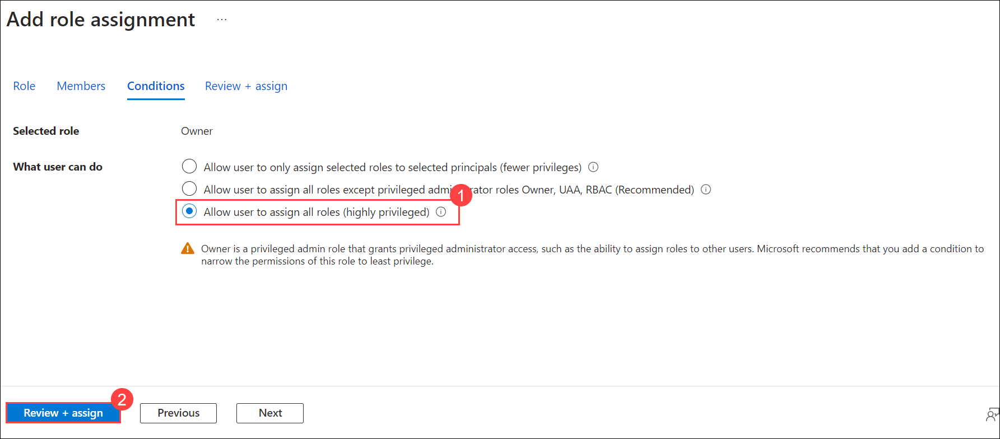

# Exercise 5: Monitoring and Load Testing (Optional)

Duration: 70 minutes

In this exercise, we will add monitoring and logging to gain insight on the application's usage in the cloud. Then create Azure load testing, which is a fully managed load-testing service that enables you to generate high-scale loads. The service simulates traffic for your applications, regardless of where they're hosted. Developers, testers, and quality assurance (QA) engineers can use it to optimise application performance, scalability, or capacity. We will also explore Azure Chaos Studio, which helps you measure, understand, and improve your cloud application and service resilience.

### Task 1: Monitoring using Application Insights

1. In the Azure Portal, navigate to **contoso-traders-<inject key="Deploymentid" enableCopy="false" />** **(1)** resource group and select the **Application Insights** resource with the name  **contoso-traders-ai<inject key="Deploymentid" />** **(2)**.

   
   
1. From the Overview of **contoso-traders-ai<inject key="Deploymentid"  enableCopy="false" />** Application Insights resource, you can set the **Show data for last** as per your requirement of monitoring insights.

   
   
1. In the first graph, you can see the number of failed requests for the Application access.

   
   
1. In the next graph, you can see the average server response time.

   
   
1. In the next graph, you can see the number of server requests.

   
   
1. In the last graph, you can see the average availability.

     
   
## Task 2: Set up Load Testing

In this task, you'll create an Azure Load Testing instance and run a test using a JMeter file.

1. In the Azure Portal, navigate to **contoso-traders-<inject key="Deploymentid" enableCopy="false" />** resource group and select the **Endpoint** resource with the name  **contoso-traders-ui2<inject key="Deploymentid" />**.

   

1. From the overview of **contoso-traders-ui2<inject key="Deploymentid" enableCopy="false" />** endpoint, copy the **Endpoint hostname** **(2)** and paste it into the notepad for later use in the task.

   

1. In the Azure Portal, navigate to **contoso-traders-<inject key="Deploymentid" enableCopy="false" />** **(1)** resource group and select the **Azure Load Testing** resource with the name  **contoso-traders-loadtest<inject key="Deploymentid" />** **(2)**.

   
   
1. On the left hand side pane, select **Tests** ***(1)*** and click on **+ Create** ***(2)*** and select **Create a quick test** ***(3)***.

   

1. On the **Create test** page, under basic tab paste the **Endpoint URL** as Test URL ***(1)*** and  leave everything as default, then click **Run Test** ***(2)***.

   

1. The test run will start running and once the test run is completed, you will be able to see **Client-side metrics**. Explore the given metrics output.

   
   
   **Note**: In case, the test fails due to `The test was stopped due to a high error rate. Check your script and try again. In case the issue persists, raise a ticket with a support error. This is expected as sometimes the load on the application exceeds the defined throughput.
     
## Task 3: Explore Chaos Studio

In this task you will add **Targets** and create an **Experiment** on **Azure Chaos Studio** to check the resilience of the web application that we created by adding  real faults and observe how our applications respond to real-world disruptions.

1. In the Azure Portal search for **Azure Chaos Studio (1)** and then click on it from the search results **(2)**.
   
   

1. In the **Azure Chaos Studio**, select **Targets** on the left menu.

   
      
1. From the drop-down menu, select **contoso-traders-<inject key="DeploymentID" enableCopy="false" />** resource group.
 
   
     
1. Click on the **contoso-traders-aks<inject key="DeploymentID" enableCopy="false" />** **(1)** **Kubernetes service** instance and form the drop-down for **Enable Targets** **(2)** choose **Enable service-direct targets (All resources)** **(3)**.

   
     
1. Click on **Review + Enable**.

   

1. Then click on **Enable** to Enable service direct targets. 
   
   

1. Wait for the deployment to be completed.  

1. In the Azure Portal search for **Azure Chaos Studio** ***(1)*** and then click on it from the search results ***(2)***.
   
   
    
1. Once the target is enabled, select **Experiments** ***(1)*** on the left, click **+ Create** ***(2)*** drop-down, and select **New experiment** **(3)** .
 
   
 
1. On the **Create an experiment** page, under **Basics** tab provide the following values and select **Next: Permissions >** ***(4)***.

    - Subscription: Select the default subscription ***(1)***
    - Resource Group: **contoso-traders-<inject key="DeploymentID" enableCopy="false" />** ***(2)***
    - Name: **contoso-chaos-<inject key="DeploymentID" enableCopy="false" />** ***(3)***
    - Region: Leave it to default 
 
   
   
1. On the **Permissions** page, leave the default selection and select **Next: Experiment designer >**.

   
 
1. On the **Experiment designer** page select **+ Add action (1)** and choose **Add fault (2)**.

   
 
1. On the **Add fault** page, select the following and select **Next: Target resources>** **(4)**.
   
   - Faults: **AKS Chaos Mesh Pods Chaos** ***(1)***
   - Duration (minutes): **5** ***(2)***
   - jsonSpec: Leave it to default ***(3)***
     
   
     
1. On the **Target resources**, select the **Manually select from a list** **(1)** under **Select target resources** , select the **contoso-traders-aks<inject key="DeploymentID" enableCopy="false" />** ***(2)*** resource, and **Add** ***(3)***.
  
   
  
1. Click on **Review + create**.
  
   
   
1. On the **Review + create** click on **Create**.
  
   
  
1. Navigate back to the **contoso-traders-aks<inject key="DeploymentID" enableCopy="false" />** container instance and select **Access control (IAM) (1)**, click on **+ Add (2)** and select **Add role assignment (3)**. 
  
   
  
1. In the **Add role assignment** page, under **Role** tab select **Privileged administrator roles**. Select **Owner (1)** in it and then **Next (2)**.
  
   
  
1. Next on the **Members** tab select **Managed identity (1)**  for **Assign access to** , click on **+ Select members (2)**  on the **Select managed identities** choose **Chaos Experiment (3)** for **Managed identity** select the experiment **contoso-chaos-<inject key="DeploymentID" enableCopy="false" /> (4)**, click on **Select (5)** and click on **Next** **(6)**.  
   
   
  
1. Next on the **Conditions** tab select **Delegation type** as **Not constrained** **(1)** and click on **Review + assign** **(2)**.

   

1. Click on **Review + assign**. 
   
   
      
1. On the Azure portal navigate back to the Chaos experiment you created **contoso-chaos-<inject key="DeploymentID" enableCopy="false" />** and click on **Start**.
  
   
 
1. Select **Ok** for **Start this experiment** pop-up.

    
       
1. Once the experiment status is **Success** click on **Details** to view the run preview.
 
   
 
1. On the **Details** preview page select **Action (1)** and view the complete detail of the run on **Fault details** under **Successful targets (2)**.
 
   

## Summary

In this exercise, you explored monitoring using Application Insights. You also configured Load testing and Chaos experiments for the application.
