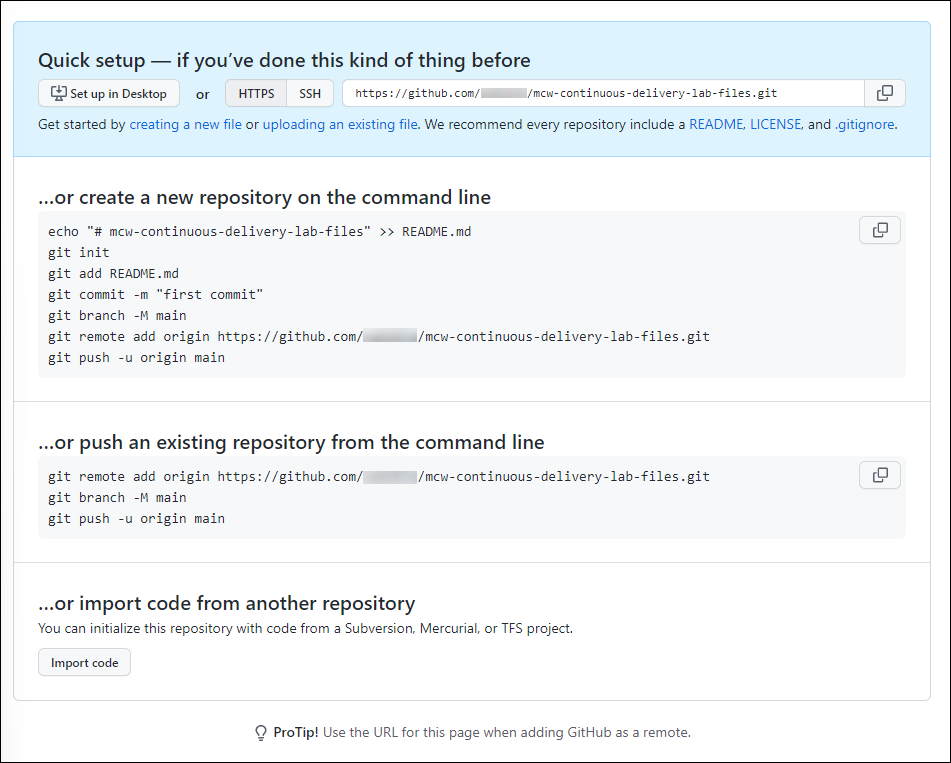
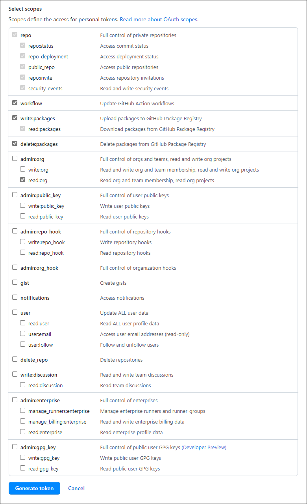
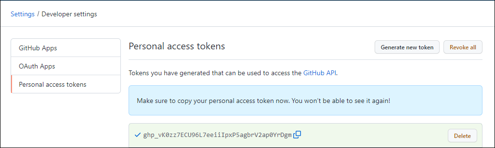
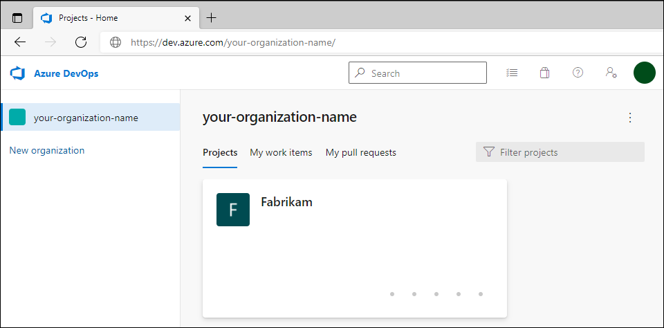
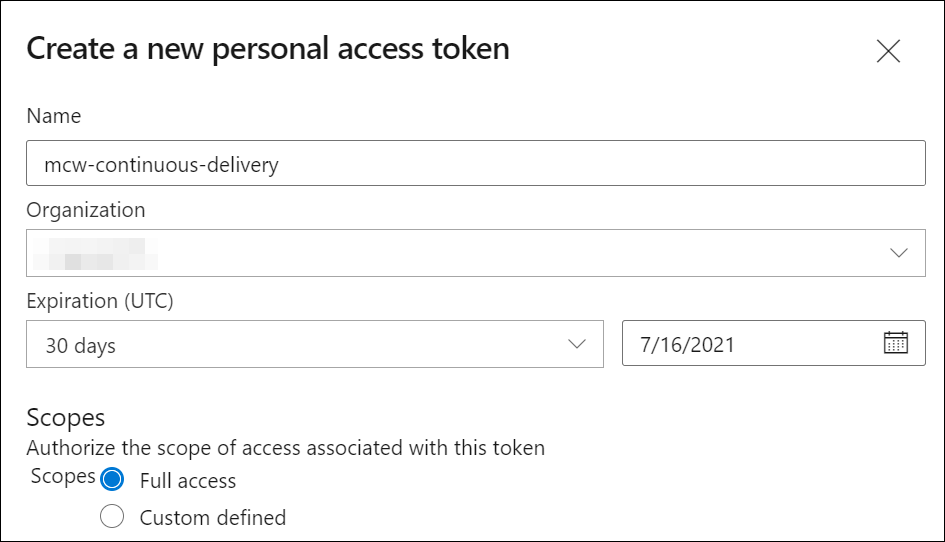
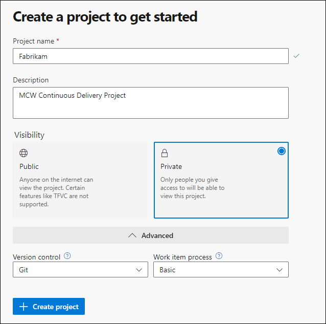
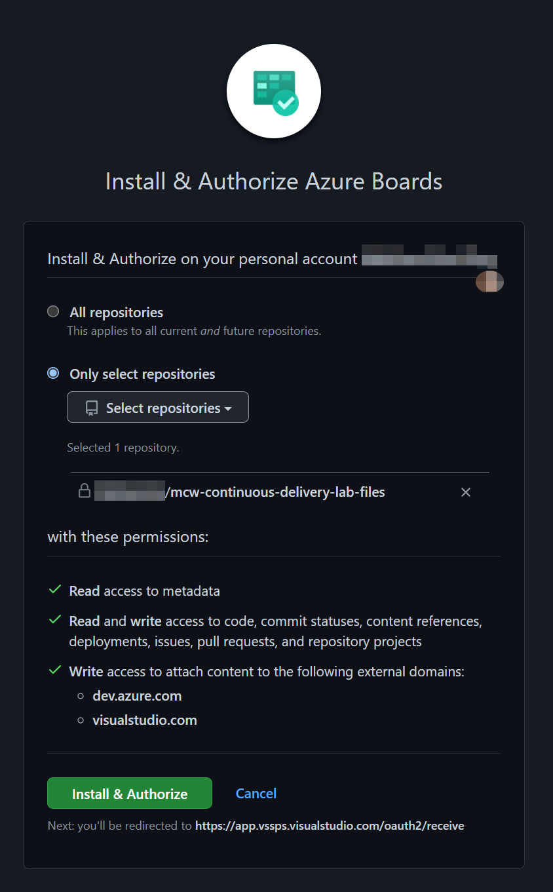
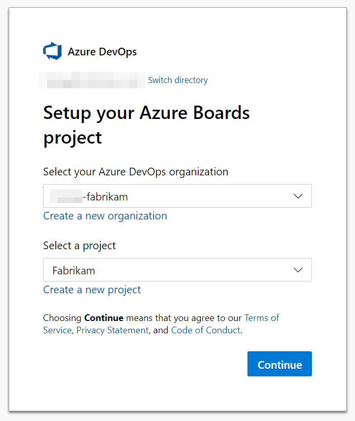
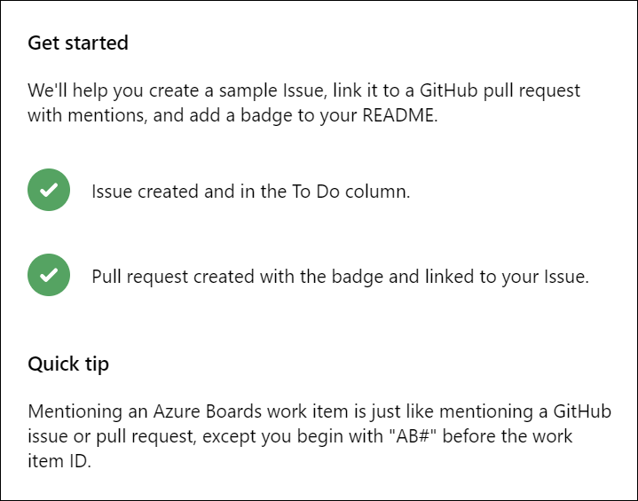

<div class="MCWHeader1">
Continuous delivery in Azure DevOps
</div>

<div class="MCWHeader2">
Before the hands-on lab setup guide
</div>

<div class="MCWHeader3">
November 2021
</div>

Information in this document, including URL and other Internet website references, is subject to change without notice. Unless otherwise noted, the example companies, organizations, products, domain names, e-mail addresses, logos, people, places, and events depicted herein are fictitious, and no association with any real company, organization, product, domain name, e-mail address, logo, person, place or event is intended or should be inferred. Complying with all applicable copyright laws is the responsibility of the user. Without limiting the rights under copyright, no part of this document may be reproduced, stored in, or introduced into a retrieval system, or transmitted in any form or by any means (electronic, mechanical, photocopying, recording, or otherwise), or for any purpose, without the express written permission of Microsoft Corporation.

Microsoft may have patents, patent applications, trademarks, copyrights, or other intellectual property rights covering the subject matter in this document. Except as expressly provided in any written license agreement from Microsoft, the furnishing of this document does not give you any license to these patents, trademarks, copyrights, or other intellectual property.

The names of manufacturers, products, or URLs are provided for informational purposes only and Microsoft makes no representations and warranties, either expressed, implied, or statutory, regarding these manufacturers or the use of the products with any Microsoft technologies. The inclusion of a manufacturer or product does not imply endorsement of Microsoft of the manufacturer or product. Links may be provided to third-party sites. Such sites are not under the control of Microsoft and Microsoft is not responsible for the contents of any linked site or any link contained in a linked site, or any changes or updates to such sites. Microsoft is not responsible for webcasting or any other form of transmission received from any linked site. Microsoft is providing these links to you only as a convenience, and the inclusion of any link does not imply endorsement of Microsoft of the site or the products contained therein.

© 2022 Microsoft Corporation. All rights reserved.

Microsoft and the trademarks listed at <https://www.microsoft.com/en-us/legal/intellectualproperty/trademarks> are trademarks of the Microsoft group of companies. All other trademarks are property of their respective owners.

**Contents**

<!-- TOC -->

- [Continuous Delivery in Azure DevOps before the hands-on lab setup guide](#continuous-delivery-in-azure-devops-before-the-hands-on-lab-setup-guide)
  - [Requirements](#requirements)
  - [Before the hands-on lab](#before-the-hands-on-lab)
    - [Task 1: Create the Project Repo](#task-1-create-the-project-repo)
    - [Task 2: Create GitHub Personal Access Token](#task-2-create-github-personal-access-token)
    - [Task 3: Create Azure DevOps Personal Access Token](#task-3-create-azure-devops-personal-access-token)
    - [Task 4: Create Azure DevOps Project](#task-4-create-azure-devops-project)
    - [Task 5: Connect Azure Board with GitHub](#task-5-connect-azure-board-with-github)

<!-- /TOC -->

# Continuous Delivery in Azure DevOps before the hands-on lab setup guide

You should follow all steps in this document *before* performing the Hands-on lab. Pay close attention to product versions, as the version numbers called out in the lab have been tested and shown successfully in the lab.

> **Note**: If the students need to use Microsoft-hosted Azure Pipelines Agents, [Task 4: Create Azure DevOps Project](#task--4-create-azure-devops-project) will need to be completed at least **2-3 business days** before the lab in order to run parallel jobs in Azure DevOps. The other option is to use self-hosted agents. If you need to go the self-hosted route, refer to the [Azure Pipelines Agents documentation](https://docs.microsoft.com/en-us/azure/devops/pipelines/agents/agents?view=azure-devops&tabs=browser).

## Requirements

1. Microsoft Azure subscription must be pay-as-you-go or MSDN.

   - Trial subscriptions will _not_ work

      - To complete this lab setup, ensure your account includes the following:

      - Has the [Owner](https://docs.microsoft.com/en-us/azure/role-based-access-control/built-in-roles#owner) built-in role for the subscription you use.

      - Is a [Member](https://docs.microsoft.com/azure/active-directory/fundamentals/users-default-permissions#member-and-guest-users) user in the Azure AD tenant you use. (Guest users will not have the necessary permissions.)

2. A [GitHub](https://github.com) account.

3. Local machine or a virtual machine configured with:

    - A browser, preferably Chrome for consistency with the lab implementation tests.

4. Git for Windows

5. PowerShell

## Before the hands-on lab

Duration: 60 minutes

You should follow all of the steps provided in this section _before_ taking part in the hands-on lab ahead of time.

### Task 1: Create the Project Repo

In this task, you will create an account in [GitHub](https://github.com) and use `git` to add lab files to a new repository.

1. Create a new repository on GitHub for the lab files.

    - Browse to [GitHub](https://github.com) in your browser and log into your account.

    - Create a new repository.

      - Select the `New` button.

        

      - Provide a name and description for your new repository.

        > **Note**: The suggested name for the repository is `mcw-continuous-delivery-lab-files`.

      - Select `Private` to make this a private repository.

        

      - Select the `Create Repository` button to create the new repository. Once the repository is created, you should see the quick setup notes.

        

        > **Note:** Copy the URL for this repository, as you need it for the next step.

2. Clone the lab repository.

- Create an appropriate workspace folder and navigate to it in a PowerShell terminal.

 > **Note**: Suggested name for the workspace folder is `C:\Workspaces\lab`, for example:

 ```pwsh
 C:
 mkdir C:\Workspaces
 cd C:\Workspaces
 mkdir lab
 cd lab
 ```

- You should now be in `C:\Workspaces\lab`. Type the following command and press `<ENTER>`:

 ```pwsh
 git clone https://github.com/microsoft/MCW-Continuous-delivery-in-Azure-DevOps.git
 ```

- Within the `lab` folder, create a folder for the GitHub repository created in Step 1 and navigate to it in PowerShell.

 ```pwsh
 mkdir mcw-continuous-delivery-lab-files
 cd mcw-continuous-delivery-lab-files
 ```

- You should now be in `C:\Workspaces\lab\mcw-continuous-delivery-lab-files`. The lab files cloned from the Microsoft MCW lab repository should be in `C:\workspaces\lab\mcw-continuous-delivery-in-azure-devops`. Copy the lab files from the Microsoft MCW lab repository to the new folder.

 ```pwsh
 Copy-Item '..\mcw-continuous-delivery-in-azure-devops\Hands-on lab\lab-files\*' -Destination ./ -Recurse
 ```

- Initialize the `mcw-continuous-delivery-lab-files` folder as a git repository, commit, and submit contents to the remote GitHub branch `main` in the lab files repository created in Step 1.

 > **Note**: The URI of the lab files GitHub repository created in Step 1 will differ from that in the example below.

 ```pwsh
 git init
 git add .
 git commit -m "Initial commit"
 git branch -M main
 git remote add origin https://github.com/YOUR_GITHUB_ACCOUNT/mcw-continuous-delivery-lab-files.git
 git push -u origin main
 ```

### Task 2: Create GitHub Personal Access Token

In this task, you will create a GitHub Personal Access Token (PAT) to be used for working with Docker images in GitHub automation.

1. Log in to your GitHub account.

2. Create a Personal Access Token as [described here](https://docs.github.com/en/authentication/keeping-your-account-and-data-secure/creating-a-personal-access-token). Ensure the following scopes are checked when configuring your GitHub Personal Access Token:

    - `repo` - Full control of private repositories.
    - `workflow` - Update GitHub Action workflows.
    - `write:packages` - Upload packages to GitHub Package Registry.
    - `delete:packages` - Delete packages from GitHub Package Registry.
    - `read:org` - Read org and team membership, read org projects. This is under the `admin:org` section of scopes.

    

3. Copy the GitHub Personal Access Token somewhere safe and accessible for later use during the lab. **DO NOT COMMIT THIS VALUE TO YOUR REPO!**

    

### Task 3: Create Azure DevOps Personal Access Token

In this task, you will create an Azure DevOps Personal Access Token to be used in automating Azure DevOps processes.

1. Log in to your existing Azure DevOps account or create a new account on <https://dev.azure.com/>.

    

2. Create an Azure DevOps Personal Access Token as [described here](https://docs.microsoft.com/en-us/azure/devops/organizations/accounts/use-personal-access-tokens-to-authenticate?view=azure-devops&tabs=preview-page). For this lab, please ensure your Azure DevOps Personal Access Token is configured with a `Full access` scope.

    > **Note**: A `Full access` scope is not recommended for Azure DevOps Personal Access Tokens in live development and production environments. We are only using this scope for this lab.

    

3. Copy the Azure DevOps Personal Access Token somewhere safe and accessible to you for later use during the lab. **DO NOT COMMIT THIS VALUE TO YOUR REPO!**

    

### Task 4: Create Azure DevOps Project

In this task, you will set up a project in Azure DevOps to be used with the section on continuous deployment in Azure DevOps.

1. Create a `Fabrikam` project in Azure DevOps for use in the lab with the following settings:

   - **Project name**: `Fabrikam`
   - **Visibility**: `Private`

   

   - Under the **Advanced** settings, be sure to select the following values:
     - **Version control**: `Git`
     - **Work item process**: `Basic`

   - Select the **Create project** button.

2. To complete Exercise 3: Task 3 in the Hands on Lab, the student will need to request a free grant of parallel jobs in Azure Pipelines via [this form](https://aka.ms/azpipelines-parallelism-request). More information can be found [here regarding changes in Azure Pipelines Grant for Public Projects](https://devblogs.microsoft.com/devops/change-in-azure-pipelines-grant-for-public-projects/).

    > **Note**: The Azure DevOps Parallelism Request can take 2-3 business days to process the request.

You should follow all steps provided *before* performing the Hands-on lab.

### Task 5: Connect Azure Board with GitHub

We can automate our project tracking with the Azure Board integration for GitHub. In this task, you will connect your Azure DevOps project's board to your GitHub repository.

1. On the GitHub Marketplace, find the [Azure Boards Integration App](https://github.com/marketplace/azure-boards).

    

2. Scroll to the bottom of the page and select `Install it for Free`.

3. On the next page, select `Complete order and begin installation`.

4. Select the lab files repository created in [Task 1 of the Before the HOL Instructions](Before%20the%20HOL%20-%20Continuous%20delivery%20in%20Azure%20DevOps.md#task-1-create-the-project-repo) and select `Install & Authorize`.

    

5. Select the Azure DevOps organization you signed into or created in the Before Hands-On Lab setup guide and select the Fabrikam project.

    

6. When the integration succeeds, you will be taken to the Azure DevOps Board. Follow the directions in the onboarding tutorial to create an initial Issue in the `To Do` Column and create a pull request associated with your Issue.

    

7. Open the new Issue that the onboarding tutorial creates within Azure DevOps and observe the GitHub pull request and comments that are linked to the Azure DevOps board Issue.

    

8. In GitHub, browse to the `Pull Requests` tab of the lab files repository created in [Task 1 of the Before the HOL Instructions](Before%20the%20HOL%20-%20Continuous%20delivery%20in%20Azure%20DevOps.md#task-1-create-the-project-repo) and open the pull request that was created in the onboarding tutorial for the Azure Boards Integration App. Note the `AB#1` annotation in the pull request comments - this annotation signals to Azure DevOps that this pull request comment should be linked to Issue #1 in Azure Boards.

    

9. Select the `Files changed` tab within the pull request detail and observe the change to the README.md associated with this pull request. After reviewing the changes, go back to the `Conversation` tab. Select the `Merge pull request` button and confirm the following prompt to merge the pull request into the `main` branch.

    

10. In Azure DevOps Boards, find the work item and observe that the issue has been moved to the `Done` column on completion of the pull request.

    

