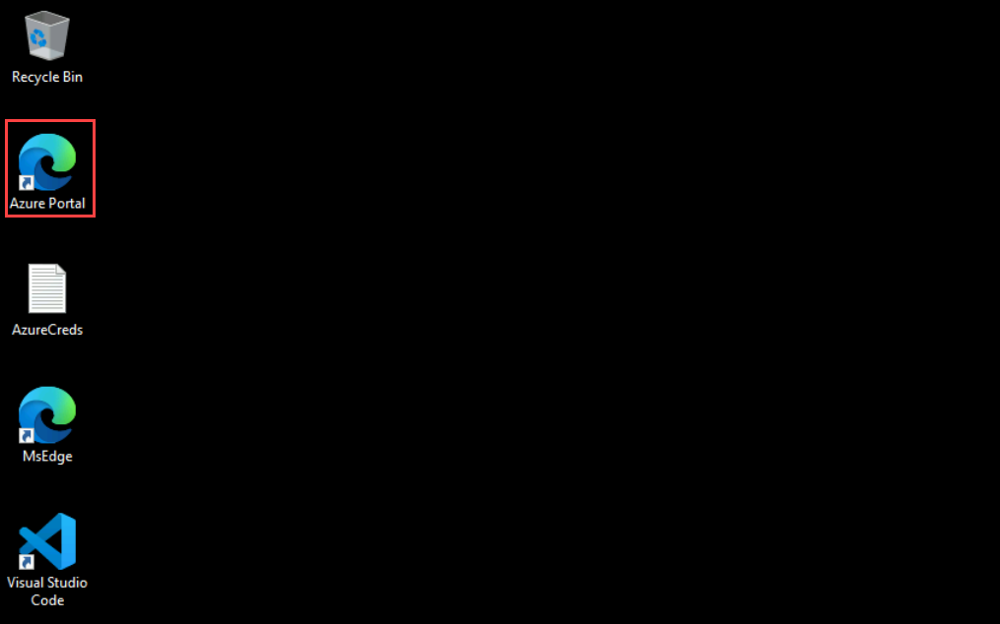
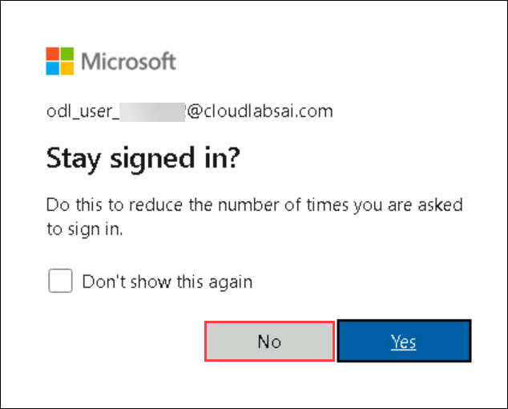

# Microsoft Dev Box for Developers

### Overall Estimated Duration: 2 hours

## Overview

Microsoft Dev Box provides high-performance, cloud-based development workstations designed to streamline the developer experience. By leveraging preconfigured environments with customizable compute and storage options, Dev Box enables developers to quickly access ready-to-code workspaces. With integrated networking capabilities and centralized management of development pools, it simplifies configuration, enhances productivity, and accelerates the development lifecycle in the cloud.

## Objective

This lab is designed to equip participants with hands-on experience in configuring and managing Microsoft Dev Box environments to streamline development workflows.

- **Implement Dev Box:** Configure and manage cloud-based development workstations using Microsoft Dev Box, including creating Dev Box definitions, setting up network connections, and accessing Dev Boxes through the portal.

## Prerequisites

Participants should have the following prerequisites:

-   **Basic Understanding of Cloud Computing :** Familiarity with fundamental cloud concepts and services, particularly in the context of Microsoft Azure.
-   **Knowledge of Azure Cognitive Services :** Understanding of the Azure Cognitive Services suite, including how to provision and use services like Computer Vision and Anomaly Detector.
-   **Experience with the Azure Portal**: Proficiency in navigating and using the Azure Portal to manage and configure cloud resources.
-   **Familiarity with PowerShell or Cloud Shell :** Basic knowledge of using PowerShell or Cloud Shell for running commands and scripts within Azure.
-   **Basic Programming Knowledge :** Understanding of scripting or programming languages like PowerShell, which are used for configuring and running client applications in Azure.
-   **Understanding of APIs and Endpoints :** Familiarity with how to interact with APIs and use endpoints for connecting to services in Azure.
-   **Knowledge of Security Best Practices :** Awareness of security principles related to cloud services, including handling keys, authentication, and securing resources.

## Architechture

The architecture for **Implement Dev Box** integrates several components to deliver a cloud-based development environment. Central to this is the **Microsoft Dev Box**, a high-performance workstation configured with specific compute, storage, and image settings defined in the **Dev Box Definition**. **Network Connections** link the Dev Boxes to Azure virtual networks, ensuring seamless integration. The **Dev Box Pool** manages multiple Dev Boxes across projects, while the **Microsoft Dev Box Portal** serves as the interface for users to create, manage, and access their Dev Boxes. This setup provides an efficient, scalable, and secure development experience in the cloud.

## Architechture Diagram

## Explanation of Components

The architecture for this lab involves several key components:

- **Microsoft Dev Box:** A cloud-based, high-performance workstation preconfigured for development tasks.  
- **Dev Box Definition:** A template defining the compute, storage, and image configuration for a Dev Box.  
- **Network Connection:** Links Dev Boxes to Azure virtual networks for secure communication with other resources.  
- **Dev Box Pool:** A collection of managed Dev Boxes, allowing for simplified scaling and deployment.  
- **Microsoft Dev Box Portal:** A web interface for creating, managing, and accessing Dev Boxes remotely.

## Getting Started with Lab

Welcome to **Microsoft Dev Box for Developers**! We've created a streamlined environment for you to explore and configure Azure Dev Box services. Let's begin by making the most of this experience:

## Accessing Your Lab Environment
 
Once you're ready to dive in, your virtual machine and **Lab Guide** will be right at your fingertips within your web browser.

     

### Virtual Machine & Lab Guide
 
Your virtual machine is your workhorse throughout the workshop. The lab guide is your roadmap to success.
 
## Exploring Your Lab Resources
 
To get a better understanding of your lab resources and credentials, navigate to the **Environment Details** tab.

   
 
## Utilizing the Split Window Feature
 
For convenience, you can open the lab guide in a separate window by selecting the **Split Window** button from the Top right corner.
 
   
 
## Managing Your Virtual Machine
 
Feel free to start, stop, or restart your virtual machine as needed from the **Resources** tab. Your experience is in your hands!
 
  

## Lab Validation

1. After completing the task, hit the **Validate** button under Validation tab integrated within your lab guide. If you receive a success message, you can proceed to the next task, if not, carefully read the error message and retry the step, following the instructions in the lab guide.

   

1. You can also validate the task by navigating to the **Lab Validation** tab, from the upper right corner in the lab guide section.

   

1. If you need any assistance, please contact us at cloudlabs-support@spektrasystems.com.

 
## Let's Get Started with Azure Portal
 
1. On your virtual machine, click on the Azure Portal icon as shown below:
 
    
 
1. You'll see the **Sign into Microsoft Azure** tab. Here, enter your credentials:
 
   - **Email/Username:** <inject key="AzureAdUserEmail"></inject>
 
      
 
3. Next, provide your password:
 
   - **Password:** <inject key="AzureAdUserPassword"></inject>
 
      

1. If you see the pop-up Action Required, click **Ask Later**.

   

   >**NOTE:** Do not enable MFA, select **Ask Later**.
 
1. If you see the pop-up **Stay Signed in?**, click **No**.

   

1. If you see the pop-up **You have free Azure Advisor recommendations!**, close the window to continue the lab.

1. If a **Welcome to Microsoft Azure** popup window appears, click **Maybe Later** to skip the tour.

## Support Contact
 
The CloudLabs support team is available 24/7, 365 days a year, via email and live chat to ensure seamless assistance at any time. We offer dedicated support channels tailored specifically for both learners and instructors, ensuring that all your needs are promptly and efficiently addressed.

Learner Support Contacts:
- Email Support: cloudlabs-support@spektrasystems.com
- Live Chat Support: https://cloudlabs.ai/labs-support

Now, click on **Next** from the lower right corner to move on to the next page.

### Happy Learning!!

