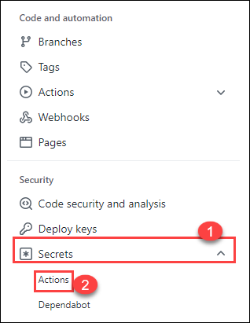
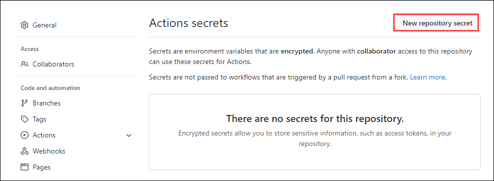
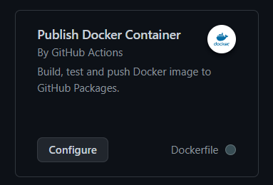
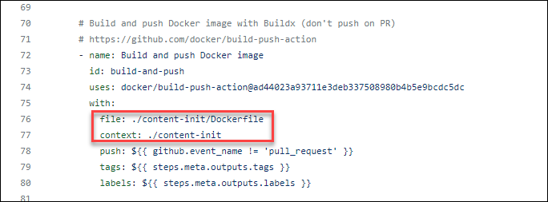
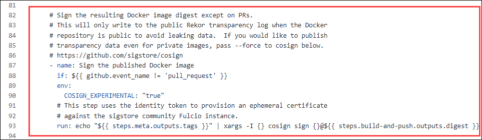
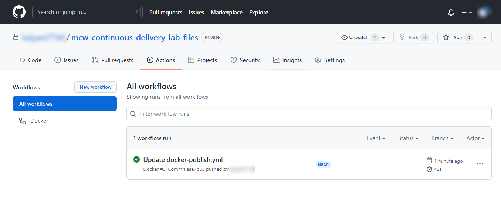
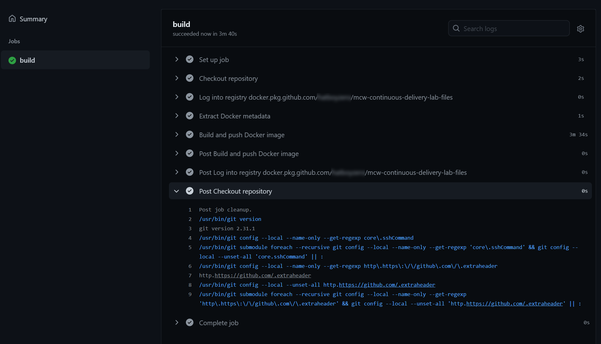
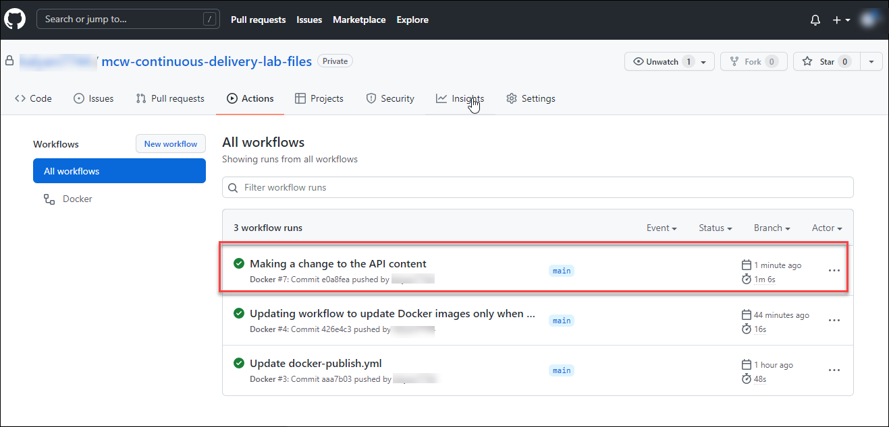
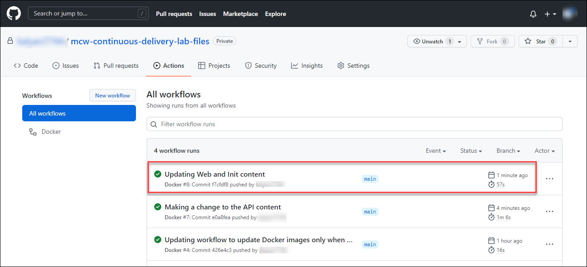
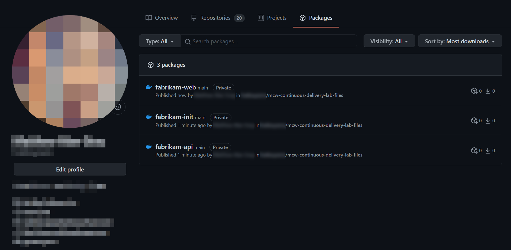

## Exercise 1: Continuous Integration

Duration: 40 minutes

After a requirements gathering effort, we find that Fabrikam Medical Conferences has many areas of potential improvement in their development workflow. Specifically, we conclude that there are a lot of manual tasks that can be automated. Automation potentially mitigates many of the recurring quality and security issues. Also, the dependencies between Fabrikam's developers' work and productivity are reduced. We will begin to address some of these efforts in this exercise to improve developer flow and establish continuous integration practices.

**Help references**

|                                       |                                                                        |
| ------------------------------------- | ---------------------------------------------------------------------- |
| **Description**                       | **Link**                                                              |
| One Dev Minute - What is Continuous Integration? | <https://docs.microsoft.com/shows/one-dev-minute/what-is-continuous-integration--one-dev-question> |
| What is Continuous Integration? | <https://docs.microsoft.com/devops/develop/what-is-continuous-integration> |
| Microsoft Learn - Explore continuous integration | <https://docs.microsoft.com/learn/modules/explore-continuous-integration> |
| Microsoft Learn - Build continuous integration (CI) workflows by using GitHub Actions | <https://docs.microsoft.com/learn/modules/github-actions-ci/> |
| Microsoft Azure Well-Architected Framework - Release Engineering - Continuous Integration | <https://docs.microsoft.com/azure/architecture/framework/devops/release-engineering-ci> |

### Task 1: Set up Local Infrastructure

You are going to set up the local infrastructure using Docker containers. There are three images you will be working with:

- `fabrikam-init`
- `fabrikam-api`
- `fabrikam-web`

You will need to make some edits to files before running these locally. In this task, you will confirm that the Docker infrastructure works locally.

1. In your Labvm open file explorer,  navigate to `C:\Workspaces\lab\mcw-continuous-delivery-lab-files` to open your local GitHub repository.
2. Replace `<yourgithubaccount>` value with your GitHub account name in the following files located at the root of your lab files repository. After updating save the files using CTRL+S.
    - `docker-compose.init.yml`
    - `docker-compose.yml`

   > **Note**: You should replace three instances of `<yourgithubaccount>` - one instance in `docker-compose.init.yml` and two instances in `docker-compose.yml`.

   > **Note**: The `<yourgithubaccount>` value must be in **lowercase**, if your GitHub account user name is in uppercase letters please change it to lowercase in Github. [Github Username Change](https://docs.github.com/en/account-and-profile/setting-up-and-managing-your-github-user-account/managing-user-account-settings/changing-your-github-username)
   
   
3. Build and run the docker-compose YAML files edited in the previous step.
    
     > **Note**: Make sure that you are in `C:\Workspaces\lab\mcw-continuous-delivery-lab-files` dir.

    ```pwsh
    docker-compose -f .\docker-compose.yml -f .\local.docker-compose.yml -f .\docker-compose.init.yml build
    docker-compose -f .\docker-compose.yml -f .\local.docker-compose.yml -f .\docker-compose.init.yml up
    ```

    
    
4. Verify that you can browse to <http://localhost:3000> in a browser and arrive at the Fabrikam conference website.

    


5. Leave this PowerShell session in running and open a new session. Paste the following command and hit `<ENTER>`.

    ```pwsh
    cd C:\Workspaces\lab\mcw-continuous-delivery-lab-files
    ```
6. Commit and push your changes to your GitHub repository.

    ```pwsh
    git pull
    git add .
    git commit -m "Updating Docker compose files"
    git push
    ```

### Task 2: Build Automation with GitHub Registry

Now that we have Docker images working locally, we can build automation in GitHub for updating and republishing our Docker images when the code changes. In this task, we will create a workflow file using the GitHub interface and its GitHub Actions workflow editor. This will get you familiar with how to create and edit an action through the GitHub website.

1. In your GitHub lab files repository, select the `Settings` tab from the lab files repository.

   

2. Under **Security**, expand **Secrets(1)** by clicking the drop-down and select **Actions(2)** blade from the left navigation bar.

    

3. Select the `New repository secret` button.

    

4. Under **Actions Secrets/New secret** page, enter the below mentioned details:

     - **Name** : Enter **CR_PAT** (1)

     - **Value** : Enter the **GitHub Personal Access Token** (2) you created in the Before the Hands-On Lab instructions.

     - Click on **Add secret** (3)
     
    

    > **Note**: CR_PAT is short for Container Registry Personal Authentication Token.

5. Select the `Actions` tab in your GitHub repository, under the **Continuous Integration Workflows** find the `Publish Docker Container` workflow and select `Configure`. This will create a file named `docker-publish.yml`.

    

    > **Note**: If you have gone through this MCW in the past, note that this step has changed. Do not rename this file. Leave this file named `docker-publish.yml`.

6. Change the registry to `ghcr.io/${{ github.actor }}` in line 20. Replace the **IMAGE_NAME** line with `fabrikam-init` in line 22. The `env` section of this file should look like this YAML:

    ```yaml
        env:
        # Use docker.io for Docker Hub if empty.
        REGISTRY: ghcr.io/${{ github.actor }}
        # github.repository as <account>/<repo>
        IMAGE_NAME: fabrikam-init
    ```

7. The login step needs to be adjusted to use our `CR_PAT` secret value for the `password`, replace **GITHUB_TOKEN** with **CR_PAT** in line 61. The login step should look like this:

    ```yaml
        # Login against a Docker registry except on PR
        # https://github.com/docker/login-action
        - name: Log into registry ${{ env.REGISTRY }}
            if: github.event_name != 'pull_request'
            uses: docker/login-action@28218f9b04b4f3f62068d7b6ce6ca5b26e35336c
            with:
            registry: ${{ env.REGISTRY }}
            username: ${{ github.actor }}
            password: ${{ secrets.CR_PAT }} # <-- Change this from GITHUB_TOKEN
    ```

8. Add explicit path to `Dockerfile` and context path to the `Build and push Docker image` step. This step will ensure the correct `Dockerfile` file can be found. The Build and push step should look like this:


   ```yaml
    # Build and push Docker image with Buildx (don't push on PR)
    # https://github.com/docker/build-push-action
    - name: Build and push Docker image for ${{ env.API_IMAGE_NAME }}
      id: build-and-push
      uses: docker/build-push-action@ad44023a93711e3deb337508980b4b5e9bcdc5dc
      with:
        file: ./content-init/Dockerfile                      
        context: ./content-init                              
        push: ${{ github.event_name != 'pull_request' }}
        tags: ${{ steps.meta.outputs.tags }}
        labels: ${{ steps.meta.outputs.labels }}
   ```
    
   
   
9. Remove the **image signing section** from line 82 to 93 in the workflow, as it is not required.

   
    
10. Commit the file to the repository. Select `Start commit`. Be sure that **Commit directly to the `main` branch** is selected. Finally, select `Commit new file`.

11. The GitHub Action is now running and will automatically build and push the container to the GitHub registry.

    

    

### Task 3: Editing the GitHub Workflow File Locally

The last task automated building and updating only one of the Docker images. In this task, we will update the workflow file with a more appropriate workflow for the structure of our repository. This task will end with a file named `docker-publish.yml` that will rebuild and publish Docker images as their respective code is updated.

The file copied in this task builds the following workflow:
  

The `check_changed_folders` job takes the following steps:

1. Look through all files in the `git diff`.
2. If there are files changed in `content-api`, set a flag to update the API Docker Image.
3. If there are files changed in `content-web`, set a flag to update the Web Docker Image.
4. If there are files changed in `content-init`, set a flag to update the Init Docker Image.
  
Each of the `build-` jobs are marked with `needs` to depend on the `git diff` check. The `if` indicates the condition that will trigger that job to run.

Now let's make this change in our repository.

1. In case there are changes on the server that you don't have locally, pull the changes from GitHub into your local copy of the code.

    ```pwsh
    git pull
    ```

2. From your `mcw-continuous-delivery-lab-files` folder, copy `docker-publish.yml` from the `Hands-on lab\lab-files` folder to the `.github\workflows` folder, overwriting what you created in steps 1-5.

    ```pwsh
    cp .\docker-publish.yml .github\workflows
    ```

    > **Note**: This command updates the workflow file created in the previous task and contains jobs as described at the beginning of this task.

3. Commit this change to your repo, then push the change to GitHub.

    ```pwsh
    git add .
    git commit -m "Updating workflow to update Docker images only when there are changes"
    git push
    ```
    
    
    > **Note**: This will update the workflow and will **not** run the "Update the ... Docker image" jobs.

4. Navigate to `C:\Workspaces\lab\mcw-continuous-delivery-lab-files\content-api` folder using file explorer and open the `Dockerfile` add the following comment to the top of `Dockerfile`. After updating the file, press CTRL+S to save the file. 

    ```yaml
    # Testing
    ```

5. Commit this change to your repo, then push the change to GitHub.

    ```pwsh
    git add .
    git commit -m "Making a change to the API content"
    git push
    ```
   

    > **Note**: The workflow will run the "Update the API Docker image" job and skip the other 2 "Update the ... Docker image" jobs.
    
6.  Navigate to `C:\Workspaces\lab\mcw-continuous-delivery-lab-files\content-web` folder using file explorer and open the `Dockerfile` add the following comment to the top of `Dockerfile`. After updating the file, press CTRL+S to save the file.
    
    ```yaml
    # Testing
    ```
7. Navigate to `C:\Workspaces\lab\mcw-continuous-delivery-lab-files\content-init` folder using file explorer and open the `Dockerfile` add the following comment to the top of `Dockerfile`. After updating the file, press CTRL+S to save the file.
    
    ```yaml
    # Testing
    ```
8. Commit these changes, then push the changes to GitHub.

    ```pwsh
    git add .
    git commit -m "Updating Web and Init content"
    git push
    ```
    
    
    > **Note**: The workflow will run the "Update the Web Docker image" and "Update the Init Docker image" jobs. It will skip the "Update the API Docker image" job.

9. Navigate to the `Packages` tab in your GitHub account and verify that the container images have been built and pushed to the container registry.

    

### Task 4: Using Dependabot

Another part of continuous integration is having a bot help track versions of the packages used in the application and notify us when there are newer versions. In this task, we will use Dependabot to track the versions of the packages we use in our GitHub repository and create pull requests to update packages for us.

1. In your lab files GitHub repository, navigate to the `Security` tab. Select the `Enable Dependabot alerts` button.

    

2. You should arrive at the `Security & analysis` blade under the `Settings` tab. Enable `Dependabot security updates`.

    > **Note**: Enabling the `Dependabot security updates` will also automatically enable `Dependency graph` and `Dependabot alerts`.

    

    > **Note**: The alerts for the repository may take some time to appear. The rest of the steps for this task rely on the alerts to be present. You can continue with the next exercise as this is an independent task and doesn't affect the lab. Please visit this task later and complete the task.

3. To observe Dependabot issues, navigate to the `Security` tab and select the `View Dependabot alerts` link. You should arrive at the `Dependabot alerts` blade in the `Security` tab.

    

4. Sort the Dependabot alerts by `Package name`. Locate the `handlebars` vulnerability by typing `handlebars` in the search box under the `Package` dropdown menu.

    

5. Select any of the `handlebars` Dependabot alert entries to see the alert detail. After reviewing the alert, select `Create Dependabot security update` and wait a few moments for GitHub to create the security update.

    

    

6. In the `Pull Requests` tab, find the Dependabot security patch pull request and merge it to your main branch.

    

    
    
    >**Note**: In case if you see any errors with merge request. Retry step 4 to step 6 by selecting any other`handlebars` Dependabot alert.

7. Pull the latest changes from your GitHub repository to your local GitHub folder.

    ```pwsh
    cd C:\Workspaces\lab\mcw-continuous-delivery-lab-files  # This path may vary depending on how
                                                            # you set up your lab files repository
    git pull
    ```
    
