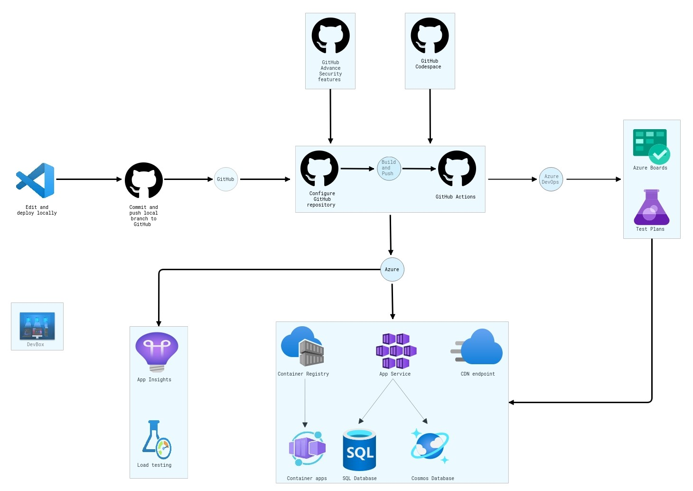

# Abstract and learning objectives 

In this hands-on lab, you will learn how to implement a solution with a combination of ARM templates and Azure DevOps to enable continuous delivery with several Azure PaaS services.

At the end of this workshop, you will be better able to implement solutions for continuous delivery with GitHub in Azure, as well create an ARM (ARM) template to provision Azure resources, create an Azure DevOps project with a GitHub repository, and configure continuous delivery with GitHub.

## Overview

Fabirkam Medical Conferences provide conference website services tailored to the medical community. Over ten years, they have built conference sites for a small conference organizer. Through word of mouth, Fabrikam Medical Conferences has become a well-known industry brand handling over 100 conferences per year and growing.

Websites for medical conferences are typically low-budget websites because the conferences usually have between 100 to 1500 attendees. At the same time, the conference owners have significant customization and change demands that require turnaround on a dime to the live sites. These changes can impact various aspects of the system from UI through to the back end, including conference registration and payment terms.

## Solution architecture

## References
 
 - [Continuous Integration](https://docs.microsoft.com/en-us/devops/develop/what-is-continuous-integration)
 - [Continuous Delivery](https://docs.microsoft.com/en-us/devops/deliver/what-is-continuous-delivery)
 - [CI/CD pipeline using Azure DevOps](https://docs.microsoft.com/en-us/azure/architecture/example-scenario/apps/devops-dotnet-webapp)
 - [Automate multistage DevOps pipelines with Azure Pipelines](https://docs.microsoft.com/en-us/azure/architecture/example-scenario/devops/automate-azure-pipelines)
