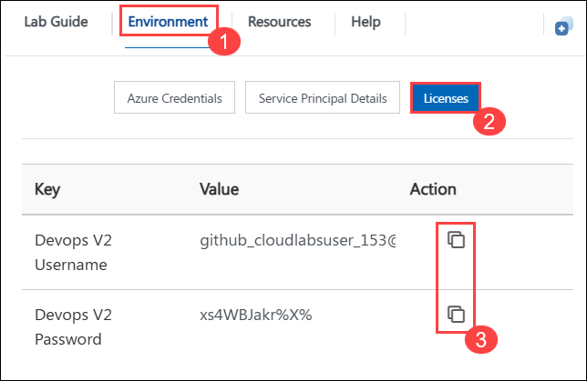

## Steps to resolve Docker application issue:

1. In search bar, Search for **Control Panel** and open it.

   
   
1. Select **Uninstall a program** from programs. 
   
   
   
1. Right click on the **Docker application** and click on **Uninstall**. Wait for the uninstallation to complete.

   
 
1. In search bar, Search for **PowerShell** application and open it.

   
   
1. Run `choco` (1) command to verify whether Chocolatey is installed or not. You should get output as mentioned in the screenshot below if it is install. 

   

   >**NOTE**: If chocolatey is not installed. Run the following command to install. 

   `Set-ExecutionPolicy Bypass -Scope Process -Force; [System.Net.ServicePointManager]::SecurityProtocol = [System.Net.ServicePointManager]::SecurityProtocol -bor 3072; iex ((New-Object System.Net.WebClient).DownloadString('https://community.chocolatey.org/install.ps1')) `
   
1. Run `choco install docker-desktop --version=4.7.0 -Force`  command to install the Docker application. Please wait till the installation is completed.

   

   >**Note**: Do not close the PowerShell window until the execution completes. 

