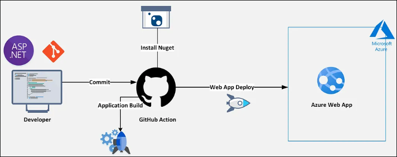
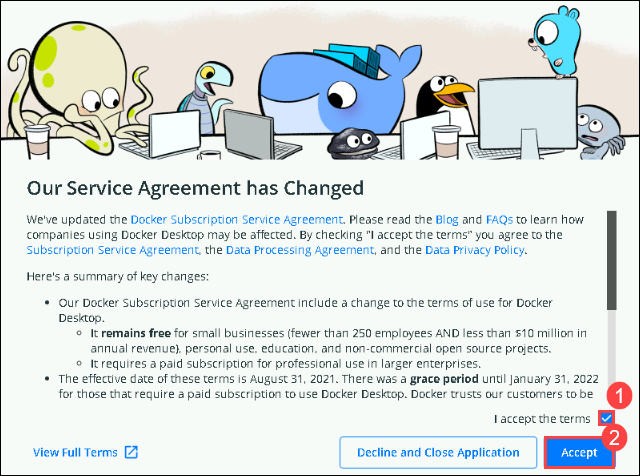

# CICD with GitHub Actions and Explore GitHub Advanced Security Features
## Overall Estimated Duration: 4 Hours
## Overview
In this comprehensive hands-on lab, you will delve into the essentials of Continuous Integration (CI), Continuous Deployment (CD), and advanced security practices using GitHub. You'll learn how to leverage GitHub Actions to automate your development workflows, including building, testing, and deploying your applications. Additionally, you'll explore GitHub's advanced security features, such as secret scanning, code scanning, and Dependabot, to safeguard your codebase against vulnerabilities.

This lab offers a practical understanding of setting up CI/CD pipelines and implementing security measures, ensuring a robust and secure development process.

## Objective
By the end of this lab, you will be able to:

- **Understand GitHub Actions:** Grasp the fundamentals of GitHub Actions, including workflows, jobs, and actions, to automate CI/CD processes.
- **Set Up CI/CD Pipelines:** Create and manage workflows for automating build, test, and deployment processes. Integrate third-party tools and services into your CI/CD pipeline.
- **Implement Advanced Workflows:** Utilize advanced features of GitHub Actions, such as matrix builds, reusable workflows, and secrets management, to optimize your CI/CD processes.
- **Explore Deployment Strategies:** Implement various deployment strategies, including rolling, blue-green, and canary releases, using GitHub Actions.
- **Utilize GitHub Security Features:** Set up and configure GitHub's security tools, including secret scanning, code scanning, and Dependabot, to identify and manage security risks.
- **Apply Security Best Practices:** Implement best practices for securing your GitHub repositories, including access control management and security policy configurations.

## Pre-requisites

- Basic knowledge of Git and GitHub
- Familiarity with software development and deployment processes
- Basic understanding of security concepts in software development

## Architecture
In this hands-on lab, you'll explore the integration of Continuous Integration (CI) and Continuous Deployment (CD) processes using GitHub Actions, along with implementing advanced security features provided by GitHub.
## Architecture Diagram
   

## Explanation of Components

- **GitHub Repository:** The centralized location for your codebase, where you define and manage GitHub Actions workflows and security configurations.
- **Workflows:** A series of automated steps, written in YAML, that run in response to specific events in your repository. Workflows can include jobs and actions.
- **Jobs:** Individual units of work within a workflow, consisting of multiple steps that can run sequentially or in parallel.
- **Actions:** Reusable components within workflows that perform specific tasks, such as building code, running tests, or deploying applications.
- **Runners:** Virtual machines that execute the workflows defined in your repository.
- **Secret Scanning:** A feature that scans your codebase for sensitive information (e.g., API keys, passwords) and alerts you if any secrets are detected.
- **Code Scanning:** A feature that automatically analyzes your code for security vulnerabilities and provides actionable feedback.

## **Getting Started with Your Implement Dev Box Workshop**
 
Welcome to your Implement Dev Box workshop! We've prepared a seamless environment for you to explore and learn about Azure services. Let's begin by making the most of this experience:
 
## **Accessing Your Lab Environment**
 
Once you're ready to dive in, your virtual machine and lab guide will be right at your fingertips within your web browser.

   .png)

### **Virtual Machine & Lab Guide**
 
Your virtual machine is your workhorse throughout the workshop. The lab guide is your roadmap to success.
 
## **Exploring Your Lab Resources**
 
To get a better understanding of your lab resources and credentials, navigate to the **Environment** tab.

   .png) 
 
## **Utilizing the Split Window Feature**
 
For convenience, you can open the lab guide in a separate window by selecting the **Split Window** button from the Top right corner.

   .png) 
   
## **Managing Your Virtual Machine**
 
Feel free to start, stop, or restart your virtual machine as needed from the **Resources** tab. Your experience is in your hands!

    
 
## **Let's Get Started with Azure Portal**
 
1. On your virtual machine, click on the Azure Portal icon as shown below:
 
    .png)

1. If the Docker Desktop service agreement pop-up appears, check the box to **accept the terms(1)** and click **Accept(2)**. Afterward, minimize any remaining Docker Desktop windows.

    
 
1. On the **Sign in to Microsoft Azure** tab you will see the login screen, in that enter the following email/username, and click on **Next**. 

   * **Email/Username**: <inject key="AzureAdUserEmail"></inject>
   
   
     
1. Now enter the following password and click on **Sign in**.
   
   * **Password**: <inject key="AzureAdUserPassword"></inject>
   
   

1. If Action required pop-up window appears, click on **Ask later**. 
  
1. If you see the pop-up **Stay Signed in?**, select **No**.

1. If you see the pop-up **You have free Azure Advisor recommendations!**, close the window to continue the lab.

1. If a **Welcome to Microsoft Azure** popup window appears, select **Cancel** to skip the tour.
   
1. Now, click on **Next** from the lower right corner to move on to the next page.

   

This hands-on lab will help you master the implementation of Continuous Integration and Continuous Deployment (CI/CD) processes using GitHub Actions, along with exploring advanced security features. You'll learn how to automate building, testing, and deploying applications, and implement security measures like secret scanning, code scanning, and dependency monitoring.

# Support Contact

The CloudLabs support team is available 24/7, 365 days a year, via email and live chat to ensure seamless assistance at any time. We offer dedicated support channels tailored specifically for both learners and instructors, ensuring that all your needs are promptly and efficiently addressed.

Learner Support Contacts:
- Email Support: labs-support@spektrasystems.com
- Live Chat Support: https://cloudlabs.ai/labs-support

Now, click on Next from the lower right corner to move on to the next page.

# Happy Learning!!
