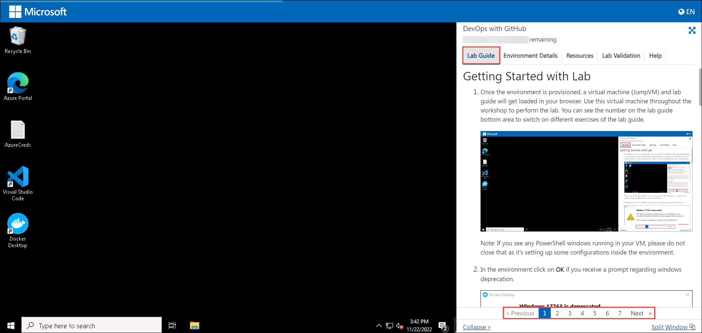
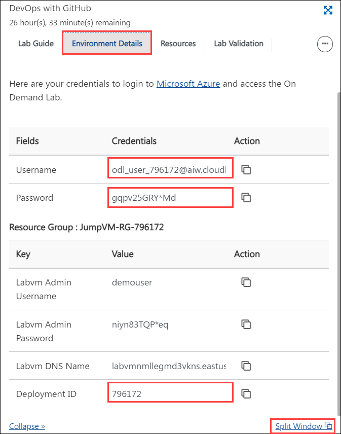
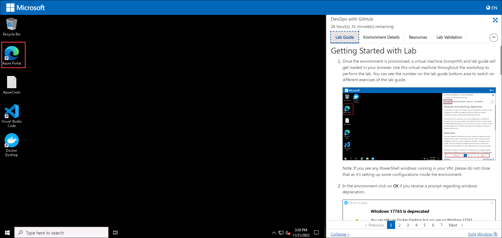

# Getting Started with Lab

1. Once the environment is provisioned, a virtual machine (JumpVM) and lab guide will get loaded in your browser. Use this virtual machine throughout the workshop to perform the lab. You can see the number on the lab guide bottom area to switch on different exercises of the lab guide.

   
   
   >Note: If you see any PowerShell windows running in your VM, please do not close that as it's setting up some configurations inside the environment.
   
1. In the environment click on **OK** if you receive a prompt regarding windows deprecation.

        

1. To get the lab environment details, you can select the **Environment Details** tab. Additionally, the credentials will also be emailed to your email address provided at registration. You can also open the Lab Guide in a separate and full window by selecting the **Split Window** from the lower right corner. Also, you can start, stop and restart virtual machines from the **Resources** tab.

   
 
   > You will see the SUFFIX value on the **Environment Details** tab, use it wherever you see SUFFIX or DeploymentID in lab steps.
 
## Login to Azure Portal

1. In the JumpVM, click on the Azure portal shortcut of the Microsoft Edge browser which is created on the desktop.

   

1. In the Welcome to Microsoft Edge page, select **Start without your data** and on the help for importing Google browsing data page select **Continue without this data** button and proceed to select **Confirm and start browsing** on the next page.

1. On the **Sign in to Microsoft Azure** tab you will see the login screen, in that enter the following email/username, and click on **Next**. 

   * **Email/Username**: <inject key="AzureAdUserEmail"></inject>
   
   
     
1. Now enter the following password and click on **Sign in**.
   
   * **Password**: <inject key="AzureAdUserPassword"></inject>
   
   
     
1. If you see the pop-up **Stay Signed in?**, select **No**.

1. If you see the pop-up **You have free Azure Advisor recommendations!**, close the window to continue the lab.

1. If a **Welcome to Microsoft Azure** popup window appears, select **Maybe Later** to skip the tour.
   
1. Now you will see Azure Portal Dashboard, click on **Resource groups** from the Navigate panel to see the resource groups.

   
   
1. Confirm that you have all resource group is present as shown below.

   
   
1. Now, click on **Next** from the lower right corner to move on to the next page.
