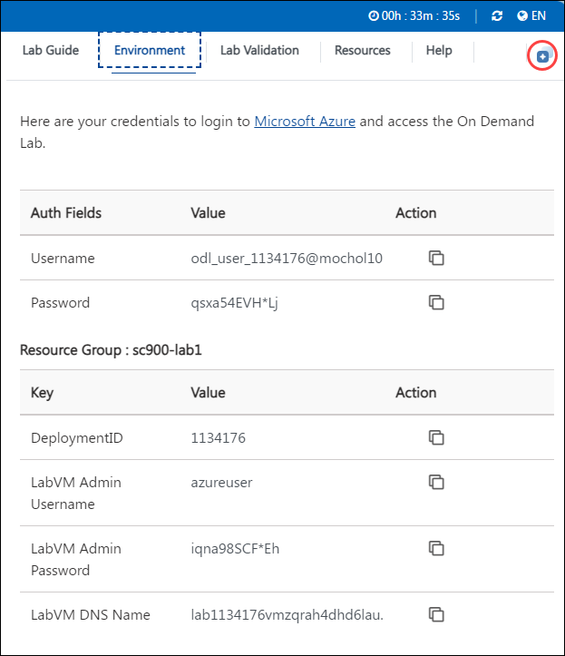

# Devops with Github 

### Overall Estimated Duration: 8 Hours

## Overview

In this lab, you'll explore Microsoft Dev Box, a service that provides self-service access to high-performance, preconfigured cloud-based workstations. You will configure a dev box environment, set up local infrastructure using .NET, and work with the application's carts, products, and UI components. The infrastructure will be deployed to the cloud using GitHub Actions, with automation for updating and republishing workflows. You’ll explore Azure Boards, Test Plans, and GitHub Enterprise security features such as Code scanning, CodeQL alerts, and Dependabots. Additionally, the lab covers implementing monitoring, logging, Azure load testing, and Azure Chaos Studio to improve application resilience and performance.

## Objectives

Set up Dev Box, CI/CD with GitHub, integrate Azure Boards, enable GitHub security, run load tests, explore Chaos Studio and monitor performance.

- **Implement Dev Box**: Configure a development environment by creating a Dev Box definition, establish a network connection, set up a Dev Box pool, and finally creating and connecting to a Dev Box using the Microsoft Dev Box portal.
- **Continuous Integration and Continuous Deployment**: You will be able to access the lab files, set up the local infrastructure, create a project repository, build and push the code using GitHub Actions, and edit the GitHub workflow file within Codespaces.
- **Azure Boards and Test Plans**: Connect Azure Boards with GitHub to enhance project tracking, and link GitHub pull requests to Boards items, enabling seamless integration between code development and project management workflows.
- **Explore GitHub's advanced security features**: Enable code scanning with CodeQL alerts, configure repository security advisories, utilize Dependabot for dependency management, and explore secret scanning to enhance repository security.
- **Monitoring and Load Testing (Optional)**: Monitor application performance using Application Insights, set up load testing to evaluate system scalability, and explore Chaos Studio to simulate real-world failures for improving system resilience.

## Prerequisites

Participants should have: Basic knowledge and understanding of the following:

- Familiarity with Microsoft Dev Box
- Basic Scripting and Automation

## Architecture

In this lab, the architecture flow begins with configuring a Microsoft Dev Box environment, providing cloud-based workstations for development. Local infrastructure is set up using .NET, focusing on managing application components such as carts, products, and the UI. GitHub Actions automate the deployment of this infrastructure to the cloud, streamlining update and republishing workflows. Next, you'll explore Azure Boards for project management, Test Plans for testing workflows, and GitHub Enterprise security features like Code scanning, CodeQL alerts, and Dependabot for vulnerability detection. Finally, you’ll implement monitoring and logging, conduct Azure Load Testing for performance benchmarking, and explore Azure Chaos Studio to simulate failures and improve the system's resilience.

## Architecture Diagram

   

## Explanation of the Components

- **Application Insights**: A monitoring tool that provides real-time performance and usage analytics for applications.
- **Azure Container Apps**: A fully managed service to build and deploy microservices and containerized applications with ease.
- **Azure Kubernetes Service (AKS)**: A managed container orchestration service that simplifies deploying, managing, and scaling Kubernetes clusters.
- **Azure Cosmos DB**: A globally distributed, fully managed NoSQL database service designed for scalable, high-performance applications.
- **GitHub**: A cloud-based platform for version control and collaboration, enabling developers to manage, share, and collaborate on code projects using Git.

## Getting Started with Lab

Welcome to your Devops-with-Github  Workshop! We've prepared a seamless environment for you to explore and learn about Azure services. Let's begin by making the most of this experience.

## Accessing Your Lab Environment
 
1. Once you're ready to dive in, your virtual machine and lab guide will be right at your fingertips within your web browser.

   

   > **Note**: If you see any PowerShell windows running in your VM, please do not close that as it's setting up some configurations inside the environment.

1. On the JumpVM, click on **Decline and Close Application** on the Docker desktop when logging into the VM the first time. Don't follow the Docker Desktop tutorial.

   

1. In the environment click on **OK** if you receive a prompt regarding Windows deprecation.

   

## Exploring Your Lab Resources
 
To get a better understanding of your lab resources and credentials, navigate to the **Environment** tab.
 
   

## Utilizing the Split Window Feature
 
For convenience, you can open the lab guide in a separate window by selecting the **Split Window** button from the Top right corner.
 
   

## Managing Your Virtual Machine
 
Feel free to start, stop, or restart your virtual machine as needed from the **Resources** tab. Your experience is in your hands!

   

## Let's Get Started with Azure Portal

1. In the JumpVM, click on the Azure portal shortcut of the Microsoft Edge browser which is created on the desktop.

   

1. On the **Sign in to Microsoft Azure** tab you will see the login screen, in that enter the following email/username, and click on **Next**.

   - **Email/Username**: <inject key="AzureAdUserEmail"></inject>

        

1. Now enter the following password and click on **Sign in**.

   - **Password**: <inject key="AzureAdUserPassword"></inject>

       

1. If you see the pop-up **Action Required**, keep default and then click on **Ask later**. If you see the pop-up Help us protect your account, click on **Skip for now**(14 days until this is required), and then click on **Next**.
   
     

    >**Note:** Do not enable MFA, select **Ask Later**.

1. First-time users are often prompted to Stay Signed In, if you see any such pop-up, click on **No**.

1. If a **Welcome to Microsoft Azure** popup window appears, click **Cancel** to skip the tour.

1. Now you will see Azure Portal Dashboard, click on **Resource groups** from the Navigate panel to see the resource groups.

   

1. Confirm that you have all resource group is present as shown below.

   

## Support Contact

The CloudLabs support team is available 24/7, 365 days a year, via email and live chat to ensure seamless assistance at any time. We offer dedicated support channels tailored specifically for both learners and instructors, ensuring that all your needs are promptly and efficiently addressed.

Learner Support Contacts:

   - Email Support: labs-support@spektrasystems.com
   - Live Chat Support: https://cloudlabs.ai/labs-support
     
Now, click on **Next** from the lower right corner to move on to the next page.

   

## Happy Learning!!
