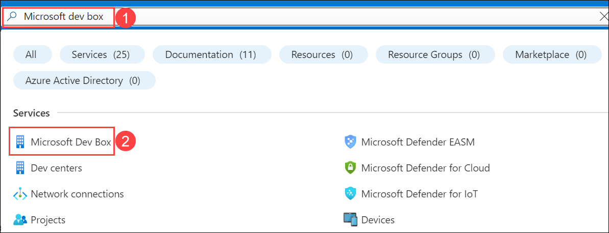
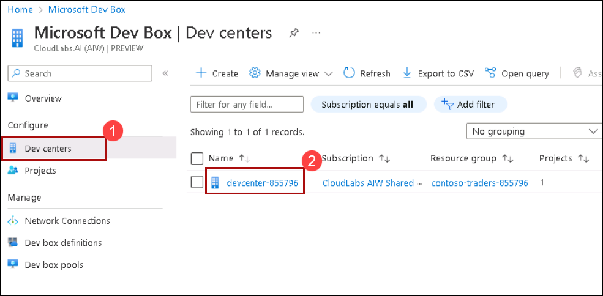
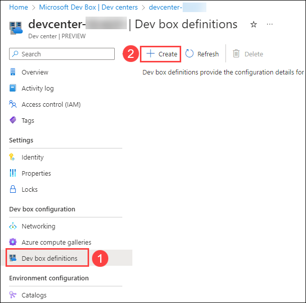
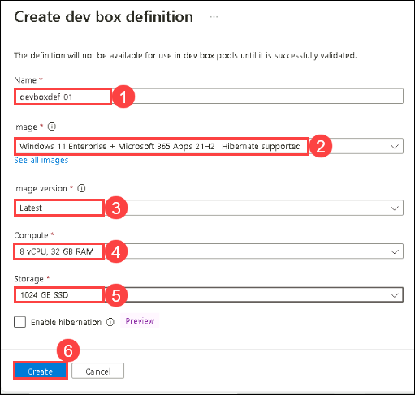
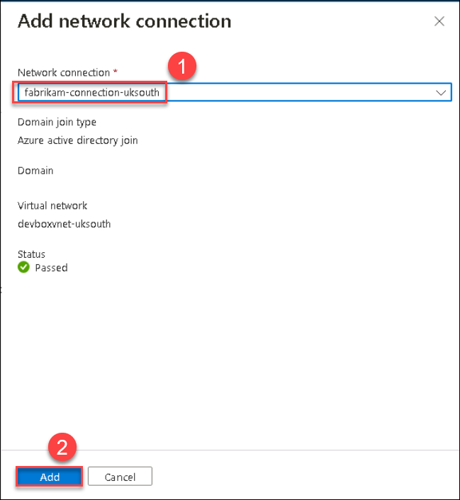
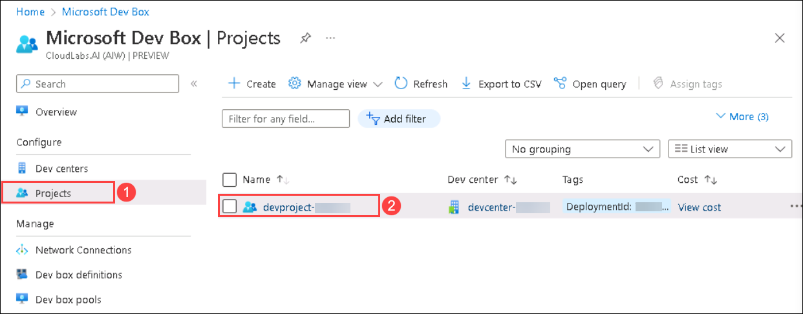
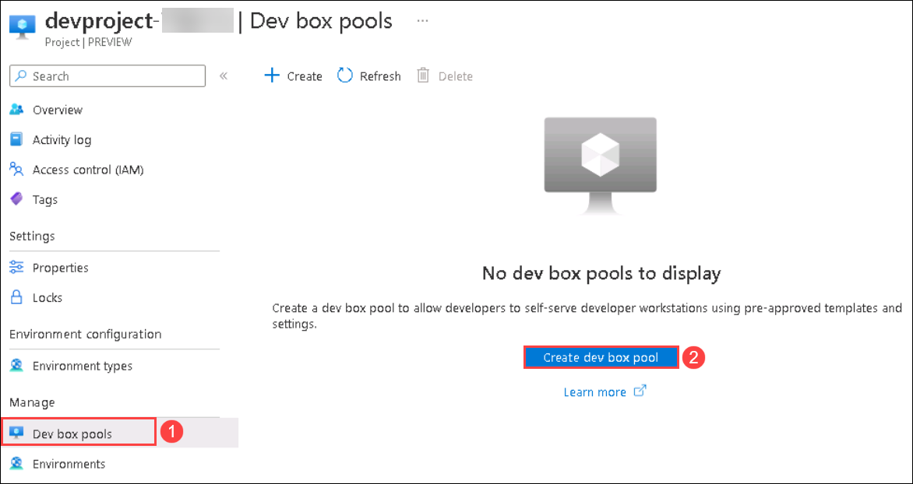
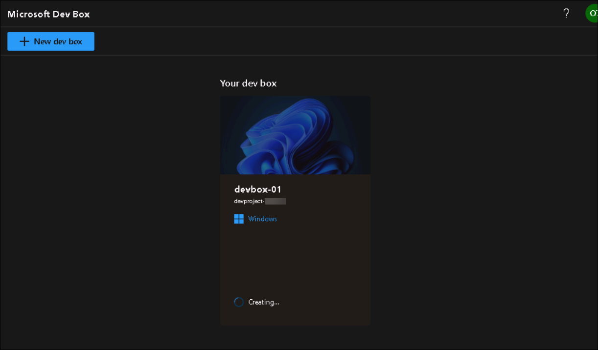
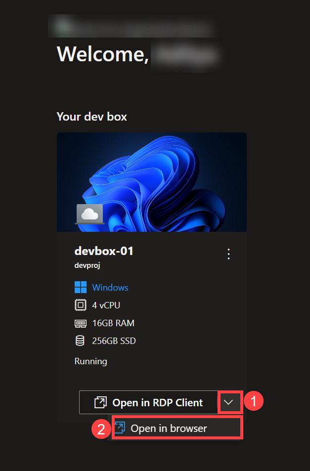

# HOL 1: Implement Dev Box

Duration: 40 minutes

Microsoft Dev Box is a service that provides self-service access to high-performance, preconfigured, and ready-to-code cloud-based workstations called dev boxes.
In the exercise, you'll configure a dev box environment access the dev box and explore its features.

## Task 1: Create Dev box definition

In this task, you'll create a Dev box definition. Dev box definitions define the image and SKU (compute + storage) that will be used in the creation of the dev boxes.

1. In the Azure portal, search for **Microsoft dev box** **(1)**, and then click on it from the search results **(2)**.

   
  
1. Now on the left-hand side blade click on **Dev Centers** **(1)** and then click on **devcenter-<inject key="DeploymentID" enableCopy="false" />** **(2)**.

   
  
1. On the left-hand side pane, click on **Dev box definitions** **(1)**, and click on **+ Create** **(2)**.

   
  
1. Now under the Create dev box definition window, add the below details and then click on **Create** **(6)**.

   - Name: **devboxdef-01** **(1)**
   - Image: **Windows 11 Enterprise + Microsoft 365 Apps 21H2 | Hibernate supported** **(2)**
   - Image version: **Latest** **(3)**
   - Compute: **8vCPU, 32 GB RAM** **(4)**
   - Storage: **1024 GB SSD** **(5)**

      
  
1. Wait for the deployment to complete before proceeding with the lab.
  
## Task 2: Create a Network connection

In this task, you'll configure the network connection using Dev Center. Network connections determine the region into which dev boxes are deployed and allow them to be connected to your existing virtual networks.

1. Once the definition is created. In the Azure portal, search for **Microsoft dev box** **(1)**, and then click on it from the search results **(2)**.

   

1. Navigate back to the **Microsoft dev box**, and then click on **Dev center** **(1)** and then click on the **devcenter-<inject key="DeploymentID" enableCopy="false" />** **(2)**.

   

1. Now under left-hand side pane, click on **Networking** under Dev box configuration, and then click on **+ Add**.

   
  
1. Now under *Add network connection*, select the **fabrikam-connection-<inject key="location" enableCopy="false" />** for Network Connection from the drop-down and then click on **Add**.

   

     >**Note**: Please select the network connection with which the Status is set **Passed**.

## Task 3: Create a dev box pool

In this task, you'll create a Dev pool using a previously configured network connection and Dev Box definitions. A dev box pool is a collection of dev boxes that you manage together. 

1. Return to the Microsoft dev box, and click on **Projects** **(1)** then click on the **devproject<inject key="DeploymentID" enableCopy="false" />** **(2)**.

   

1. On the left hand side pane click on **Dev box pools** **(1)** and then click on **Create dev box pool** **(2)**.

   
  
1. Under *Create a dev box pool* window, enter the following details and click on **Create** **(7)**.

   - Name: **devbox-pool-<inject key="DeploymentID" enableCopy="false" />** **(1)**

   - Dev box definition: **devboxdef-01** **(2)**

   - Network Connection: **fabrikam-connection-<inject key="location" enableCopy="false" />** **(3)**

      .png)

   - Dev box Creator Privileges: **Local Administrator** **(4)**

   - Auto-stop: Select **No** button **(5)**
   
   - Licensing: Check the checkbox **(6)**
  
      .png)
  
## Task 4: Launching Dev box

In this task, you'll access a Dev Box and explore its features.

1. On a new browser tab, visit ```https://devbox.microsoft.com/```.

1. Here, click on **Get started** **(1)**, Name it as **devbox-01** **(2)** and then click on **Create** **(3)**.

   .png)
   
1. The Devbox creation will take around 60 - 90 minutes time. You can move to the next exercise and come back later to check on the devbox environment.

   

1. On **Your Dev box** page, click on the drop down button **(1)** and click on **Open in browser** **(2)**.

   

1. In Session settings, click on **Connect**.

   

1. Under **Sign in to Cloud PC** page, enter your credentials and click on **Sign In**.

  - Username: <inject key="AzureAdUserEmail"></inject>
  
  - Password: <inject key="AzureAdUserPassword"></inject>
  
      

7. Now the Dev box will start configuring your account and a remote session of your Dev box will launch.

     

## Summary

In this exercise, you have created a Dev box definition, Network connection and Dev box pool in Microsoft Dev Box. Also, you have accessed a Dev Box and explored its features.
