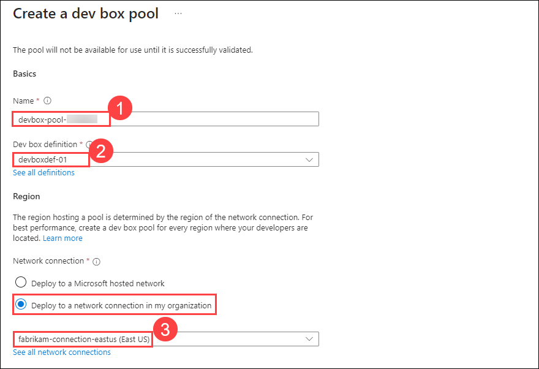

# HOL 1: Implement Dev Box

### Estimated Duration: 2 hour 30 minutes

## Overview

Microsoft Dev Box is a service that provides self-service access to high-performance, preconfigured, and ready-to-code cloud-based workstations called dev boxes.
In the exercise, you'll configure a dev box environment access the dev box and explore its features.
Dive deeper into Azure Dev Box using the [reference link](https://learn.microsoft.com/en-us/azure/dev-box/overview-what-is-microsoft-dev-box).

## Lab Objectives

You will be able to complete the following tasks:

-   Task 1: Create Dev box definition
-   Task 2: Create a Network connection
-   Task 3: Create a dev box pool
-   Task 4: Create and connect to a Dev Box via the Microsoft Dev Box portal

## Task 1: Create Dev box definition

In this task, you'll create a Dev box definition. Dev box definitions define the image and SKU (compute + storage) that will be used in the creation of the dev boxes.

1. In the Azure portal, search for **Microsoft Dev Box** **(1)**, and then click on it from the search results **(2)**.

   
  
2. Now on the left-hand side blade click on **Dev Centers** **(1)** under _Configure_ and then click on **devcenter-<inject key="DeploymentID" enableCopy="false" />** **(2)**.

   
  
3. On the left-hand side pane, click on **Dev box definitions** **(1)** under _Dev box configuration_, and click on **+ Create** **(2)**.

   
  
4. Now under the _Create dev box definition_ window, add the below details and then click on **Create** **(6)**.

   - Name: **devboxdef-01** **(1)**

   - Image: **Windows 11 Enterprise + Microsoft 365 Apps 21H2 | Hibernate supported** **(2)**

   - Image version: **Latest** **(3)**

   - Compute: **8vCPU, 32 GB RAM** **(4)**

   - Storage: **1024 GB SSD** **(5)**

      
  
5. Wait for the definition to get created before proceeding with the next task.

> **Congratulations** on completing the task! Now, it's time to validate it. Here are the steps:
> - Click on the Validate button.
> - If you receive a success message, you can proceed to the next task.
> - If not, carefully read the error message and retry the step, following the instructions in the lab guide. 
> - If you need any assistance, please contact us at cloudlabs-support@spektrasystems.com. We are available 24/7 to help you out.

<validation step="38822c5f-cf39-4de9-b174-d40057508e09" />
  
## Task 2: Create a Network connection

In this task, you'll configure the network connection using Dev Center. Network connections determine the region into which dev boxes are deployed and allow them to be connected to your existing virtual networks.

1. Now from left-hand side pane, click on **Networking** under Dev box configuration, and then click on **+ Add**.

      
  
2. Now under _Add network connection_, select the **fabrikam-connection-<inject key="location" enableCopy="false" />** for Network Connection from the drop-down and then click on **Add**.

      

      >**Note**: Please select the network connection with which the Status is set **Passed**.

## Task 3: Create a dev box pool

In this task, you'll create a Dev pool using a previously configured network connection and Dev Box definitions. A dev box pool is a collection of dev boxes that you manage together. 

1. Now, from the Microsoft Dev Box page, click on **Projects** **(1)** under **Configure** then click on the **devproject<inject key="DeploymentID" enableCopy="false" />** **(2)**.

    

2. On the left hand side pane click on **Dev box pools** **(1)** under **Manage** and then click on **Create dev box pool** **(2)**.

    
  
3. Under *Create a dev box pool* window, enter the following details and click on **Create** **(7)**.

   - Name: **devbox-pool-<inject key="DeploymentID" enableCopy="false" />** **(1)**

   - Dev box definition: **devboxdef-01** **(2)**

   - Network Connection: **fabrikam-connection-<inject key="location" enableCopy="false" />** **(3)**

      

   - Dev box Creator Privileges: **Local Administrator** **(4)**

   - Auto-stop: **Unselected** **(5)**
   
   - Licensing: Check the checkbox **I confirm that my organization has Azure Hybrid Benefit licenses, which will apply to all dev boxes in this pool(6)**.
  
      

> **Congratulations** on completing the task! Now, it's time to validate it. Here are the steps:
> - Click on the Validate button.
> - If you receive a success message, you can proceed to the next task.
> - If not, carefully read the error message and retry the step, following the instructions in the lab guide. 
> - If you need any assistance, please contact us at cloudlabs-support@spektrasystems.com. We are available 24/7 to help you out.

<validation step="4efc1567-6ea2-4d6d-82cc-19b9e495f429" />
  
## Task 4: Create and connect to a Dev Box via the Microsoft Dev Box portal

In this task, you'll access a Dev Box using Developer and explore its features.

1. On a new browser tab, visit ```https://devbox.microsoft.com/```.

2. Here, click on **New dev box** **(1)**, Name it as **devbox-01** **(2)** and then click on **Create** **(3)**.

      
   
3. The Devbox creation will take around 60 - 90 minutes time. After completing the Dev Box creation in the developer portal, please proceed to the next step.

      

4. On **Your Dev box** page, click on the drop down button **(1)** and click on **Open in browser** **(2)**.

      

5. In Session settings, click on **Connect**.

      

6. Under **Sign in to Cloud PC** page, enter your credentials and click on **Sign In**.

     - Username: <inject key="AzureAdUserEmail"></inject>
  
     - Password: <inject key="AzureAdUserPassword"></inject>
  
          

7. Now the Dev box will start configuring your account and a remote session of your Dev box will launch.

   

> **Congratulations** on completing the task! Now, it's time to validate it. Here are the steps:
> - Click on the Validate button.
> - If you receive a success message, you can proceed to the next task.
> - If not, carefully read the error message and retry the step, following the instructions in the lab guide. 
> - If you need any assistance, please contact us at cloudlabs-support@spektrasystems.com. We are available 24/7 to help you out.

<validation step="9c4d3be7-e79c-4f0d-9200-995105897fb3" />

8. Explore the additional features of Dev Box to enhance your development experience. Learn more [here](https://azuremarketplace.microsoft.com/en-us/marketplace/apps/dockerinc1694120899427.devbox_azuremachine?tab=overview)

## Summary

In this lab, you have covered the following:

- Created a Dev Box definition with specific compute and storage configurations.
- Configured network connections for seamless integration with Azure virtual networks.
- Set up a Dev Box pool to manage and deploy multiple Dev Boxes.
- Accessed and explored the Dev Box environment for hands-on experience in cloud-based development.


### You have successfully completed the lab
