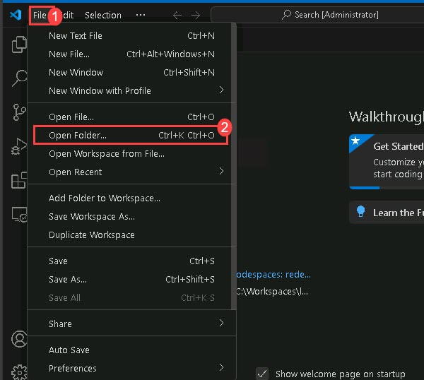
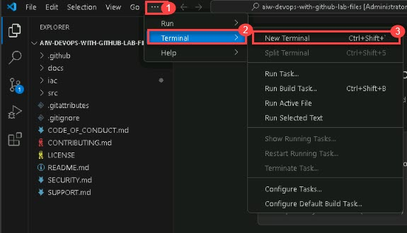
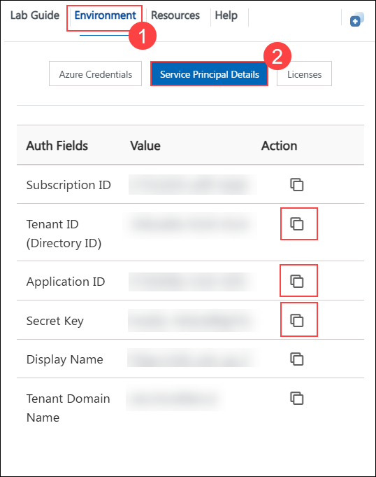
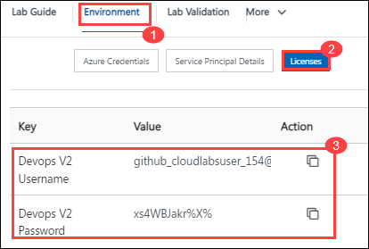
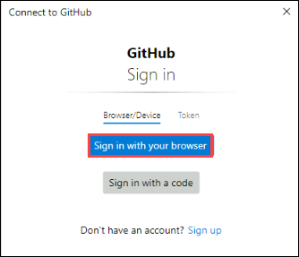
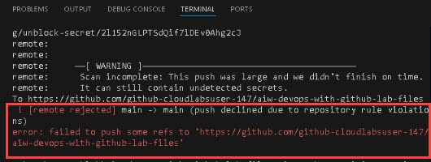
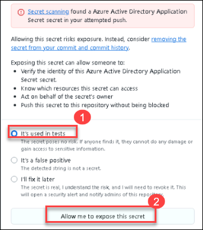
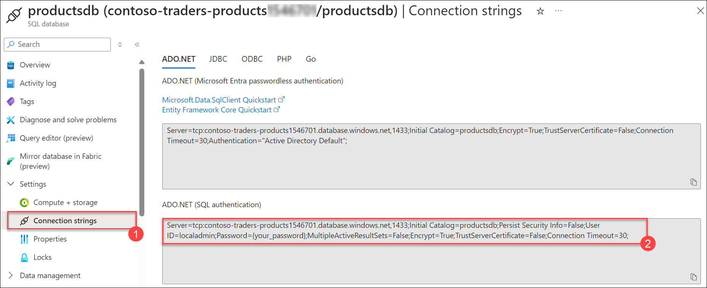
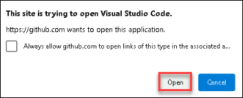

# Lab 1: Continuous Integration and Continuous Deployment with GitHub Actions

### Estimated Duration: 140 minutes

In this hands-on lab, you are going to set up the local infrastructure using dotnet. There are three parts of the application you will be working with: carts, products, and ui. You will deploy the infrastructure to cloud using GitHub Actions. you will also build automation in GitHub for updating and republishing our workflows when the code changes.

## Lab Objectives

You will be able to complete the following tasks:

- Task 1: Access the lab files
- Task 2: Set up Local Infrastructure
- Task 3: Create the Project Repo
- Task 4: Build and push using GitHub Actions
- Task 5: Editing the GitHub Workflow File using Codespace

### Task 1: Access the lab files

In this task, you'll access and explore the code repository of the web app using Visual Studio Code. Visual Studio Code is a cross-platform, lightweight but powerful source code editor.

1. From the VM desktop, double-click on the **Visual Studio Code** desktop icon to open the application.

   
   
1. In **Visual Studio Code**, click on , click on **File** **(1)** and select **Open Folder** **(2)**.

    

1. In the **Open Folder** tab, navigate to the following path `C:\Workspaces\lab\aiw-devops-with-github-lab-files` to open your local GitHub repository and click on **Select Folder**.

   
    
1. You may receive a prompt: Do you trust the authors of the files in this folder? select the **checkbox** **(1)** the box and click on **Yes, I trust the authors** **(2)**.

   
   
1. You'll be to see the lab files in Visual Studio code and explore the code files.

   

### Task 2: Set up Local Infrastructure

In this task, You will set up the local infrastructure using Dotnet . You'll be working with three docker images: fabrikam-init, fabrikam-api, and fabrikam-web.
   
1. Open a **New Terminal** in the Visual Studio Code by selecting click on **menu (1)**, click on **Terminal (2)** and then on **New Terminal (3)**.

   
   
1. Click on the **drop-down** **(1)** button next to PowerShell and select **Command Prompt** **(2)**  from the list. A new command Prompt terminal will be opened.   

   
   
1. Navigate to **Environment Details** **(1)**, click on **Service Principal Details** **(2)** and copy the **Application Id(Client Id)**, **Secret Key (Client Secret)**, and **Tenant Id (Directory ID)**.   
   
   
   
1. Update the **Application Id(Client Id)**, **client Secret**, and **tenant Id** in the command mentioned below. Run it in the terminal.

   ```pwsh
   az login --service-principal -u <clientId> -p=<clientSecret> --tenant <tenantId>
   ```

   

   >**Note** : Open Notepad, make the necessary updates to the command, then copy and paste the updated command into the terminal for execution.

1. Run the below mentioned command to navigate to `ContosoTraders.Api.Products` folder.

   ```pwsh
   cd C:\Workspaces\lab\aiw-devops-with-github-lab-files\src\ContosoTraders.Api.Products
   ```
   
      
   
1. Run `dotnet user-secrets set "KeyVaultEndpoint" "https://contosotraderskv<SUFFIX>.vault.azure.net/"` command to set secret path.

   >**Note**: Replace `<SUFFIX>` with **<inject key="DeploymentID" />** before running the command.

   
   
1. Run the below mentioned command to build and host the carts locally.

   ```pwsh
   dotnet build && dotnet run --no-build
   ```  

    
   
   >**Note**: Please wait for 2 - 3 minutes for build to complete.
   
1. Keep the terminal running. Open a new browser tab and try accessing the application using localhost port. You'll be able to see the output similar to screenshot mentioned below.

   ```pwsh
   https://localhost:62300/swagger
   ```  

        
   
   > **Note:** * If you are not able to access the application, click on **Advanced** under Your connection isn't private.

    
   
   * Then click on Continue to localhost(unsafe) to access the application.

      
   
1. Navigate back to **VS Code** and stop the terminal by typing **ctrl + C**. Run the below mentioned command to navigate to `ContosoTraders.Api.Carts` folder. 
  
   ```pwsh
   cd C:\Workspaces\lab\aiw-devops-with-github-lab-files\src\ContosoTraders.Api.Carts
   ```
  
        
   
1. Run `dotnet user-secrets set "KeyVaultEndpoint" "https://contosotraderskv<SUFFIX>.vault.azure.net/"` command to set secret path.

   
   
   >**Note**: Replace `<SUUFIX>` with **<inject key="DeploymentID" />** before running the command.
   
1. Run the below mentioned command to build and host the carts locally.

   ```pwsh
   dotnet build && dotnet run --no-build
   ```    
  
    
   
   >**Note**: Please wait for 2 - 3 minutes for build to complete.

1. Keep the terminal running. Open a new browser tab and try accessing the application using localhost port. You'll be able to see the output similar to screenshot mentioned below.

   ```pwsh
   https://localhost:62400/swagger
   ```  

   
   
1. Navigate back to **VS Code** and stop the terminal by typing **ctrl + C**.    
   
1. From the search bar, search for **Comand prompt** and open the application.

      
   
1. Run the below mentioned command to navigate to `ContosoTraders.Ui.Website` folder. 
  
   ```pwsh
   cd C:\Workspaces\lab\aiw-devops-with-github-lab-files\src\ContosoTraders.Ui.Website
   ```
    
   
1. Run the below mentioned command to install npm.

   ```pwsh
   npm ci
   ```    
  
    
   
   >**Note**: Please wait until the installation completes. It will take around 10 - 15 minutes when you run npm install for the first time. Incase the execution is stuck, Please use **ctrl + C** to stop the execution and retry step again.
   
1. Navigate back to **VS Code**, Run the below mentioned command to navigate to `ContosoTraders.Ui.Website` folder. 
  
   ```pwsh
   cd C:\Workspaces\lab\aiw-devops-with-github-lab-files\src\ContosoTraders.Ui.Website
   ```

1. Now run the below mentioned command to run ui of the application. This will automatically open a browser tab where you'll see the complete application running

   ```pwsh
   npm run start
   ```    
  
    
   
   >**Note**: It can take 5 - 10 minutes when you execute the command for the first time. You can continue with the next task and check on this step later.   
   
### Task 3: Create the Project Repo

In this task, you'll access the GitHub enterprise account and create a new repository to store the infrastructure.

In this task, you will create an account in [GitHub](https://github.com) and use `git` to add lab files to a new repository.

1. In a new browser tab open ```https://www.github.com/login```. From Environment details page ***(1)***, navigate to **License** ***(2)*** tab and **copy** ***(3)*** the crentials. Use the same username and password to login into GitHub.

    
   
1. For **Device Verification Code**, use the same credentials as in the previous step, open `http://outlook.office.com/` in a private window and enter the same username and password used for GitHub Account login. Copy the verification code and Paste code it in Device verification.

    
    
1. In the upper-right corner, expand the user **drop-down menu** ***(1)*** and select **Your repositories** ***(2)***.

   

1. Next to the search criteria, locate and select the **New** button.

   

1. On the **Create a new repository** screen, name the repository ```aiw-devops-with-github-lab-files``` ***(1)***, select **Public** ***(2)*** and click on **Create repository** ***(3)***  button.

   
   
   >**Note**: If you observe any repository existing with the same name, please make sure you delete the Repo and create a new one. Please follow the step 6 to step 10. Else, skip to step 11.

1. In the upper-right corner, expand the user **drop-down menu** ***(1)*** and select **Your repositories** ***(2)***.

   

1. Using the search bar, search for ```aiw-devops-with-github-lab-files``` **(1)** and select to open it.

   

1. From the GitHub repository, click on the **Settings** tab.

   

1. In the settings page, scroll to the bottom of the page and select **Delete this repository**.

   

1. In the Are you absolutely sure? pop up window, Copy the **repository name** **(1)**, paste it in the **box** **(2)**, and cick on **I understand the consequences, delete this repository** **(3)**.

   

1. On the **Quick setup** screen, copy the **HTTPS** GitHub URL for your new repository, and **save it** in a notepad for future use.

   
   
1. From the GitHub username, note down the **Unique-ID** present in the Username. You'll use this value in upcoming steps.

    
   
1. Navigate back to the **Visual Studio Code** application in which the terminal is already open. In the terminal, click on the **drop-down** button and select **PowerShell** to open a fresh PowerShell terminal tab.

   

1. In the Visual Studio Code, run the below commands in the terminal to set your **username** and **email**, which Git uses for commits. Make sure to replace GitHub account email and username.

   >**Note**: For the email format github_cloudlabsuser_xxx@xxx.com, the corresponding username will follow this format: github-cloudlabsuser-xxx
   
     ```pwsh
     cd C:\Workspaces\lab\aiw-devops-with-github-lab-files
     git config --global user.email "you@example.com"
     git config --global user.name "Your UserName"
     ```
     
    
   
1.  Run the below mentioned command in the terminal. Make sure to replace <your_github_repository-url> with the value you copied in step 11 and Unique-ID in step 12

    Note: This step is done to Initialize the folder as a git repository, commit, and submit contents to the remote GitHub branch “main” in the lab files    repository created in Step 1. 

      ```pwsh
      git init
      git add .
      git commit -m "Initial commit"
      git branch -M main
      git remote add origin<Unique-ID> <your_github_repository-url>
      git push -u origin<Unique-ID> main
      ```
     
   - If you are asked authenticate your GitHub account. Select **1. web browser** and you will be prompted with a pop-up window to authorize Git Credential Manager. Click on **Authorize GitCredentialManager** to provide access

       

       

 - After you are prompted with the message **Authorization Succeeded**, close the tab and continue with the next task.
   
>**Note**: If you encounter any errors as shown below, please follow the steps outlined below.

   

(i). Scroll up within the terminal to locate the highlighted link. Click on the link.

   

(ii)choose the **It's used in tests**(1) option. Then, select **Allow me to expose this secret**(2) to proceed.

      

(iii). After completing the previous step, navigate back to VS Code and rerun step-15 to finish the push process. 

### Task 4: Build and push using GitHub Actions

In this exercise, you will build automation in GitHub for updating and republishing our Docker images when the code changes. You will create a workflow file using the GitHub interface and its GitHub Actions workflow editor. This will get you familiar with how to create and edit an action through the GitHub website.

1. From Azure Portal Dashboard, click on Resource groups from the Navigate panel to see the resource groups.

    
   
1. Select **contoso-traders-<inject key="DeploymentID" enableCopy="false" />** resource group from the list.

     
   
1. Select **productsdb** SQL database from the list of resources.

    
   
1. Under Settings side blade, select **Connection strings** ***(1)*** and copy the **ADO.NET (SQL authentication)** ***(2)*** connection string from ADO.NET tab. 

     
 
1. In your GitHub lab files repository, select the **Settings** tab from the lab files repository.

   
   
1. Under **Security**, expand **Secrets and variables** ***(1)*** by clicking the drop-down and select **Actions** ***(2)*** blade from the left navigation bar. Select the **New repository secret** ***(3)*** button.

   
    
1. Under **Actions Secrets/New secret** page, enter the below mentioned details and Click on **Add secret** ***(3)***.

   >**Note**: Replace `{your_password}` with the ODL User Azure Password. Go to **Environment Details (1)**, click on **Azure credentials (2)**, and copy **Password (3)**.
   
      

   - **Name** : Enter **SQL_PASSWORD** ***(1)***
   - **Value** : Paste the **ADO.NET (SQL authentication)** ***(2)*** which you copied in previous step.
   
      
      
1. Navigate to **Environment Details** **(1)**, click on **Service Principal Details** **(2)** and copy the **Subscription ID**, **Tenant Id (Directory ID)**, **Application Id(Client Id)** and **Secret Key (Client Secret)**.

   
   
   - Replace the values that you copied in below Json. You will be using them in this step.
   
      ```json
      {
         "clientId": "zzzzzzzz-zzzz-zzzz-zzzz-zzzzzzzzzzzz",
         "clientSecret": "client-secret",
         "tenantId": "zzzzzzzz-zzzz-zzzz-zzzz-zzzzzzzzzzzz",
         "subscriptionId": "zzzzzzzz-zzzz-zzzz-zzzz-zzzzzzzzzzzz"
      }
      ```
   
1. Select **New repository secret** and under **Actions Secrets/New secret** page, enter the below mentioned details and Click on **Add secret** ***(3)***.

   - **Name** : Enter **SERVICEPRINCIPAL** ***(1)***
   - **Value** : Paste the service principal details in json format ***(2)***
   
          
   
1. Select **New repository secret** and under **Actions Secrets/New secret** page, enter the below mentioned details and Click on **Add secret** ***(3)***.

   - **Name** : Enter **ENVIRONMENT** ***(1)***
   - **Value** : **<inject key="DeploymentID" enableCopy="false" />** ***(2)***
   
      
   
1. From your GitHub repository, select **Actions** ***(1)*** tab. Select the **contoso-traders-app-deployment** ***(2)*** workflow from the side blade, Click on the  **drop-down** ***(3)*** next Run workflow button, and select **Run workflow** ***(4)***.

   
   
1. Navigate back to Actions tab and select the **contoso-traders-app-deployment** workflow. This workflow builds the docker image, which is pushed to container registry. The same image is pushed to Azure container application.

   
   
   
   
   >**Note**: If the workflow **fails** due to **npm install** job, follow from step 13 - step 16. Else, continue from step 17. 
   
1. From the GitHub browser tab, follow the steps given below and click on **Create codespace on main** ***(3)***.

   - click on **Code** ***(1)***, 
   - Select the **Codespace** ***(2)*** tab

      

      >**Note:** Select **Allow**, on the **Visual studio** pop-up.

      > It will redirect you to the new tab of the browser. On the **Select user to authorize Visual Studio Code** page select **Continue**. On the pop-up select **Open**.
   
1. Run the below mentioned commands in the **Terminal**. You'll set node version to node 14.

   ```pwsh
   cd src
   cd ContosoTraders.Ui.Website
   nvm install 14
   nvm use 14
   npm i
   git add . 
   git commit -m "updated node version"
   git push
   ```
    
1. From your GitHub repository, select **Actions** ***(1)*** tab. You'll see an Action named **Updated node version** ***(2)*** executing. Please wait untill the execution completes

   
   
         
   
1. Navigate to Azure Portal, click on Resource groups from the Navigate panel to see the resource groups.

    
   
1. Select **contoso-traders-<inject key="DeploymentID" enableCopy="false" />** resource group from the list.

    
   
1. Select **contoso-traders-ui2<inject key="DeploymentID" enableCopy="false" />** endpoint from the list of resources.

    
   
1. Click on **Endpoint hostname**. It'll open a browser tab where you will be visual that the Contoso Traders app has been hosted successfully.

    
    
    
    
### Task 5: Editing the GitHub Workflow File using Codespace

The last task automated building and updating only one of the Docker images. In this task, we will update the workflow file with a more appropriate workflow for the structure of our repository. This task will end with a file named `docker-publish.yml` that will rebuild and publish Docker images as their respective code is updated.

1. From the GitHub browser tab, follow the steps given below and click on **Create codespace on main** ***(3)***.

   - click on **Code** ***(1)***, 
   - Select the **Codespace** ***(2)*** tab

   
   
   >**Note**: Incase you had created codespace in previous task. Click on **+** button to create new codespace.
   
1. You will be redirected to a new Codespace tab in your browser. Click **Continue** then allow the pop-up windows to open Visual Studio Code and click **Install** to add the required extensions

   

1. From the explorer side blade, navigate to **.github (1)** > **workflows** **(2)** and select **contoso-traders-provisioning-deployment.yml** **(3)** file.

    
   
1. Remove the commands from line 7 to 14 from the workflow file and save the file.

    
   
   >**Note**: Press **CTRL + S**, to save the changes, if needed.

1. Using the terminal from codespace, run the following commands to commit this change to your repo and to push the change to GitHub.

   ```pwsh
   git add .
   git commit -m "Updating app deployment"
   git push
   ```
    
    
   > **Note**: This will update the workflow and will **not** run the "Update the ... Docker image" jobs.

1. Navigate back to the GitHub browser, select the **Actions** ***(1)*** tab and review the **workflow** ***(2)*** created automatically for the changes made. 

   

1. Click on the **Next** button present in the bottom-right corner of this lab guide.

## Summary

In this lab, you hosted the application locally, deployed the application to Azure using GitHub Actions, and explored Codespace.

### You have successfully completed the lab
