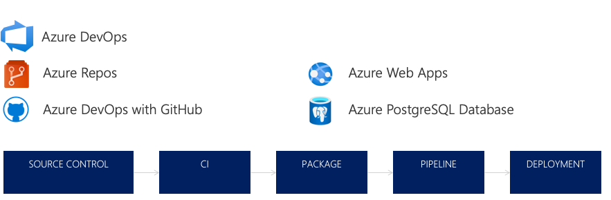

Continuous delivery in Azure DevOps

 Whiteboard design session trainer guide

November 2021

Information in this document, including URL and other Internet Web site references, is subject to change without notice. Unless otherwise noted, the example companies, organizations, products, domain names, e-mail addresses, logos, people, places, and events depicted herein are fictitious, and no association with any real company, organization, product, domain name, e-mail address, logo, person, place or event is intended or should be inferred. Complying with all applicable copyright laws is the responsibility of the user. Without limiting the rights under copyright, no part of this document may be reproduced, stored in or introduced into a retrieval system, or transmitted in any form or by any means (electronic, mechanical, photocopying, recording, or otherwise), or for any purpose, without the express written permission of Microsoft Corporation.

Microsoft may have patents, patent applications, trademarks, copyrights, or other intellectual property rights covering subject matter in this document. Except as expressly provided in any written license agreement from Microsoft, the furnishing of this document does not give you any license to these patents, trademarks, copyrights, or other intellectual property.

The names of manufacturers, products, or URLs are provided for informational purposes only and Microsoft makes no representations and warranties, either expressed, implied, or statutory, regarding these manufacturers or the use of the products with any Microsoft technologies. The inclusion of a manufacturer or product does not imply endorsement of Microsoft of the manufacturer or product. Links may be provided to third party sites. Such sites are not under the control of Microsoft and Microsoft is not responsible for the contents of any linked site or any link contained in a linked site, or any changes or updates to such sites. Microsoft is not responsible for webcasting or any other form of transmission received from any linked site. Microsoft is providing these links to you only as a convenience, and the inclusion of any link does not imply endorsement of Microsoft of the site or the products contained therein.

© 2021 Microsoft Corporation. All rights reserved.

Microsoft and the trademarks listed at <https://www.microsoft.com/en-us/legal/intellectualproperty/trademarks> are trademarks of the Microsoft group of companies. All other trademarks are property of their respective owners.

**Contents**

<!-- TOC -->

- [Trainer information](#trainer-information)
  - [Role of the trainer](#role-of-the-trainer)
  - [Whiteboard design session flow](#whiteboard-design-session-flow)
  - [Before the whiteboard design session: How to prepare](#before-the-whiteboard-design-session-how-to-prepare)
  - [During the whiteboard design session: Tips for an effective whiteboard design session](#during-the-whiteboard-design-session-tips-for-an-effective-whiteboard-design-session)
- [Continuous delivery in Azure DevOps whiteboard design session student guide](#continuous-delivery-in-azure-devops-whiteboard-design-session-student-guide)
  - [Abstract and learning objectives](#abstract-and-learning-objectives)
  - [Step 1: Review the customer case study](#step-1-review-the-customer-case-study)
    - [Customer situation](#customer-situation)
    - [Customer needs](#customer-needs)
    - [Infographic for common scenarios](#infographic-for-common-scenarios)
    - [Customer objections](#customer-objections)
  - [Step 2: Design a proof of concept solution](#step-2-design-a-proof-of-concept-solution)
  - [Step 3: Present the solution](#step-3-present-the-solution)
  - [Wrap-up](#wrap-up)
  - [Additional references](#additional-references)
- [Continuous delivery in Azure DevOps whiteboard design session trainer guide](#continuous-delivery-in-azure-devops-whiteboard-design-session-trainer-guide)
  - [Step 1: Review the customer case study](#step-1-review-the-customer-case-study-1)
  - [Step 2: Design a proof of concept solution](#step-2-design-a-proof-of-concept-solution-1)
  - [Step 3: Present the solution](#step-3-present-the-solution-1)
  - [Wrap-up](#wrap-up-1)
  - [Preferred target audience](#preferred-target-audience)
  - [Preferred solution](#preferred-solution)
  - [Checklist of preferred objection handling](#checklist-of-preferred-objection-handling)
  - [Customer quote (to be read back to the attendees at the end)](#customer-quote-to-be-read-back-to-the-attendees-at-the-end)

<!-- /TOC -->

# Trainer information

Thank you for taking time to support the whiteboard design sessions as a trainer!

## Role of the trainer

An amazing trainer:

- Creates a safe environment in which learning can take place.

- Stimulates the participant's thinking.

- Involves the participant in the learning process.

- Manages the learning process (on time, on topic, and adjusting to benefit participants).

- Ensures individual participant accountability.

- Ties it all together for the participant.

- Provides insight and experience to the learning process.

- Effectively leads the whiteboard design session discussion.

- Monitors quality and appropriateness of participant deliverables.

- Effectively leads the feedback process.

## Whiteboard design session flow

Each whiteboard design session uses the following flow:

**Step 1: Review the customer case study (15 minutes)**

**Outcome**

Analyze your customer's needs.

- Customer's background, situation, needs and technical requirements

- Current customer infrastructure and architecture

- Potential issues, objectives and blockers

**Outcome**

Design a solution and prepare to present the solution to the target customer audience in a 15-minute chalk-talk format.

- Determine your target customer audience.

- Determine customer's business needs to address your solution.

- Design and diagram your solution.

- Prepare to present your solution.

**Step 3: Present the solution (30 minutes)**

**Outcome**

Present solution to your customer:

- Present solution

- Respond to customer objections

- Receive feedback

**Wrap-up (15 minutes)**

- Review preferred solution

## Before the whiteboard design session: How to prepare

Before conducting your first whiteboard design session:

- Read the Student guide (including the case study) and Trainer guide.

- Become familiar with all key points and activities.

- Plan the point you want to stress, which questions you want to drive, transitions, and be ready to answer questions.

- Prior to the whiteboard design session, discuss the case study to pick up more ideas.

- Make notes for later.

## During the whiteboard design session: Tips for an effective whiteboard design session

**Refer to the Trainer guide** to stay on track and observe the timings.

**Do not expect to memorize every detail** of the whiteboard design session.

When participants are doing activities, you can **look ahead to refresh your memory**.

- **Adjust activity and whiteboard design session pace** as needed to allow time for presenting, feedback, and sharing.

- **Add examples, points, and stories** from your own experience. Think about stories you can share that help you make your points clearly and effectively.

- **Consider creating a "parking lot"** to record issues or questions raised that are outside the scope of the whiteboard design session or can be answered later. Decide how you will address these issues, so you can acknowledge them without being derailed by them.

***Have fun**! Encourage participants to have fun and share!*

**Involve your participants.** Talk and share your knowledge but always involve your participants, even while you are the one speaking.

**Ask questions** and get them to share to fully involve your group in the learning process.

**Ask first**, whenever possible. Before launching into a topic, learn your audience's opinions about it and experiences with it. Asking first enables you to assess their level of knowledge and experience, and leaves them more open to what you are presenting.

**Wait for responses**. If you ask a question such as, "What's your experience with (fill in the blank)?" then wait. Do not be afraid of a little silence. If you leap into the silence, your participants will feel you are not serious about involving them and will become passive. Give participants a chance to think, and if no one answers, patiently ask again. You will usually get a response.

# Continuous delivery in Azure DevOps whiteboard design session student guide

## Abstract and learning objectives

In this whiteboard design session, you will learn how to design a solution with a combination of ARM templates, Azure DevOps, and GitHub actions to enable continuous delivery with several Azure PaaS services.

At the end of this workshop, you will be better able to build templates to automate cloud infrastructure and reduce error-prone manual processes. In addition, you'll learn how to design a deployment and monitoring architecture using ARM templates to provision Azure resources, Application Insights for deep application monitoring, and GitHub as a source code repository and build/deploy pipeline.

## Step 1: Review the customer case study

**Outcome**

Analyze your customer's needs.

Timeframe: 15 minutes

Directions: With all participants in the session, the facilitator/SME presents an overview of the customer case study along with technical tips.

1. Meet your team members and trainer.

2. Read all directions for steps 1-3 in the student guide.

3. As a team, review the following customer case study.

### Customer situation

Fabrikam Medical Conferences provides conference web site services tailored to the medical community. They started out 10 years ago building a few conference sites for a small conference organizer. Since then, word of mouth has spread, and Fabrikam Medical Conferences is now a well-known industry brand. They currently handle over 100 conferences per year and growing.

Websites for medical conferences are typically low budget web sites because the conferences usually have between 100 to 1500 attendees. At the same time, the conference owners have significant customization and change demands that require turnaround on a dime to the live sites. These changes can impact various aspects of the system from UI through to the back end, including conference registration and payment terms.

**Public website and data layer**

The VP of Engineering at Fabrikam, Susan Withers, has a team of 12 developers who handle all aspects of development, testing, deployment, and operational management of their customer sites. Due to customer demands, they have issues with the efficiency and reliability the conference websites. This mainly caused by an inefficient development and operations workflow.

In the current situation, the conference sites are hosted on-premises with the following topology and platform implementation:

- The conference web sites are built with the MEAN stack (Mongo, Express, Angular, Node.js).
- Web sites and APIs are hosted on Linux machines.
- MongoDB is also running on a separate cluster of Linux machines.

### Customer needs

1. Be able to automatically and continuously deploy new software builds to the Azure App Service web app.

2. Ensure that continuously deployed builds to the cloud do not interfere with the production copy of the solution.

3. Identify an automated way of deploying to different environments for "development," "test," and "production" so that changes or deployments to one environment do not affect the others.

4. Configure the automated builds to first require that a full series of unit tests pass before a deployment is started.

5. Provide a search feature and visual dashboard for the application logs so the developers can more quickly resolve help desk tickets.

6. Enhance the logged data from the front-end website to give the developers a more complete picture of the application's performance and behavior.

    - Browser information such as browser page load time and user activity per page.

    - Application dependency metrics such as request times and request failures for communication with the database or other services.

7. Implement proactive diagnostics to generate automatic alerts for unusual application behavior including aberrant request response time, dependency response time, and page load time.

### Infographic for common scenarios

### Customer objections

1. We do not want to be locked in to a specific source control repository. We are evaluating GitHub and Azure DevOps and need to be able to change between them without frustrating rework.

2. We do not want the developers to be able to make changes to the Azure resources even though they will have access to make source code changes.

3. If developers can deploy directly to the cloud, will that expose us to the same quality problems we had before when untested code was promoted to production?

4. How much of an impact will these process changes have on our development cadence? Will learning this place a new burden on the developers?

5. Our developers are already having a challenge learning how to use Git; will adding a continuous deployment system on top of that slow them down and confuse them even more?

## Step 2: Design a proof of concept solution

**Outcome**

Design a solution and prepare to present the solution to the target customer audience in a 15-minute chalk-talk format.

Timeframe: 60 minutes

**Business needs**

Directions: With your team, answer the following questions and be prepared to present your solution to others:

1. Who will you present this solution to? Who is your target customer audience? Who are the decision makers?

2. What customer business needs do you need to address with your solution?

**Design**

Directions: With your team, respond to the following questions:

*Continuous Integration and Deployment*

1. What available system should you use to automate software builds and deployments of the application?

2. Explain how you can continuously deploy new builds directly to the cloud without interfering with the production site.

3. Document how to integrate unit tests into the continuous delivery process so that when a test fails to pass, the deployment process is flagged and stopped.

4. Explain how you can test a new build simultaneously with an existing build, like an A/B test.

5. Why shouldn't we have multiple long-lived branches in source control?

6. Create a plan on how to switch the source control location from Azure DevOps to GitHub.

*Enhance system logging functionality*

1. Implement a solution that will enable the logs to be searchable and visible in an online dashboard.

2. Implement a solution to enhance the application logs to provide more useful performance and application behavior details, specifically around browser metrics and application dependencies. Discuss which visualization, or dashboard, options exist for the log results. Existing App Service logs already cover these topics:

    - **Detailed Error Logging**---detailed error information for HTTP status codes that indicate a failure (status code 400 or greater).

    - **Failed Request Tracing**---detailed information on failed requests, including a trace of the Internet Information Server IIS components used to process the request and the time taken in each component.

    - **Web Server Logging**---information about HTTP transactions using the W3C extended log file format.

    - **Application Diagnostics**---trace messages as defined in the source code.

    - **Deployment Logs**

**Prepare**

Directions: As a team:

1. Identify any customer needs that are not addressed with the proposed solution.

2. Identify the benefits of your solution.

3. Determine how you will respond to the customer's objections.

Prepare a 15-minute chalk-talk style presentation to the customer.

## Step 3: Present the solution

**Outcome**

Present a solution to the target customer audience in a 15-minute chalk-talk format.

Timeframe: 30 minutes

**Presentation**

Directions:

1. Pair with another team.

2. One group is the Microsoft team and the other is the customer.

3. The Microsoft team presents their proposed solution to the customer.

4. The customer makes one of the objections from the list of objections.

5. The Microsoft team responds to the objection.

6. The customer team gives feedback to the Microsoft team.

7. Switch roles and repeat Steps 2-6.

## Wrap-up

Timeframe: 15 minutes

Directions: Reconvene with the larger group to hear the facilitator/SME share the preferred solution for the case study.

## Additional references

|    |            |
|----------|:-------------:|
| **Description** | **Links** |
| Enable diagnostics logging for web apps | <https://azure.microsoft.com/en-us/documentation/articles/web-sites-enable-diagnostic-log/> |
| Monitor web app performance  | <https://azure.microsoft.com/en-us/documentation/articles/insights-perf-analytics/> |
| Azure Pipelines | <https://azure.microsoft.com/en-us/services/devops/pipelines/> |
| Switch deployment slots in Azure web apps | <https://blogs.msdn.microsoft.com/devops/2017/04/10/considerations-on-using-deployment-slots-in-your-devops-pipeline/> |
| App service continuous deployment | <https://docs.microsoft.com/en-us/azure/app-service/deploy-continuous-deployment> |
| App service staging environments | <https://azure.microsoft.com/en-us/documentation/articles/web-sites-staged-publishing/> |
| Application Insights | <https://docs.microsoft.com/en-us/azure/azure-monitor/app/app-insights-overview/> |

# Continuous delivery in Azure DevOps whiteboard design session trainer guide

## Step 1: Review the customer case study

- Check in with your participants to introduce yourself as the trainer.

- Ask, "What questions do you have about the customer case study?"

- Briefly review the steps and timeframes of the whiteboard design session.

- Ready, set, go! Let participants begin.

## Step 2: Design a proof of concept solution

- Check in with your teams to ensure that they are transitioning from step to step on time.

- Provide feedback on their responses to the business needs and design.

  - Try asking questions first that will lead the participants to discover the answers on their own.

- Provide feedback for their responses to the customer's objections.

  - Try asking questions first that will lead the participants to discover the answers on their own.

## Step 3: Present the solution

- Determine which groups will be paired together before Step 3 begins.

- For the first round, assign one group as the presenting team and the other as the customer.

- Have the presenting team present their solution to the customer team.

  - Have the customer team provide one objection for the presenting team to respond to.

  - The presentation, objections, and feedback should take no longer than 15 minutes.

  - If needed, the trainer may also provide feedback.

## Wrap-up

- Have participants reconvene with the larger session group to hear the facilitator/SME share the following preferred solution.

## Preferred target audience

- Alex Montgomery, VP of Sales

- Todd Culp, Enterprise Architect

- Development team

## Preferred solution

The solution for the Fabrikam Medical scenario involves several technologies, including:

- Creating a local, short-lived branch for feature work.

- Committing to the local branch and pushing to a central repository.

- Using pull requests to merge to a single, long-lived master branch after peer review.

- Creating a build definition that is automatically triggered with each commit.

- Executing unit tests as part of the automated build process.

- Creating a release pipeline that relies upon several Azure DevOps Release Management features:

  - Provisioning of Azure resources using Azure Resource Management (ARM) Templates.

  - Automated deployment of the solution to the development environment.

  - Execution of automated tests.

  - The manual approval process for promoting solutions to test and ultimately production environments using deployment slots.

  - Automatic switching of deployment slots upon successful deployment conditions.

- Creating an Application Insights account to gather more detailed analytics on the application's performance and health.

*Continuous Integration and Deployment*

1. What available system should you use to automate software builds and deployments of the application?

    Azure DevOps' build and release management features are a complete end-to-end solution for automating builds deployment for the solutions. From there, you can customize the gates your solution needs to promote the solution from environment to environment. You're in complete control of how the CI/CD process is implemented.

    Once we have the build definition producing build artifacts, we create a release pipeline using the Release Management features of Azure DevOps.

    The release pipeline is like the build definition in that it is a series of steps or tasks that we put together to produce an outcome. In this case...we produce the deployment of a release to one or more environments and perform some level of validation and verification of each release.

    We can then configure approval steps between each environment as quality stage gates. This allows us to control the flow of releases as they proceed through the environments.

    The pipeline for development would simply deploy upon a successful build from the build pipeline.

    Then, before we deploy to test, we may want the QA team to decide when to deploy the release into the environment. If that were the case, we would configure a manual approval, and the deployment, although still automated, would not occur until a member of the QA team approved it to be deployed. This is useful when a QA team may be reviewing an existing release (previously deployed) and does not want the current release to be overwritten in their test environment.

    Once the deployment to test occurs, we would likely have additional acceptance tests executed.

    If these acceptance tests pass, we could then trigger the deployment to production.

    It is important to note that each environment can have its own set of tasks as oftentimes, the deployment and validation steps vary by environment.

2. Explain how you can continuously deploy new builds directly to the cloud without interfering with the production site.

    For a production deployment, the customer wants to maintain the uptime of the application. Thus, when we are deploying a new release, we want the application to remain available.

    Azure App Services have a deployment slot feature specifically to enable this scenario. Each App Service has, by default, a production deployment slot. This is not to be confused with a production environment. For this case study, we could add a new deployment slot named "staging."

    To do this, we add a deployment slot to the Azure App Service and configure the release pipeline to deploy to the newly created deployment slot.

    Assuming a successful deployment and verification to the staging slot, we add a task to the deployment that switches the staging deployment slot with the production deployment slot and all new requests will be directed to the newly deployed application. All of this is done with no downtime to the application.

3. Document how to integrate unit tests into the continuous delivery process such that when a test fails to pass, the deployment process is flagged and stopped.

    Let's assume your solution already includes a test project with unit tests. You can create or edit your build definition to include a task (Visual Studio Test task) that runs unit tests. After your build starts, this task automatically runs all the unit tests in your solution. If one or more tests fail, the continuous delivery process will halt for that particular build. You could then also configure the test task to create a new work item when a test fails.

4. Explain how you can test a new build simultaneously with an existing build, like an A/B test?

    The most common technique to meet this requirement is to create deployment slots where your App Service variation can be deployed to. Then, configure the release pipeline to deploy to the preferred deployment slot. Using the Azure Portal, you can configure the Traffic Routing feature, specifying which percentage of users should go to the primary site and each deployment slot when they browse to your site's URL. Additionally, you could use Application Insights to measure the effectiveness of each version of the site.

5. Why shouldn't we have multiple long-lived branches in source control?

    If you think of your work as a delta off of a master, the size of the delta increases as your branch incorporates more and more work. As the size of your team grows, the amount of work hidden from each other increases. And the chances that your assumptions about the state of the code hold decreases the more you use long-lived branches. If you merge your code back to master frequently, you demonstrate the direction you're taking the code. When you merge your code more frequently to master, the pain of integration happens at the beginning instead of the end of your work. This allows you to find issues faster and fix them at the earliest possible moment. Merging your code frequently also results in fewer merge conflicts. If you're developing a large feature, consider using feature flags so that you can continue to merge your code frequently.

6. Create a plan on how to switch the source control location from Azure DevOps to GitHub.

    Let's assume you have already uploaded your codebase to GitHub from Azure DevOps. First, start by editing your existing build definition. When you initially configured the build definition, you selected Azure DevOps as the source for your code. You would now change the "Get sources" item to select GitHub. This, in turn, will require you to authenticate to GitHub (if you have not previously done so). Finally, you select the specifics for your Repository and Default branch. The rest of the build and release process remains unchanged.

*Enhance system logging functionality*

1. Implement a solution that will enable the logs to be searchable and visible in an online dashboard

    Application Insights provide rich performance monitoring, alerting, and easy-to-consume dashboards. The service also allows us to quickly see if we have a problem and how many customers may be affected. The service provides for interactive queries and full-text searches for unlocking insights into our logs.

2. Implement a solution to enhance the application logs to provide more useful performance and application behavior details, specifically around browser metrics and application dependencies. Discuss which visualization, or dashboard, options exist for the log results. Existing App Service logs already cover these topics:

    - **Detailed Error Logging**---detailed error information for HTTP status codes that indicate a failure (status code 400 or greater).

    - **Failed Request Tracing**---detailed information on failed requests, including a trace of the Internet Information Server IIS components used to process the request and the time taken in each component.

    - **Web Server Logging**---information about HTTP transactions using the W3C extended log file format.

    - **Application Diagnostics**---trace messages as defined in the source code.

    - **Deployment Logs**

    The website logs can be easily and significantly enhanced by enabling Application Insights in the project. Enabling monitoring on your ASP.NET and ASP.NET Core based web applications running on Azure App Services is now easier than ever. Whereas previously you needed to manually install a site extension, the latest extension/agent is now built into the app service image by default.

    There are two ways to enable application monitoring for Azure App Services hosted applications:

    - _Agent-based application monitoring (ApplicationInsightsAgent)_

        This method is the easiest to enable, and no advanced configuration is required. It is often referred to as "runtime" monitoring. For Azure App Services we recommend at a minimum enabling this level of monitoring and then based on your specific scenario you can evaluate whether more advanced monitoring through manual instrumentation is needed.

    - _Manually instrumenting the application through code by installing the Application Insights SDK_

        This approach is much more customizable, but it requires adding a dependency on the Application Insights SDK NuGet packages. This method also means you have to manage the updates to the latest version of the packages yourself.

        If you need to make custom API calls to track events/dependencies not captured by default with agent-based monitoring, you will need to use this method. Check out the API for custom events and metrics article to learn more.

    By using Application Insights, you should adapt the App Service deployment slots by marking the app setting holding the instrumentation key for Application Insights to be slot-bound. That way, staging and production can report independent log analytics even after a swap.

    From the Application Insights Portal, we can see detailed metrics from our solution and get a visual layout of the dependency relationships between our application components using App map. Each component displays specific KPIs such as load, performance, failures, and alerts. By selecting App Analytics on one of the application components, we can open the Application Insights Analytics feature. This will provide a query language for analyzing all of the data collected by Application Insights.

    To get custom information about our users, the Users panel in Application Insights will allow us to understand important details in a variety of ways. We can use this panel to understand such information as to where our users are connecting from, the browser type they are using, and what areas of the application they're accessing.

## Checklist of preferred objection handling

1. We do not want to be locked into a specific source control repository. We are evaluating GitHub and Azure DevOps and need to be able to change between them without frustrating rework.

    **Potential answer**

    Azure DevOps allows you to use GitHub as an alternate repository for source control. The code can still be built, tested, packaged, and deployed using Visual Studio Team Services.

2. We do not want the developers to be able to make changes to the Azure resources even though they have access to the source code

    **Potential answer**

    By using the Azure Pipelines features of Azure DevOps, a developer never needs to touch Azure resources. Once the code is checked into the source code repository, the CI/CD activities automate the building, testing, and deployment of that code without developer intervention.

3. If developers can deploy directly to the cloud, will that expose us to the same problems we had before when untested code was promoted to production?

    **Potential answer**

    If we use Azure DevOps' Pipelines features, we have the opportunity to configure all the necessary rules and/or approvals for ensuring a smooth and secure deployment process. The goal here is to remove human touches from the process thus increasing the stability of the release process.

4. How much of an impact will these process changes have on our development cadence? Will learning this place a new burden on the developers?

    **Potential answer**

    CI/CD is a commitment. To achieve velocity with confidence, there is a required rigor in testing that becomes key to success. This will likely result in a learning curve where you must slow down to go fast. It might even be painful at the start, but that pain is ultimately what drives the automation, monitoring, and incident handling efforts.

5. Our developers are already having a challenge learning how to use Git; will adding a continuous deployment system on top of that slow them down and confuse them  even more?

    **Potential answer**

    There is a learning curve with every quality gate added. Developers will need to do more automated testing locally to ensure code will pass the CI process. Working from master (or trunk) requires that developers own the state of the build process. When the build is broken, fixing the build becomes the priority. This is another area where we slow down to go faster for a higher quality deliverable.

## Customer quote (to be read back to the attendees at the end)

"With continuous deployment and automation of our software delivery processes we feel confident we can rapidly iterate on development of cloud-native, container-based services with the right DevOps support in place to be successful with a small team."

- Arthur Block, VP of Engineering at Fabrikam Medical Conferences
